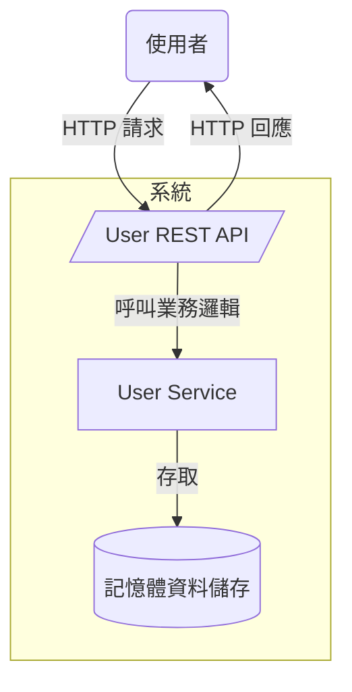
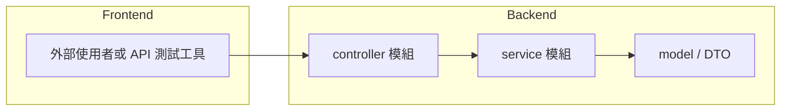
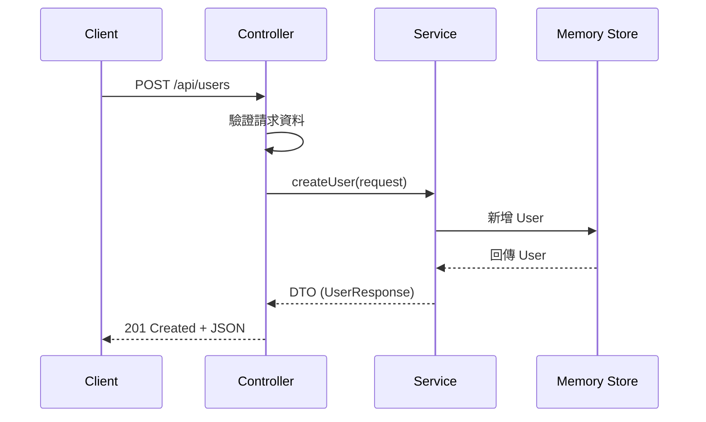
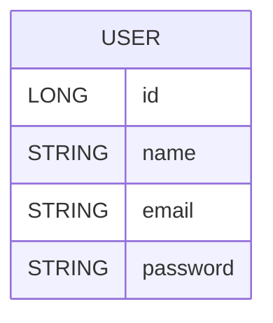
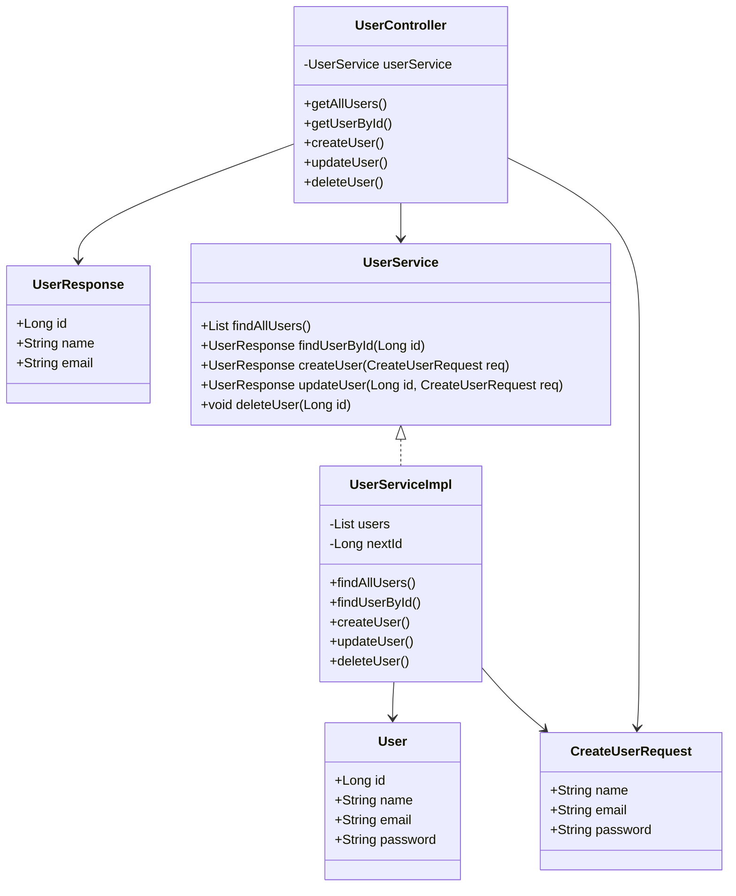
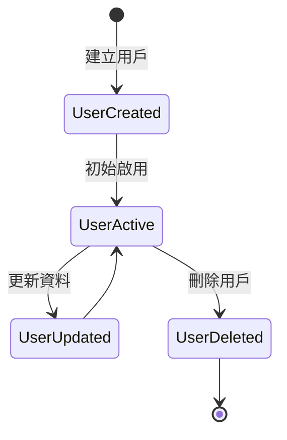

# Chapter 1 - Spring Boot Basics 規格文件

## 1. 架構與選型
- **後端框架**：Spring Boot 3.2.0，使用自動組態與內嵌伺服器減少樣板設定。
- **語言與版本**：Java 21。建置與執行都需使用 `D:\java\jdk-21`（避免 Java 8 造成 Maven 插件載入失敗）。
- **建置工具**：Apache Maven 3.9.x，採多外掛設定；透過 `spring-boot-maven-plugin` 產生可執行 JAR。
- **依賴管理**：遵循 Spring Boot Starter 套件，包含 Web、Validation、Actuator；Lombok 僅於編譯期使用。
- **診斷監控**：Spring Boot Actuator 暴露應用監控端點；可日後延伸整合監控工具。
- **文件腳本**：使用 PowerShell 7+ 或 `run.bat` 啟動建置流程，確保在 Windows 下使用 Java 21。

## 2. 資料模型
| 名稱 | 角色 | 主要欄位 | 說明 |
| --- | --- | --- | --- |
| `User` | Domain Model | `id`, `name`, `email`, `password` | 系統內部用戶資料，`password` 僅供內部儲存，對外不輸出。 |
| `CreateUserRequest` | Request DTO | `name`, `email`, `password` | 建立／更新用戶請求物件，含 Bean Validation 限制。 |
| `UserResponse` | Response DTO | `id`, `name`, `email` | 對外回傳資料；不包含敏感資訊。 |
| `UserService` | Service Interface | CRUD 方法 | 定義用戶操作介面，利於替換實作。 |
| `UserServiceImpl` | Service Implementation | `List<User>` | 以記憶體清單模擬資料層，負責業務邏輯與 DTO 轉換。 |
| `UserController` | REST Controller | `/api/users` | 暴露 CRUD RESTful 端點，回傳 `ResponseEntity`。 |

## 3. 關鍵流程
1. **查詢全部用戶**：`GET /api/users` → Service 取得清單 → DTO 轉換 → 回傳 200 陣列。
2. **依 ID 查詢**：`GET /api/users/{id}` → Service 搜尋 → 找到回 200，不存在回 404。
3. **建立用戶**：`POST /api/users` → 驗證請求 → 服務層設定流水號 → 儲存於記憶體 → 回傳 201 與 DTO。
4. **更新用戶**：`PUT /api/users/{id}` → 驗證 → 若存在更新欄位 → 200 回傳新 DTO；否則 404。
5. **刪除用戶**：`DELETE /api/users/{id}` → 服務層移除 → 回傳 204。
6. **建置流程**：PowerShell 指令設定 `JAVA_HOME` 至 Java 21 → `mvn clean package` → Spring Boot Repackage → 產生可執行 JAR。

## 4. 虛擬碼
```pseudo
function createUser(request):
    validate request (not blank, email format, password length)
    user = new User()
    user.id = nextId++
    user.name = request.name
    user.email = request.email
    user.password = request.password
    users.add(user)
    return mapToResponse(user)

function buildProject():
    ensureJavaHomePointsTo21()
    mvn clean package
    if mavenEnforcer detects java < 21:
        fail with clear message
    else:
        springBootRepackage executable jar
```

## 5. 系統脈絡圖


## 6. 容器 / 部署概觀
```mermaid
graph TB
    Client[瀏覽器 / API Client]
    subgraph Windows 11 工作站
        JVM[JVM (Java 21)]
        SpringBoot[Spring Boot 應用]
    end

    Client -->|RESTful 請求 (HTTP)| SpringBoot
    SpringBoot -->|執行於| JVM
    JVM -->|部署於| Windows 11 工作站
```

## 7. 模組關係圖（Backend / Frontend）


## 8. 序列圖


## 9. ER 圖


## 10. 類別圖（後端關鍵類別）


## 11. 流程圖
```mermaid
flowchart TD
    A[開始] --> B[收到 REST 請求]
    B --> C{路徑判斷}
    C -->|GET /api/users| D[呼叫 findAllUsers]
    C -->|GET /api/users/{id}| E[呼叫 findUserById]
    C -->|POST| F[驗證 CreateUserRequest]
    C -->|PUT| G[驗證 + 檢查存在]
    C -->|DELETE| H[刪除用戶]
    F --> I[創建 User -> 儲存]
    G --> J{用戶存在?}
    J -->|是| K[更新欄位]
    J -->|否| L[回傳 404]
    D --> M[回傳 200]
    E --> N[回傳 200 或 404]
    I --> O[回傳 201]
    K --> P[回傳 200]
    H --> Q[回傳 204]
    L --> Q
    M & N & O & P & Q --> R[結束]
```

## 12. 狀態圖


## 13. 建置與版本需求
- Maven 執行需使用 Java 21：`pwsh` 下建議執行 `Set-Item Env:JAVA_HOME 'D:\java\jdk-21'` 與 `mvn --java-home D:\java\jdk-21 clean package`。
- 專案將新增 Maven Enforcer 規則，若使用低於 21 的 JDK，會立即停止建置並提示切換版本，避免 `TypeNotPresentException`。
- 若使用 `run.bat`，腳本會自動設定 PATH 指向 Java 21，適用於 Windows CMD。

## 14. 測試策略
- 採手動驗證 REST 端點（Postman / curl）。
- 建置流程：`mvn clean verify`（需 Java 21）→ 確認無錯誤後才能執行下一個任務。
- 可考慮後續補充 JUnit 測試以涵蓋 Service 層邏輯。

## 15. 風險與緩解
- **Java 版本錯誤**：使用 Maven Enforcer 與文件提示確保使用者切換至 Java 21。
- **資料遺失**：目前採記憶體儲存（示範用途），若需持久化須改為資料庫實作。
- **敏感資訊外洩**：對外 DTO 不回傳 `password`，Service 僅於內部使用。
- **模組擴充**：未來可引入資料庫層或安全機制；介面化設計可減輕替換負擔。
