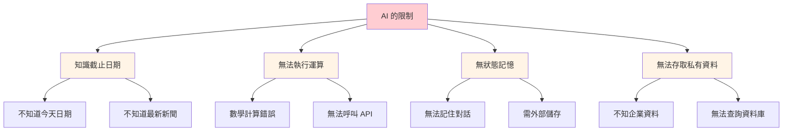
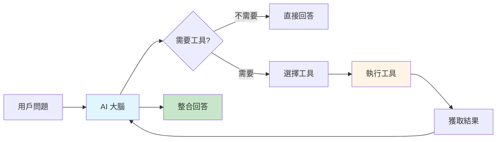
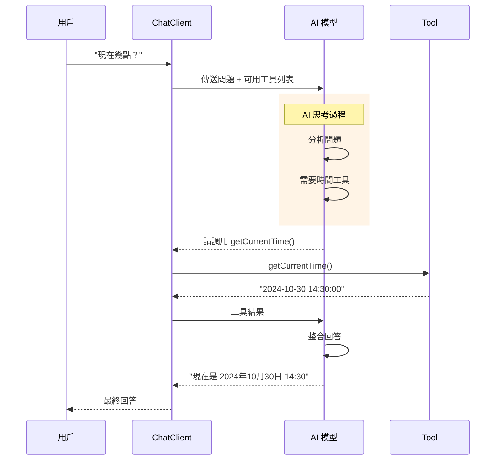

# 5.6 Function Calling (上) - 賦予 AI 操作世界的能力

> **對應範例**: `chapter5-spring-ai-advanced`
> **難度**: ⭐⭐☆☆☆

---

## 📚 本章概要

Tool Calling（工具調用）是 Spring AI 的核心功能之一，讓 AI 能夠調用外部函數和工具，突破自身知識限制。這就像給 AI 裝上「外掛」，讓它能夠執行實際操作、獲取即時資料、進行精確計算。

**學習目標**:
- 理解 Tool Calling 的核心概念
- 認識 AI 的固有限制
- 實現第一個簡單工具
- 掌握 @Tool 註解基礎用法
- 建立完整的工具調用流程

---

## 🎯 AI 為什麼需要工具?

### AI 的四大限制



**1. 知識截止問題**
```
用戶: "今天是幾號？"
AI (無工具): "抱歉，我的訓練資料截至 2024年1月..."

用戶: "今天是幾號？"
AI (有工具): "今天是 2024年10月30日" ✅
```

**2. 數學運算限制**
```
用戶: "計算 789 × 456"
AI (無工具): "大約是 359,000" ❌ (實際是 359,784)

用戶: "計算 789 × 456"
AI (有工具): "789 × 456 = 359,784" ✅
```

**3. 無法存取即時資料**
```
用戶: "查詢台積電股價"
AI (無工具): "我無法獲取即時股價資料..."

用戶: "查詢台積電股價"
AI (有工具): "台積電(2330) 當前股價: 580元" ✅
```

### Tool Calling 的解決方案

| AI 限制 | Tool Calling 解法 | 實際應用 |
|---------|------------------|----------|
| 📅 **不知道時間** | 時間查詢工具 | 日期、星期、時區轉換 |
| 🔢 **計算不準** | 計算器工具 | 數學運算、統計分析 |
| 🌐 **無即時資料** | API 調用工具 | 天氣、股價、新聞 |
| 🏢 **無企業資料** | 資料庫工具 | 銷售資料、客戶資訊 |

---

## 🏗️ Tool Calling 基礎架構

### 核心概念



### 工作流程



**流程說明**:
1. 用戶提問
2. AI 判斷是否需要工具
3. 選擇合適的工具
4. 執行工具獲取結果
5. AI 整合結果生成回答

---

## 💻 第一個 Tool - 時間查詢

### 步驟 1: 建立工具類別

```java
// 對應範例: chapter5-spring-ai-advanced/.../tools/DateTimeTools.java:12

@Component
public class DateTimeTools {

    /**
     * 獲取當前時間
     * 注意: description 必須用英文,AI 才能理解
     */
    @Tool(description = "Get the current date and time in Taiwan (Asia/Taipei timezone)")
    public String getCurrentDateTime() {
        LocalDateTime now = LocalDateTime.now();
        DateTimeFormatter formatter =
            DateTimeFormatter.ofPattern("yyyy年MM月dd日 HH:mm:ss");

        return String.format("當前時間：%s（台灣時間）",
            now.format(formatter));
    }
}
```

**關鍵要點**:
1. ✅ 使用 `@Component` 讓 Spring 管理
2. ✅ 使用 `@Tool` 標記為可調用工具
3. ✅ `description` **必須英文**（AI 通過描述判斷是否使用）
4. ✅ 方法必須是 `public`
5. ✅ 返回值會傳給 AI 處理

### 步驟 2: 建立 ChatClient

```java
// 對應範例: chapter5-spring-ai-advanced/.../controller/SimpleToolController.java:18

@RestController
@RequestMapping("/api/simple-tool")
@RequiredArgsConstructor
public class SimpleToolController {

    private final ChatModel chatModel;
    private final DateTimeTools dateTimeTools;

    /**
     * 基礎工具調用示例
     */
    @GetMapping("/chat")
    public String chat(@RequestParam String message) {

        // 建立帶工具的 ChatClient
        String response = ChatClient.create(chatModel)
                .prompt(message)
                .tools(dateTimeTools)  // 註冊工具
                .call()
                .content();

        return response;
    }
}
```

**實現要點**:
- `ChatClient.create(chatModel)`: 建立客戶端
- `.prompt(message)`: 設定用戶訊息
- `.tools(dateTimeTools)`: **註冊可用工具**
- `.call().content()`: 執行並獲取回應

### 步驟 3: 測試工具

**測試 1: 詢問時間**
```bash
GET /api/simple-tool/chat?message=現在幾點？

回應: "現在是 2024年10月30日 14:30:05（台灣時間）"
```

**測試 2: 不需要工具的問題**
```bash
GET /api/simple-tool/chat?message=你好

回應: "你好！有什麼我可以幫助你的嗎？"
```

**測試 3: 間接需要時間的問題**
```bash
GET /api/simple-tool/chat?message=今天星期幾？

回應: "今天是 2024年10月30日（台灣時間），星期三。"
```

---

## 🔧 @Tool 註解詳解

### 基本語法

```java
@Tool(
    description = "工具功能的英文描述"  // 必填，AI 據此判斷
)
public ReturnType methodName(參數...) {
    // 工具邏輯
    return result;
}
```

### 描述的重要性

```java
// ❌ 不好的描述
@Tool(description = "Get time")
public String getCurrentTime() { ... }

// ✅ 好的描述
@Tool(description = "Get the current date and time in Taiwan timezone, " +
                    "formatted as 'yyyy-MM-dd HH:mm:ss'")
public String getCurrentTime() { ... }
```

**好描述的特徵**:
1. ✅ 清楚說明功能
2. ✅ 說明參數含義（如果有）
3. ✅ 說明返回值格式
4. ✅ 提供使用場景

### 帶參數的工具

```java
// 對應範例: chapter5-spring-ai-advanced/.../tools/CalculatorTools.java:15

@Component
public class CalculatorTools {

    /**
     * 基礎計算器
     */
    @Tool(description = "Perform basic math operations. " +
          "Operations: add, subtract, multiply, divide. " +
          "Example: calculate('add', 10, 5) returns 15")
    public String calculate(String operation, double a, double b) {

        double result = switch (operation.toLowerCase()) {
            case "add" -> a + b;
            case "subtract" -> a - b;
            case "multiply" -> a * b;
            case "divide" -> {
                if (b == 0) {
                    yield Double.NaN;
                }
                yield a / b;
            }
            default -> throw new IllegalArgumentException(
                "不支援的運算: " + operation);
        };

        if (Double.isNaN(result)) {
            return "錯誤：除數不能為零";
        }

        return String.format("%.2f %s %.2f = %.2f",
            a, getSymbol(operation), b, result);
    }

    private String getSymbol(String operation) {
        return switch (operation.toLowerCase()) {
            case "add" -> "+";
            case "subtract" -> "-";
            case "multiply" -> "×";
            case "divide" -> "÷";
            default -> "?";
        };
    }
}
```

**使用示例**:
```bash
用戶: "計算 123 加 456"
AI: 調用 calculate("add", 123, 456)
工具回應: "123.00 + 456.00 = 579.00"
AI 回應: "123 加 456 等於 579"
```

---

## 🎨 多工具協作

### 註冊多個工具

```java
// 對應範例: chapter5-spring-ai-advanced/.../controller/MultiToolController.java:22

@RestController
@RequestMapping("/api/multi-tool")
@RequiredArgsConstructor
public class MultiToolController {

    private final ChatModel chatModel;
    private final DateTimeTools dateTimeTools;
    private final CalculatorTools calculatorTools;

    /**
     * 多工具整合
     */
    @GetMapping("/chat")
    public String chat(@RequestParam String message) {

        String response = ChatClient.create(chatModel)
                .prompt(message)
                .tools(
                    dateTimeTools,      // 時間工具
                    calculatorTools     // 計算工具
                )
                .call()
                .content();

        return response;
    }
}
```

### 測試多工具場景

**場景 1: 只需要一個工具**
```bash
用戶: "現在幾點？"
AI: 只調用 dateTimeTools
回應: "現在是下午 2:30"
```

**場景 2: 需要多個工具**
```bash
用戶: "現在是下午 2:30，3 小時後是幾點？"
AI:
1. 調用 dateTimeTools 獲取當前時間
2. 調用 calculatorTools 計算 14.5 + 3 = 17.5
回應: "3 小時後是下午 5:30"
```

**場景 3: 不需要工具**
```bash
用戶: "你好嗎？"
AI: 不調用任何工具
回應: "我很好，謝謝！有什麼我可以幫助你的嗎？"
```

---

## 💡 最佳實踐

### 1. 工具設計原則

```java
// ✅ 好的工具設計
@Tool(description = "Convert temperature between Celsius and Fahrenheit. " +
      "Parameters: temperature (number), unit (C or F)")
public String convertTemperature(double temp, String unit) {
    if (unit.equalsIgnoreCase("C")) {
        double fahrenheit = (temp * 9/5) + 32;
        return String.format("%.1f°C = %.1f°F", temp, fahrenheit);
    } else {
        double celsius = (temp - 32) * 5/9;
        return String.format("%.1f°F = %.1f°C", temp, celsius);
    }
}

// ❌ 不好的工具設計
@Tool(description = "轉換溫度")  // ❌ 中文描述
public Object convert(Map params) {  // ❌ 類型不明確
    // ...
}
```

### 2. 錯誤處理

```java
@Tool(description = "Get weather information for a city")
public String getWeather(String city) {
    try {
        // 模擬 API 調用
        if (city == null || city.trim().isEmpty()) {
            return "錯誤：請提供城市名稱";
        }

        // 實際應用中會調用天氣 API
        return String.format("%s 的天氣：晴天，溫度 25°C", city);

    } catch (Exception e) {
        // 返回友善的錯誤訊息，讓 AI 能理解
        return "無法獲取天氣資訊：" + e.getMessage();
    }
}
```

### 3. 返回值格式

```java
// ✅ 清晰的返回格式
@Tool(description = "Get current time in specified timezone")
public String getTimeInTimezone(String timezone) {
    try {
        ZoneId zone = ZoneId.of(timezone);
        ZonedDateTime time = ZonedDateTime.now(zone);

        return String.format(
            "時區: %s\n" +
            "時間: %s\n" +
            "UTC 偏移: %s",
            timezone,
            time.format(DateTimeFormatter.ofPattern("yyyy-MM-dd HH:mm:ss")),
            time.getOffset()
        );

    } catch (Exception e) {
        return "不支援的時區: " + timezone;
    }
}

// ❌ 難以理解的返回
@Tool(description = "Get time")
public long getTime() {
    return System.currentTimeMillis();  // AI 難以理解時間戳
}
```

### 4. 參數驗證

```java
@Tool(description = "Calculate factorial of a number (0-20)")
public String factorial(int n) {
    // 參數驗證
    if (n < 0) {
        return "錯誤：階乘不支援負數";
    }

    if (n > 20) {
        return "錯誤：數字太大，請輸入 0-20 之間的數字";
    }

    // 計算階乘
    long result = 1;
    for (int i = 2; i <= n; i++) {
        result *= i;
    }

    return String.format("%d! = %d", n, result);
}
```

---

## 🎬 完整示例：智能助手

### 整合時間和計算工具

```java
// 對應範例: chapter5-spring-ai-advanced/.../controller/SmartAssistantController.java:15

@RestController
@RequestMapping("/api/assistant")
@RequiredArgsConstructor
@Slf4j
public class SmartAssistantController {

    private final ChatModel chatModel;
    private final DateTimeTools dateTimeTools;
    private final CalculatorTools calculatorTools;

    /**
     * 智能助手 API
     */
    @PostMapping("/chat")
    public AssistantResponse chat(@RequestBody AssistantRequest request) {

        log.info("收到問題: {}", request.getMessage());

        long startTime = System.currentTimeMillis();

        String response = ChatClient.create(chatModel)
                .prompt(request.getMessage())
                .tools(dateTimeTools, calculatorTools)
                .call()
                .content();

        long executionTime = System.currentTimeMillis() - startTime;

        log.info("回應完成，耗時: {}ms", executionTime);

        return AssistantResponse.builder()
                .success(true)
                .question(request.getMessage())
                .answer(response)
                .executionTime(executionTime)
                .timestamp(LocalDateTime.now())
                .build();
    }
}
```

### 測試對話

**對話 1: 時間相關**
```
用戶: "現在幾點？明天這個時候是幾號？"
助手: "現在是 2024年10月30日 14:30，
      明天這個時候是 2024年10月31日 14:30。"
```

**對話 2: 計算相關**
```
用戶: "如果我有 1000 元，買 3 個 250 元的商品，還剩多少？"
助手: "3 個 250 元的商品總共是 750 元（250 × 3 = 750），
      1000 元減去 750 元，還剩 250 元。"
```

**對話 3: 混合場景**
```
用戶: "我每天工作 8 小時，一週 5 天，一個月工作多少小時？"
助手: "一週工作 40 小時（8 × 5 = 40），
      一個月按 4 週計算，約工作 160 小時（40 × 4 = 160）。"
```

---

## 📝 重點回顧

### Tool Calling 的價值
✅ **突破限制**: AI 能獲取即時資料
✅ **精確計算**: 避免數學錯誤
✅ **實際操作**: 調用 API、查詢資料庫
✅ **靈活擴展**: 輕鬆添加新功能

### 技術要點
- **@Tool 註解**: 標記可調用的工具方法
- **描述必須英文**: AI 根據描述判斷用途
- **清晰的返回值**: 讓 AI 能理解結果
- **錯誤處理**: 返回友善的錯誤訊息

### 實現步驟
1. 建立工具類別（@Component）
2. 使用 @Tool 標記方法
3. 在 ChatClient 中註冊工具
4. 測試不同場景

---

## 🚀 下一步

完成本節後，您已經掌握了 Function Calling 的基礎用法。接下來需要深入學習進階技巧：

**企業級工具開發**
- 學習開發複雜的企業級工具函數
- 掌握工具的參數驗證和錯誤處理機制
- 理解如何整合資料庫、外部 API 等後端服務
- 學習實作需要權限控制的工具函數
- 掌握工具執行的監控、日誌和追蹤

**工具鏈管理與協作**
- 學習管理多個工具的註冊和生命週期
- 掌握工具之間的依賴關係和執行順序
- 理解如何設計工具鏈解決複雜任務
- 學習實作工具的動態載入和熱更新
- 掌握工具版本管理和相容性處理

這些進階技術將讓您能夠建立功能強大的 AI 智能助手系統。

---

**參考資料**:
- [Spring AI Tool Calling](https://docs.spring.io/spring-ai/reference/api/functions.html)
- [OpenAI Function Calling Guide](https://platform.openai.com/docs/guides/function-calling)
- [Tool Calling Best Practices](https://docs.spring.io/spring-ai/reference/concepts.html)
