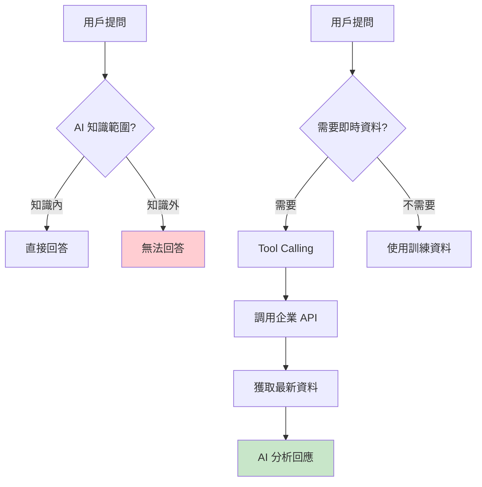
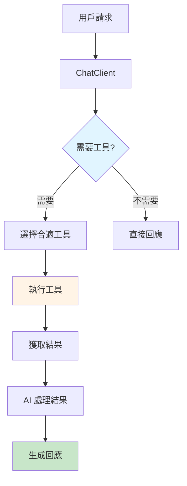
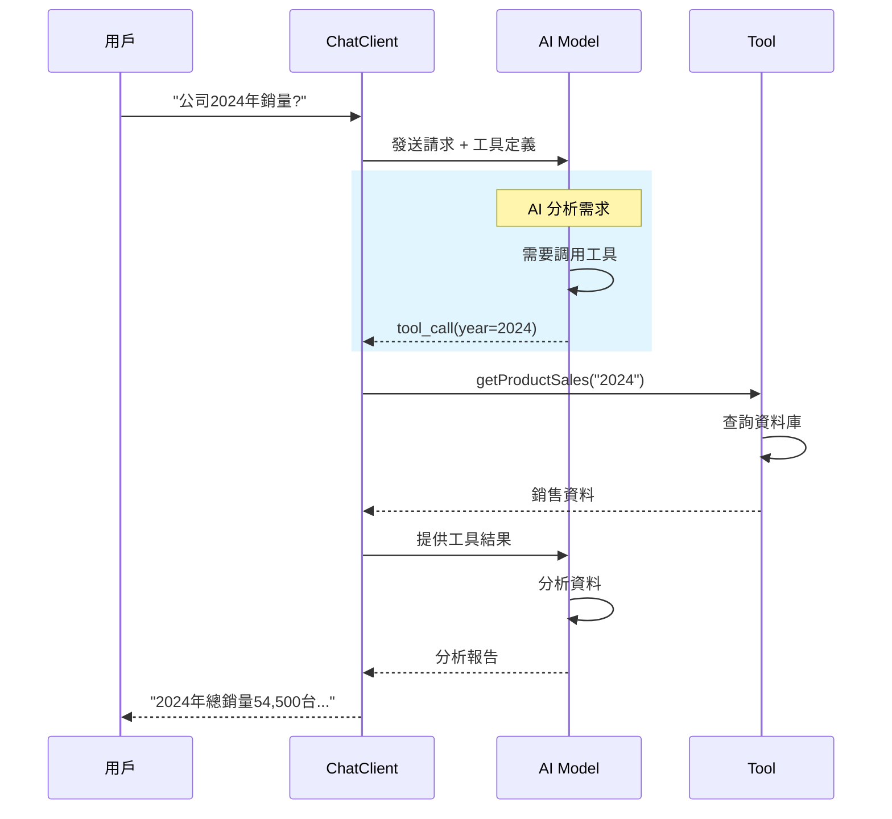
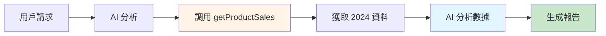

# 5.7 Function Calling (中) - 讀取企業資料

> **對應範例**: `chapter5-spring-ai-advanced`
> **難度**: ⭐⭐⭐⭐☆

---

## 📚 本章概要

Tool Calling 是 Spring AI 最強大的功能之一,讓 AI 能夠調用外部工具和存取企業資料。透過這個機制,AI 可以突破自身知識限制,成為真正的企業智能助手。

**學習目標**:
- 理解 Tool Calling 的工作原理
- 掌握 @Tool 註解的進階使用
- 實現企業資料存取工具
- 建立多工具協作系統
- 設計智能商業分析平台

---

## 🎯 為什麼需要 Tool Calling?

### AI 的局限性



**傳統 AI 的問題**:
- ❌ 知識有截止日期（如 2024年1月）
- ❌ 無法存取企業內部資料
- ❌ 不能執行實際操作
- ❌ 無法整合外部系統

**Tool Calling 的價值**:
- ✅ 即時存取最新資料
- ✅ 整合企業內部系統
- ✅ 執行實際業務操作
- ✅ 多系統協同工作

---

## 🏗️ Tool Calling 架構

### 核心概念



### 工作流程



---

## 💻 基礎工具實現

### 1. 簡單工具 - 日期時間

```java
// 對應範例: chapter5-spring-ai-advanced/.../tools/DateTimeTools.java:15

@Component
public class DateTimeTools {

    /**
     * 獲取當前日期時間
     */
    @Tool(description = "Get the current date and time in specified timezone. " +
          "Supports timezones like 'Asia/Taipei', 'America/New_York', 'Europe/London'.")
    public String getCurrentDateTime(String timezone) {
        try {
            ZoneId zoneId = ZoneId.of(timezone);
            ZonedDateTime now = ZonedDateTime.now(zoneId);

            return now.format(
                DateTimeFormatter.ofPattern("yyyy-MM-dd HH:mm:ss z")
            );
        } catch (Exception e) {
            return "Invalid timezone: " + timezone;
        }
    }
}
```

**實現要點**:
1. ✅ 使用 `@Tool` 註解標記方法
2. ✅ `description` 必須用**英文**描述功能
3. ✅ 參數和返回值會自動序列化
4. ✅ 方法必須是 public

### 2. 企業資料工具 - 產品銷售

```java
// 對應範例: chapter5-spring-ai-advanced/.../tools/ProductSalesTools.java:25

@Component
@RequiredArgsConstructor
public class ProductSalesTools {

    private final EnterpriseDataService dataService;

    /**
     * 查詢產品銷售資料
     */
    @Tool(description = "Get company product sales information by year and product model. " +
          "Can filter by year (e.g., '2023', '2024') and product (model or name). " +
          "Returns detailed sales data including quantity, revenue, and product information.")
    public ProductSalesResponse getProductSales(String year, String product) {

        log.info("查詢產品銷售：年份={}, 產品={}", year, product);

        // 從企業系統獲取資料
        List<Product> products = dataService.filterProducts(year, product);

        // 計算統計資料
        int totalQuantity = products.stream()
                .mapToInt(Product::getQuantity)
                .sum();

        BigDecimal totalRevenue = products.stream()
                .map(Product::getRevenue)
                .reduce(BigDecimal.ZERO, BigDecimal::add);

        // 建立回應
        return ProductSalesResponse.builder()
                .products(products)
                .totalQuantity(totalQuantity)
                .totalRevenue(totalRevenue)
                .queryYear(year)
                .queryProduct(product)
                .build();
    }
}
```

### 3. 資料模型設計

```java
// 對應範例: chapter5-spring-ai-advanced/.../model/Product.java:12

@Data
@Builder
public class Product {

    @JsonProperty("year")
    @JsonPropertyDescription("銷售年份")
    private String year;

    @JsonProperty("model")
    @JsonPropertyDescription("產品型號")
    private String model;

    @JsonProperty("name")
    @JsonPropertyDescription("產品名稱")
    private String name;

    @JsonProperty("quantity")
    @JsonPropertyDescription("銷售數量")
    private Integer quantity;

    @JsonProperty("revenue")
    @JsonPropertyDescription("銷售金額")
    private BigDecimal revenue;

    @JsonProperty("category")
    @JsonPropertyDescription("產品類別")
    private String category;
}
```

**關鍵註解**:
- `@JsonProperty`: 指定 JSON 欄位名稱
- `@JsonPropertyDescription`: **重要!** 讓 AI 理解欄位用途
- `@JsonClassDescription`: 類別層級的描述

---

## 🔧 進階工具開發

### 多工具協作配置

```java
// 對應範例: chapter5-spring-ai-advanced/.../config/AiConfig.java:28

@Configuration
@RequiredArgsConstructor
public class AiConfig {

    private final ProductSalesTools productSalesTools;
    private final DateTimeTools dateTimeTools;
    private final CalculatorTools calculatorTools;

    /**
     * 企業級 ChatClient 配置
     */
    @Bean
    public ChatClient enterpriseChatClient(ChatModel chatModel) {
        return ChatClient.builder(chatModel)
                .defaultTools(
                    productSalesTools,    // 產品銷售工具
                    dateTimeTools,        // 日期時間工具
                    calculatorTools       // 計算工具
                )
                .defaultSystem("""
                    你是專業的企業資料分析師。

                    當用戶詢問企業資料時:
                    1. 使用適當的工具獲取最新資料
                    2. 進行深入的資料分析
                    3. 提供清晰的洞察和建議

                    可用工具:
                    - 產品銷售資料查詢
                    - 日期時間查詢
                    - 數學計算
                    """)
                .build();
    }
}
```

### 統計分析工具

```java
// 對應範例: chapter5-spring-ai-advanced/.../tools/ProductSalesTools.java:95

/**
 * 獲取銷售統計分析
 */
@Tool(description = "Get sales statistics and analysis for a specific year. " +
      "Returns top-selling products, category breakdown, and growth metrics.")
public SalesStatistics getSalesStatistics(String year) {

    List<Product> products = dataService.filterProducts(year, null);

    // 計算各類別統計
    List<CategoryStat> categoryStats = products.stream()
            .collect(Collectors.groupingBy(Product::getCategory))
            .entrySet().stream()
            .map(entry -> {
                String category = entry.getKey();
                List<Product> categoryProducts = entry.getValue();

                int quantity = categoryProducts.stream()
                        .mapToInt(Product::getQuantity)
                        .sum();

                BigDecimal revenue = categoryProducts.stream()
                        .map(Product::getRevenue)
                        .reduce(BigDecimal.ZERO, BigDecimal::add);

                double percentage = calculatePercentage(quantity, products);

                return CategoryStat.builder()
                        .category(category)
                        .quantity(quantity)
                        .revenue(revenue)
                        .percentage(percentage)
                        .build();
            })
            .collect(Collectors.toList());

    // 取得銷量前五名
    List<Product> topProducts = products.stream()
            .sorted((p1, p2) -> Integer.compare(
                p2.getQuantity(), p1.getQuantity()))
            .limit(5)
            .collect(Collectors.toList());

    return SalesStatistics.builder()
            .topProducts(topProducts)
            .categoryStats(categoryStats)
            .build();
}
```

### 年度比較工具

```java
// 對應範例: chapter5-spring-ai-advanced/.../tools/ProductSalesTools.java:145

/**
 * 比較不同年份的銷售表現
 */
@Tool(description = "Compare sales performance between two years. " +
      "Returns detailed comparison including growth rates and product performance changes.")
public String compareSalesByYear(String year1, String year2) {

    List<Product> products1 = dataService.filterProducts(year1, null);
    List<Product> products2 = dataService.filterProducts(year2, null);

    int total1 = products1.stream().mapToInt(Product::getQuantity).sum();
    int total2 = products2.stream().mapToInt(Product::getQuantity).sum();

    BigDecimal revenue1 = products1.stream()
            .map(Product::getRevenue)
            .reduce(BigDecimal.ZERO, BigDecimal::add);

    BigDecimal revenue2 = products2.stream()
            .map(Product::getRevenue)
            .reduce(BigDecimal.ZERO, BigDecimal::add);

    double quantityGrowth = calculateGrowthRate(total1, total2);
    double revenueGrowth = calculateGrowthRate(revenue1, revenue2);

    return String.format("""
            年度銷售比較分析 (%s vs %s):
            銷售數量：%d → %d (成長率：%.2f%%)
            銷售金額：%s → %s (成長率：%.2f%%)
            產品數量：%d → %d
            """,
            year1, year2,
            total1, total2, quantityGrowth,
            revenue1, revenue2, revenueGrowth,
            products1.size(), products2.size()
    );
}
```

---

## 🎬 實際應用場景

### 場景 1：基礎銷售查詢

**用戶**: "請告訴我 2024 年所有產品的銷售情況"

**AI 處理流程**:


**AI 回應**:
```
📊 **2024年銷售總覽**
- 總銷售數量：54,500 台
- 總銷售金額：22.05 億元
- 產品線：5 款產品

📈 **各產品表現**
1. PD-1235 平板電腦 Pro：15,000台 (27.5%)
2. PD-1385 智能手錶 Ultra：15,000台 (27.5%)
3. PD-1255 無線耳機 Pro：15,000台 (27.5%)
4. PD-1405 智能手機 Pro Max：12,500台 (23.0%)
5. PD-1300 智能音箱 Home：12,000台 (22.0%)

💡 **分析洞察**
- 產品線分布均衡，各產品銷量接近
- 智能手機和平板電腦貢獻最多營收
- 穿戴裝置和智能家居市場表現強勁
```

### 場景 2：跨年度比較

**用戶**: "比較一下 2023 和 2024 年的銷售表現"

**工具調用序列**:
1. `getProductSales("2023", null)`
2. `getProductSales("2024", null)`
3. `compareSalesByYear("2023", "2024")`

**AI 回應**:
```
📊 **2023 vs 2024 年度銷售比較**

**整體表現**
- 銷售數量：26,500 → 54,500 台 (+105.7%)
- 銷售金額：11.45 → 22.05 億元 (+92.6%)
- 產品線：4 → 5 款產品

**成長亮點**
1. ✅ 銷量翻倍增長，市場接受度提升
2. ✅ 新增智能音箱產品線拓展市場
3. ✅ 平板電腦從 1,500 台躍升至 15,000 台

**策略建議**
- 🎯 繼續擴展產品多樣化策略
- 🎯 加強智能家居市場投入
- 🎯 優化供應鏈以支撐快速增長
```

### 場景 3：深度分析

**用戶**: "分析穿戴裝置類別的市場表現，給出策略建議"

**工具調用**:
- `getSalesStatistics("2024")`
- 針對穿戴裝置類別進行分析

**AI 回應**:
```
🔍 **穿戴裝置類別深度分析**

**產品表現**
- PD-1385 智能手錶系列
  - 2023: 15,000台 (56.6% 占比)
  - 2024: 15,000台 (27.5% 占比)

**市場洞察**
1. **絕對量穩定**: 銷量維持在 15,000 台水平
2. **相對占比下降**: 從 56.6% 降至 27.5%
3. **產品升級成功**: Sport → Ultra，單價提升 50%
4. **市場趨於飽和**: 需要新的增長點

**競爭分析**
- 市場競爭加劇
- 功能同質化嚴重
- 價格敏感度提高

**策略建議**
1. 📊 **產品差異化**
   - 開發專業運動版本
   - 強化健康監測功能
   - 推出時尚款式

2. 🔄 **生態系統整合**
   - 與手機、平板深度聯動
   - 開發專屬 App 服務
   - 建立用戶社群

3. 💰 **商業模式創新**
   - 引入訂閱服務
   - 推出健康管理套餐
   - 企業團購方案

4. 🌍 **市場拓展**
   - 進入新興市場
   - 針對銀髮族開發產品
   - 拓展企業客戶
```

---

## 💡 最佳實踐

### 1. 工具設計原則

**✅ 良好的工具設計**:
```java
@Tool(description = "Get product sales data by year and optional product filter. " +
      "Year format: 'YYYY' (e.g., '2024'). " +
      "Product can be model number (e.g., 'PD-1234') or name (e.g., 'Laptop'). " +
      "Returns list of products with quantity, revenue, and category information.")
public ProductSalesResponse getProductSales(String year, String product)
```

**❌ 不良的工具設計**:
```java
@Tool(description = "獲取資料") // ❌ 中文描述
public List<Object> getData(Map params) // ❌ 類型不明確
```

**設計原則**:
1. ✅ Description 使用**英文**
2. ✅ 明確說明參數格式和範例
3. ✅ 描述返回值結構
4. ✅ 使用明確的類型（避免 Object、Map）

### 2. 參數驗證

```java
@Tool(description = "Calculate percentage between two numbers")
public double calculatePercentage(Double value, Double total) {
    // 參數驗證
    if (value == null || total == null) {
        throw new IllegalArgumentException("參數不能為空");
    }

    if (total == 0) {
        throw new IllegalArgumentException("總數不能為零");
    }

    if (value < 0 || total < 0) {
        throw new IllegalArgumentException("參數不能為負數");
    }

    return (value / total) * 100;
}
```

### 3. 錯誤處理

```java
@Tool(description = "Get product details by model number")
public ProductDetails getProductDetails(String model) {
    try {
        ProductDetails details = dataService.getProduct(model);

        if (details == null) {
            // 返回有意義的錯誤訊息,而不是拋出異常
            return ProductDetails.error(
                "Product not found: " + model
            );
        }

        return details;

    } catch (Exception e) {
        log.error("獲取產品詳情失敗: {}", model, e);

        // 返回錯誤資訊,讓 AI 可以理解
        return ProductDetails.error(
            "Error retrieving product: " + e.getMessage()
        );
    }
}
```

### 4. 效能優化

```java
@Service
public class EnterpriseDataService {

    // 使用快取避免重複查詢
    @Cacheable(value = "productSales", key = "#year + ':' + #product")
    public List<Product> filterProducts(String year, String product) {
        // 資料庫查詢邏輯
        return queryDatabase(year, product);
    }

    // 批次查詢優化
    public Map<String, List<Product>> batchFilterProducts(
            List<String> years) {

        // 一次查詢多個年份
        return years.stream()
                .collect(Collectors.toMap(
                    year -> year,
                    year -> filterProducts(year, null)
                ));
    }
}
```

---

## 📊 工具設計模式

### 模式 1：查詢工具

```java
/**
 * 特點: 只讀操作,不修改資料
 * 適用: 資料查詢、報表生成
 */
@Tool(description = "Query pattern: read-only data retrieval")
public DataResponse queryData(QueryRequest request) {
    return dataService.query(request);
}
```

### 模式 2：操作工具

```java
/**
 * 特點: 執行業務操作
 * 適用: 資料更新、流程觸發
 */
@Tool(description = "Action pattern: perform business operation")
public OperationResult performOperation(OperationRequest request) {
    // 驗證權限
    validatePermission(request);

    // 執行操作
    Result result = businessService.execute(request);

    // 記錄日誌
    auditLog.record(request, result);

    return result;
}
```

### 模式 3：聚合工具

```java
/**
 * 特點: 整合多個資料源
 * 適用: 儀表板、綜合報表
 */
@Tool(description = "Aggregation pattern: combine multiple data sources")
public AggregatedReport generateReport(ReportRequest request) {
    // 並行獲取多個資料源
    CompletableFuture<SalesData> salesFuture =
        CompletableFuture.supplyAsync(() -> getSalesData(request));

    CompletableFuture<InventoryData> inventoryFuture =
        CompletableFuture.supplyAsync(() -> getInventoryData(request));

    CompletableFuture<CustomerData> customerFuture =
        CompletableFuture.supplyAsync(() -> getCustomerData(request));

    // 等待所有資料
    CompletableFuture.allOf(
        salesFuture, inventoryFuture, customerFuture
    ).join();

    // 整合報表
    return AggregatedReport.builder()
            .sales(salesFuture.join())
            .inventory(inventoryFuture.join())
            .customer(customerFuture.join())
            .build();
}
```

---

## 📝 重點回顧

### Tool Calling 核心價值
✅ **突破知識限制**: AI 可存取即時資料
✅ **企業系統整合**: 連接 ERP、CRM 等系統
✅ **智能分析**: 結合資料與 AI 智能
✅ **靈活擴展**: 輕鬆新增工具功能

### 技術要點
| 要點 | 說明 |
|------|------|
| **@Tool 註解** | 標記工具方法,description 必須英文 |
| **類型明確** | 避免使用 Object、Map 等模糊類型 |
| **參數驗證** | 確保輸入資料的有效性 |
| **錯誤處理** | 返回有意義的錯誤訊息 |
| **效能優化** | 使用快取和批次查詢 |

### 應用場景
- 📊 **商業智能**: 銷售分析、財務報表
- 🏢 **企業整合**: ERP、CRM、人事系統
- 🤖 **智能助手**: 客服、資料查詢
- 📈 **資料分析**: 趨勢預測、異常檢測

---

## 🚀 下一步

完成本節後，您已經掌握了進階的工具開發技術。接下來需要學習工具生態的管理：

**工具鏈管理與編排**
- 學習設計和管理複雜的工具生態系統
- 掌握工具的分類、標籤和組織策略
- 理解如何實現工具的動態發現和載入
- 學習設計多步驟任務的工具編排流程
- 掌握工具執行的優先級和資源管理

**真實 API 整合實戰**
- 學習整合真實的第三方 API 服務（天氣、地圖、金融等）
- 掌握 API 認證、限流、錯誤處理的最佳實踐
- 理解如何設計 API 調用的快取和重試機制
- 學習處理 API 回應的解析和轉換
- 掌握 API 整合的安全性和合規性要求

完成這些學習後，您將能夠建立真正實用的 AI 智能助手應用。

---

**參考資料**:
- [Spring AI Tool Calling](https://docs.spring.io/spring-ai/reference/api/functions.html)
- [Tool Calling Best Practices](https://platform.openai.com/docs/guides/function-calling)
- [Enterprise AI Integration Patterns](https://docs.spring.io/spring-ai/reference/concepts.html)
