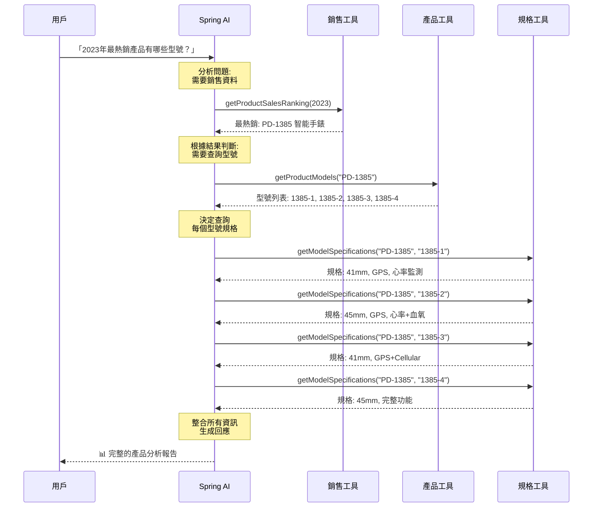
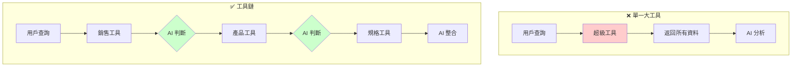
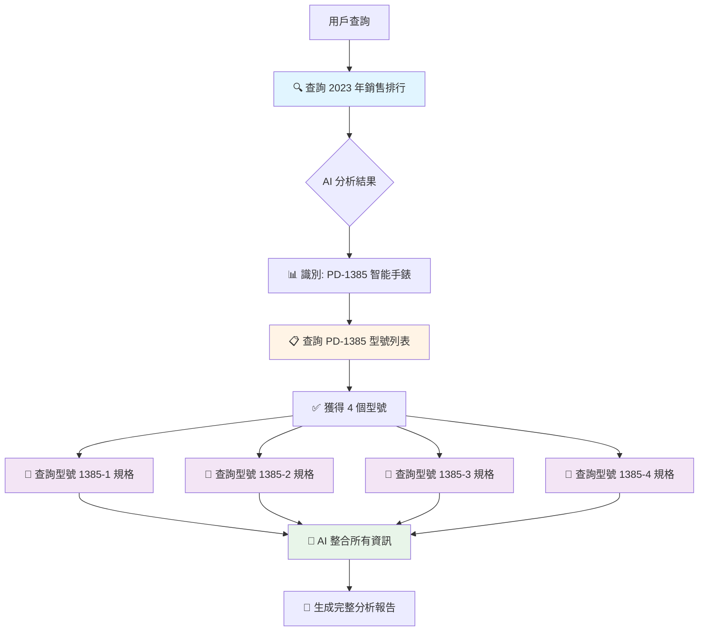

# 5.8 Function Calling (下) - 進階工具鏈與多步驟任務

> **對應範例**: `chapter5-spring-ai-advanced`
> **難度**: ⭐⭐⭐⭐☆

---

## 📚 本章概要

工具鏈（Tool Chain）是 Spring AI 的進階特性，允許 AI 自動進行多層次的工具調用。與單一工具相比，工具鏈能讓 AI 像人類一樣思考：「要完成這個任務，我需要先做 A，然後根據 A 的結果做 B，最後用 C 來整合」。

**學習目標**:
- 理解工具鏈的自動調用機制
- 掌握複雜工具鏈的設計模式
- 學會建立企業級工具生態系統
- 了解工具鏈的效能優化策略

---

## 🎯 為什麼需要工具鏈?

### 傳統方式的限制

想像一個場景：用戶問「去年最熱銷的產品有哪些型號？」

**❌ 傳統單一工具做法**:
```java
@Tool(description = "Get all product information including sales and models")
public ProductFullInfo getProductFullInfo(String year) {
    // 在一個工具裡做所有事情：
    // 1. 查詢銷售資料
    // 2. 找出最熱銷產品
    // 3. 查詢產品型號
    // 4. 查詢每個型號的規格
    // 5. 統計分析...

    return hugeResult; // 返回一大包資料
}
```

**問題**:
- 📦 一次返回大量資料，浪費 tokens
- 🔧 工具功能過於複雜，難以維護
- 🎯 無法根據中間結果動態調整策略
- 🔄 重複使用性差

**✅ 工具鏈做法**:
```java
// 工具 1: 銷售排行
@Tool(description = "Get product sales ranking for a specific year")
public SalesRanking getProductSalesRanking(int year) { ... }

// 工具 2: 產品型號
@Tool(description = "Get product models by product code")
public ProductDetail getProductModels(String product) { ... }

// 工具 3: 型號規格
@Tool(description = "Get model specifications")
public ProductModel getModelSpecifications(String productCode, String modelCode) { ... }
```

**優勢**:
- ✅ 按需調用，節省 tokens
- ✅ 工具職責單一，易於維護
- ✅ AI 可動態調整調用策略
- ✅ 工具可獨立重用

---

## 🔗 工具鏈執行流程

### 自動鏈式調用機制



### 工具鏈 vs 單一工具比較



---

## 💻 實戰：建立工具鏈系統

### 1. 產品詳情工具

簡化的產品型號查詢工具：

```java
// 對應範例: chapter5-spring-ai-advanced/.../tools/ProductDetailsTools.java:77

@Component
@Slf4j
public class ProductDetailsTools {

    /**
     * 產品詳情資料模型
     */
    public record ProductDetail(
            String product,
            String productName,
            List<String> models,
            String category,
            String description
    ) {}

    /**
     * 根據產品代碼獲取產品型號列表
     */
    @Tool(description = "Get detailed product information including all available models by product code or name. " +
          "Returns comprehensive product details with model specifications.")
    public ProductDetail getProductModels(String product) {
        log.info("查詢產品型號：{}", product);

        // 模擬企業產品資料庫
        Map<String, ProductDetail> productDatabase = Map.of(
            "PD-1405", new ProductDetail(
                "PD-1405",
                "智能手機 Pro 系列",
                List.of("1405-001", "1405-002", "1405-003", "1405-004"),
                "智能手機",
                "高端智能手機系列，支援 5G 和 AI 攝影"
            ),
            "PD-1234", new ProductDetail(
                "PD-1234",
                "筆記型電腦 Ultra 系列",
                List.of("1234-1", "1234-2", "1234-3", "1234-4", "1234-5"),
                "筆記型電腦",
                "輕薄高效能筆記型電腦，適合商務和創作"
            )
            // ... 更多產品
        );

        return productDatabase.getOrDefault(product,
            new ProductDetail(product, "未知產品", List.of(), "未分類", "查無此產品"));
    }

    /**
     * 產品型號規格資料模型
     */
    public record ProductModel(
            String modelCode,
            String modelName,
            String specifications,
            String price,
            String availability
    ) {}

    /**
     * 獲取特定型號的詳細規格
     */
    @Tool(description = "Get detailed specifications for a specific product model. " +
          "Returns comprehensive model information including price and availability.")
    public ProductModel getModelSpecifications(String productCode, String modelCode) {
        log.info("查詢型號規格：{}-{}", productCode, modelCode);

        // 根據產品類型生成規格資訊
        return switch (productCode) {
            case "PD-1405" -> new ProductModel(
                    modelCode,
                    "智能手機 Pro " + modelCode,
                    generatePhoneSpecs(modelCode),
                    generatePrice("phone", modelCode),
                    "現貨供應"
            );
            case "PD-1234" -> new ProductModel(
                    modelCode,
                    "筆記型電腦 Ultra " + modelCode,
                    generateLaptopSpecs(modelCode),
                    generatePrice("laptop", modelCode),
                    "現貨供應"
            );
            default -> new ProductModel(
                    modelCode,
                    "產品型號 " + modelCode,
                    "標準規格",
                    "價格面議",
                    "請洽詢"
            );
        };
    }

    private String generatePhoneSpecs(String modelCode) {
        return switch (modelCode) {
            case "1405-001" -> "6.1吋 OLED 螢幕, 128GB 儲存, 雙鏡頭";
            case "1405-002" -> "6.1吋 OLED 螢幕, 256GB 儲存, 三鏡頭";
            case "1405-003" -> "6.7吋 OLED 螢幕, 512GB 儲存, 三鏡頭 Pro";
            case "1405-004" -> "6.7吋 OLED 螢幕, 1TB 儲存, 四鏡頭 Pro Max";
            default -> "標準智能手機規格";
        };
    }

    private String generateLaptopSpecs(String modelCode) {
        return switch (modelCode) {
            case "1234-1" -> "13吋, Intel i5, 8GB RAM, 256GB SSD";
            case "1234-2" -> "13吋, Intel i7, 16GB RAM, 512GB SSD";
            case "1234-3" -> "15吋, Intel i7, 16GB RAM, 1TB SSD";
            default -> "標準筆記型電腦規格";
        };
    }

    private String generatePrice(String category, String modelCode) {
        return switch (category) {
            case "phone" -> switch (modelCode) {
                case "1405-001" -> "NT$ 25,900";
                case "1405-002" -> "NT$ 29,900";
                case "1405-003" -> "NT$ 35,900";
                default -> "NT$ 25,000";
            };
            case "laptop" -> switch (modelCode) {
                case "1234-1" -> "NT$ 35,900";
                case "1234-2" -> "NT$ 45,900";
                case "1234-3" -> "NT$ 55,900";
                default -> "NT$ 40,000";
            };
            default -> "價格面議";
        };
    }
}
```

### 2. 增強版銷售工具

簡化的銷售資料分析工具：

```java
// 對應範例: chapter5-spring-ai-advanced/.../tools/EnhancedSalesTools.java:321

@Component
@Slf4j
public class EnhancedSalesTools {

    /**
     * 產品銷售資料模型
     */
    public record ProductSales(
            String product,
            String productName,
            int salesVolume,
            BigDecimal revenue,
            String category,
            double marketShare
    ) {}

    /**
     * 銷售排行資料模型
     */
    public record SalesRanking(
            List<ProductSales> topProducts,
            ProductSales bestSeller,
            int totalVolume,
            BigDecimal totalRevenue,
            String analysisYear
    ) {}

    /**
     * 獲取指定年份的產品銷售排行
     */
    @Tool(description = "Get comprehensive product sales data for a specific year. " +
          "Returns detailed sales information including volume, revenue, and market share.")
    public SalesRanking getProductSalesRanking(int year) {
        log.info("查詢年度銷售排行：{}", year);

        List<ProductSales> salesData = getSalesDataByYear(year);

        if (salesData.isEmpty()) {
            return new SalesRanking(List.of(), null, 0, BigDecimal.ZERO, String.valueOf(year));
        }

        // 計算總銷量和總營收
        int totalVolume = salesData.stream()
                .mapToInt(ProductSales::salesVolume)
                .sum();

        BigDecimal totalRevenue = salesData.stream()
                .map(ProductSales::revenue)
                .reduce(BigDecimal.ZERO, BigDecimal::add);

        // 按銷量排序
        List<ProductSales> topProducts = salesData.stream()
                .sorted((p1, p2) -> Integer.compare(p2.salesVolume(), p1.salesVolume()))
                .collect(Collectors.toList());

        ProductSales bestSeller = topProducts.get(0);

        log.info("銷售排行查詢完成：{}年，最佳銷售產品：{}", year, bestSeller.productName());

        return new SalesRanking(
                topProducts,
                bestSeller,
                totalVolume,
                totalRevenue,
                String.valueOf(year)
        );
    }

    /**
     * 比較不同產品的銷售表現
     */
    @Tool(description = "Compare sales performance between multiple products in a specific year. " +
          "Returns detailed comparison with rankings and performance metrics.")
    public String compareProductPerformance(int year, List<String> products) {
        log.info("比較產品銷售表現：{}年，產品：{}", year, products);

        List<ProductSales> allSales = getSalesDataByYear(year);

        List<ProductSales> targetProducts = allSales.stream()
                .filter(sale -> products.contains(sale.product()))
                .sorted((p1, p2) -> Integer.compare(p2.salesVolume(), p1.salesVolume()))
                .collect(Collectors.toList());

        if (targetProducts.isEmpty()) {
            return "未找到指定產品的銷售資料";
        }

        StringBuilder comparison = new StringBuilder();
        comparison.append(String.format("📊 %d年產品銷售表現比較\n\n", year));

        for (int i = 0; i < targetProducts.size(); i++) {
            ProductSales product = targetProducts.get(i);
            comparison.append(String.format(
                    "%d. %s (%s)\n" +
                    "   銷售量：%,d 台\n" +
                    "   營收：%s\n" +
                    "   市場占有率：%.2f%%\n\n",
                    i + 1,
                    product.productName(),
                    product.product(),
                    product.salesVolume(),
                    formatCurrency(product.revenue()),
                    product.marketShare()
            ));
        }

        return comparison.toString();
    }

    private List<ProductSales> getSalesDataByYear(int year) {
        // 模擬不同年份的銷售資料
        Map<Integer, List<ProductSales>> salesDatabase = Map.of(
            2023, List.of(
                new ProductSales("PD-1385", "智能手錶系列", 15000,
                        new BigDecimal("300000000"), "穿戴裝置", 35.7),
                new ProductSales("PD-1234", "筆記型電腦 Ultra 系列", 10000,
                        new BigDecimal("800000000"), "筆記型電腦", 23.8),
                new ProductSales("PD-1405", "智能手機 Pro 系列", 8500,
                        new BigDecimal("425000000"), "智能手機", 20.2)
            ),
            2024, List.of(
                new ProductSales("PD-1405", "智能手機 Pro 系列", 18500,
                        new BigDecimal("925000000"), "智能手機", 28.5),
                new ProductSales("PD-1385", "智能手錶系列", 17000,
                        new BigDecimal("510000000"), "穿戴裝置", 26.2),
                new ProductSales("PD-1234", "筆記型電腦 Ultra 系列", 12000,
                        new BigDecimal("960000000"), "筆記型電腦", 18.5)
            )
        );

        return salesDatabase.getOrDefault(year, List.of());
    }

    private String formatCurrency(BigDecimal amount) {
        if (amount.compareTo(new BigDecimal("100000000")) >= 0) {
            return String.format("NT$ %.1f億",
                    amount.divide(new BigDecimal("100000000"), 1, RoundingMode.HALF_UP).doubleValue());
        }
        return String.format("NT$ %,d", amount.intValue());
    }
}
```

### 3. 工具鏈協調配置

```java
// 對應範例: chapter5-spring-ai-advanced/.../config/AdvancedAiConfig.java:532

@Configuration
@RequiredArgsConstructor
public class AdvancedAiConfig {

    private final ProductDetailsTools productDetailsTools;
    private final EnhancedSalesTools enhancedSalesTools;
    private final DateTimeTools dateTimeTools;
    private final CalculatorTools calculatorTools;

    /**
     * 企業級工具鏈 ChatClient
     * 支援複雜的多步驟工具調用
     */
    @Bean
    public ChatClient toolChainChatClient(ChatModel chatModel) {
        return ChatClient.builder(chatModel)
                .defaultTools(
                    enhancedSalesTools,     // 銷售資料分析工具
                    productDetailsTools,    // 產品詳情工具
                    calculatorTools,        // 計算工具
                    dateTimeTools          // 時間工具
                )
                .defaultSystem("""
                    你是一個專業的企業資料分析專家，擅長使用多種工具進行深度分析。

                    工具使用策略：
                    1. 根據用戶查詢自動選擇合適的工具組合
                    2. 按邏輯順序調用工具（先獲取基礎資料，再進行詳細分析）
                    3. 充分利用工具鏈的優勢，避免一次性獲取過多資料
                    4. 提供深入的分析洞察和商業建議

                    回答風格：
                    - 使用專業但易懂的語言
                    - 提供結構化的分析結果
                    - 包含具體的數據和洞察
                    - 給出實用的商業建議
                    """)
                .build();
    }
}
```

---

## 🎬 實際應用場景

### 場景：複雜銷售分析

**用戶查詢**: 「請告訴我 2023 年最熱銷的產品，並列出該產品所有型號的詳細規格和價格」

**工具鏈執行流程**:



**AI 回應範例**:

```
📊 **2023年最熱銷產品分析報告**

🏆 **最佳銷售產品**
- 產品：PD-1385 智能手錶系列
- 銷售量：15,000 台
- 營收：NT$ 3.0億
- 市場占有率：35.7%

📱 **產品型號完整資訊**

**1. 智能手錶 1385-1**
- 規格：41mm, GPS, 心率監測
- 價格：NT$ 12,900
- 定位：入門款，適合日常使用

**2. 智能手錶 1385-2**
- 規格：45mm, GPS, 心率監測, 血氧檢測
- 價格：NT$ 15,900
- 定位：進階款，增加健康監測功能

**3. 智能手錶 1385-3**
- 規格：41mm, GPS+Cellular, 心率監測, 血氧檢測
- 價格：NT$ 18,900
- 定位：獨立通訊款，支援獨立通話

**4. 智能手錶 1385-4**
- 規格：45mm, GPS+Cellular, 心率監測, 血氧檢測, ECG
- 價格：NT$ 22,900
- 定位：旗艦款，完整健康監測功能

💡 **商業洞察**
- 智能手錶市場需求強勁，占公司總銷量超過1/3
- 產品線完整，從入門到旗艦都有覆蓋
- 健康監測功能是主要賣點
- 建議加強運動和健康生態系統整合
```

---

## 💻 控制器實現

簡化的工具鏈控制器：

```java
// 對應範例: chapter5-spring-ai-advanced/.../controller/ToolChainController.java:611

@RestController
@RequestMapping("/api/tool-chain")
@RequiredArgsConstructor
@Slf4j
public class ToolChainController {

    private final ChatClient toolChainChatClient;

    /**
     * 複雜工具鏈查詢
     */
    @GetMapping("/complex-query")
    public String complexQuery(@RequestParam String prompt) {
        log.info("收到複雜工具鏈查詢：{}", prompt);

        long startTime = System.currentTimeMillis();

        String response = toolChainChatClient
                .prompt(prompt)
                .call()
                .content();

        long endTime = System.currentTimeMillis();

        log.info("複雜查詢完成，耗時：{}ms", endTime - startTime);

        return response;
    }

    /**
     * 產品深度分析
     */
    @PostMapping("/product-analysis")
    public ProductAnalysisResponse productAnalysis(@RequestBody ProductAnalysisRequest request) {
        log.info("產品深度分析請求：{}", request);

        long startTime = System.currentTimeMillis();

        // 構建分析提示詞
        String prompt = buildAnalysisPrompt(request);

        String analysis = toolChainChatClient
                .prompt(prompt)
                .call()
                .content();

        long endTime = System.currentTimeMillis();

        return ProductAnalysisResponse.builder()
                .success(true)
                .productCode(request.getProductCode())
                .analysisType(request.getAnalysisType())
                .analysis(analysis)
                .executionTime(endTime - startTime)
                .timestamp(LocalDateTime.now())
                .build();
    }

    private String buildAnalysisPrompt(ProductAnalysisRequest request) {
        StringBuilder prompt = new StringBuilder();

        prompt.append("請進行深度產品分析：\n");
        prompt.append("產品代碼：").append(request.getProductCode()).append("\n");
        prompt.append("分析類型：").append(request.getAnalysisType()).append("\n");

        if (request.getYear() != null) {
            prompt.append("分析年份：").append(request.getYear()).append("\n");
        }

        return prompt.toString();
    }
}
```

---

## 📝 重點回顧

### 工具鏈核心概念

✅ **自動鏈式調用** - AI 自動判斷需要調用哪些工具
✅ **資料流轉** - 前一個工具的輸出成為下一個工具的輸入
✅ **智能決策** - AI 根據中間結果動態調整策略
✅ **職責分離** - 每個工具專注於特定功能

### 設計原則

| 原則 | 說明 | 實踐建議 |
|------|------|----------|
| **單一職責** | 每個工具專注一件事 | 避免工具功能重疊 |
| **清晰描述** | 工具描述要精確 | 使用 @Tool description |
| **錯誤處理** | 優雅的降級機制 | 返回友善的錯誤訊息 |
| **效能優化** | 避免不必要調用 | 設計合理的資料流轉 |

### 企業應用價值

**1. 降低開發成本**
- 🔧 模組化設計：工具可重複使用和組合
- ⚡ 快速開發：新功能通過工具組合快速實現
- 🛠️ 易於維護：單一工具的修改不影響其他功能

**2. 提升用戶體驗**
- 🗣️ 自然互動：用戶用自然語言描述複雜需求
- 🎯 精準回應：AI 自動選擇最佳工具組合
- 📊 深度分析：提供比傳統 BI 更深入的洞察

**3. 擴展業務能力**
- 🚀 無限擴展：新工具可無縫整合到現有系統
- 🔄 靈活組合：根據業務需求動態組合工具
- 💡 創新應用：AI 可發現人類未想到的工具組合方式

---

## 🚀 下一步

完成本節後，您已經掌握了工具鏈的管理技術。接下來需要整合真實的外部服務：

**真實 API 服務整合**
- 學習整合真實世界的第三方 API（天氣、地圖、翻譯等）
- 掌握 API 金鑰管理和安全性最佳實踐
- 理解如何處理 API 限流、配額和費用控制
- 學習設計穩健的錯誤處理和降級策略
- 掌握 API 回應的快取和效能優化

**結構化資料轉換**
- 學習讓 AI 輸出結構化的資料格式（JSON、XML）
- 掌握使用 BeanOutputConverter 進行資料轉換
- 理解如何定義和驗證輸出資料的結構
- 學習處理 AI 輸出的解析錯誤和格式問題
- 掌握結構化輸出在實際應用中的使用場景

完成第五章後，您將具備開發完整 AI 應用的全方位能力，為進入記憶系統和 RAG 技術做好準備。

