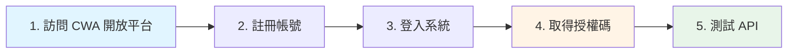
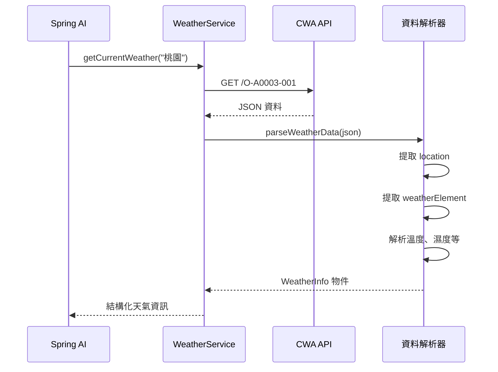
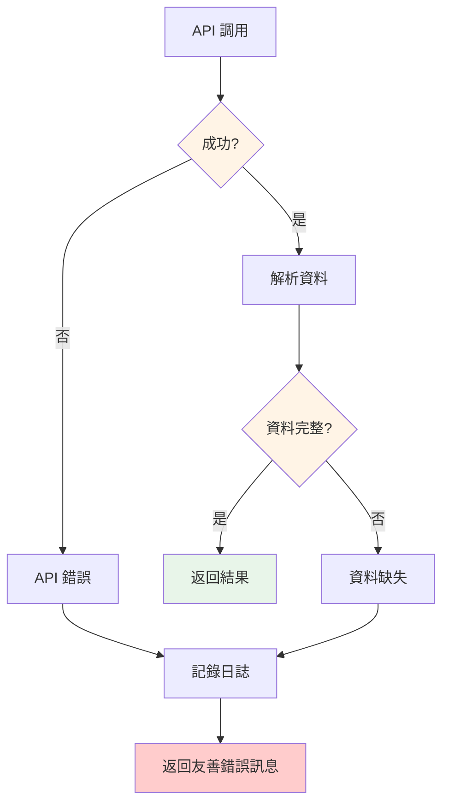

# 5.9 即時資料查詢 - 串接氣象 API

> **對應範例**: `chapter5-spring-ai-advanced`
> **難度**: ⭐⭐⭐☆☆

---

## 📚 本章概要

學習如何整合真實的第三方 API，讓 AI 能夠獲取即時資訊。透過中央氣象局 API 範例，你將掌握從 API 註冊、資料解析到工具整合的完整流程。

**學習目標**:
- 整合真實的第三方 API（中央氣象局）
- 掌握 JSON 資料解析技術
- 建立天氣查詢工具系統
- 處理 API 錯誤和異常情況

---

## 🎯 為什麼要整合真實 API?

### 模擬資料的問題

網路上許多教學使用模擬資料：

```java
// ❌ 模擬資料做法
@Tool(description = "Get weather information")
public String getWeather(String city) {
    // 返回固定的假資料
    return "台北今天晴天，溫度 25°C";
}
```

**問題**:
- 📅 資料永遠不變，無法反映真實情況
- 🎓 僅供學習，無法實際應用
- ❌ 無法體驗真實的 API 整合挑戰

### 真實 API 的價值

```java
// ✅ 真實 API 做法
@Tool(description = "Get current weather information from CWA")
public WeatherInfo getCurrentWeather(String location) {
    // 調用中央氣象局 API
    String url = baseUrl + "/O-A0003-001?Authorization=" + apiKey;
    JsonNode response = restTemplate.getForObject(url, JsonNode.class);

    // 解析真實資料
    return parseWeatherData(response, location);
}
```

**優勢**:
- ✅ 即時更新的真實資料
- ✅ 可實際應用於產品
- ✅ 學習完整的整合流程
- ✅ 處理真實世界的挑戰

---

## 🌤️ 中央氣象局 API 整合

### 1. 註冊和取得 API Key

**步驟流程**:



**詳細說明**:

1. **訪問開放平台**: [https://opendata.cwa.gov.tw/index](https://opendata.cwa.gov.tw/index)
2. **註冊帳號**: 完成會員註冊
3. **取得授權碼**: 會員資訊 → 取得授權碼
4. **選擇資料集**: 資料主題 → 觀測 → 現在天氣觀測報告
5. **測試 API**: 使用 Swagger 介面測試

### 2. API 資料結構

中央氣象局 API 回傳的 JSON 結構：

```json
{
  "records": {
    "location": [
      {
        "locationName": "桃園",
        "weatherElement": [
          {
            "elementName": "TEMP",
            "elementValue": "28.5"
          },
          {
            "elementName": "HUMD",
            "elementValue": "72"
          },
          {
            "elementName": "Weather",
            "elementValue": "多雲"
          }
        ]
      }
    ]
  }
}
```

### 3. 資料解析流程



---

## 💻 實戰：建立天氣查詢系統

### 1. 專案配置

**Maven 依賴**:

```xml
<dependencies>
    <!-- Spring AI OpenAI Starter -->
    <dependency>
        <groupId>org.springframework.ai</groupId>
        <artifactId>spring-ai-openai-spring-boot-starter</artifactId>
    </dependency>

    <!-- Spring Boot Web -->
    <dependency>
        <groupId>org.springframework.boot</groupId>
        <artifactId>spring-boot-starter-web</artifactId>
    </dependency>
</dependencies>
```

**應用程式配置**:

```yaml
# application.yml

spring:
  ai:
    openai:
      api-key: ${OPENAI_API_KEY}
      chat:
        options:
          model: gpt-4o-mini
          temperature: 0.1

# 中央氣象局 API 配置
cwa:
  api:
    key: ${CWA_API_KEY}  # 你的 API Key
    base-url: https://opendata.cwa.gov.tw/api/v1/rest/datastore

logging:
  level:
    com.example.weather: DEBUG
```

### 2. 天氣服務實現

簡化的天氣查詢服務：

```java
// 對應範例: chapter5-spring-ai-advanced/.../service/WeatherService.java:150

@Service
@RequiredArgsConstructor
@Slf4j
public class WeatherService {

    private final RestTemplate restTemplate;

    @Value("${cwa.api.key}")
    private String apiKey;

    @Value("${cwa.api.base-url}")
    private String baseUrl;

    /**
     * 取得指定地區的目前天氣資訊
     */
    @Tool(description = "Get current weather information for a specific location in Taiwan. " +
          "Supports major cities and counties like Taipei, Taoyuan, Taichung, Tainan, Kaohsiung, etc.")
    public WeatherInfo getCurrentWeather(String location) {
        try {
            log.info("查詢天氣資訊：{}", location);

            // 調用中央氣象局 API
            String url = baseUrl + "/O-A0003-001?Authorization=" + apiKey;
            JsonNode response = restTemplate.getForObject(url, JsonNode.class);

            if (response == null || !response.has("records")) {
                return WeatherInfo.error("無法取得天氣資料");
            }

            // 解析天氣資料
            JsonNode records = response.get("records");
            JsonNode locations = records.get("location");

            // 尋找指定地區的天氣資料
            for (JsonNode locationNode : locations) {
                String locationName = locationNode.get("locationName").asText();

                if (locationName.contains(location) || location.contains(locationName)) {
                    WeatherInfo result = parseWeatherData(locationNode, locationName);
                    log.info("成功取得 {} 的天氣資訊", locationName);
                    return result;
                }
            }

            return WeatherInfo.notFound("找不到 " + location + " 的天氣資料");

        } catch (Exception e) {
            log.error("取得天氣資料時發生錯誤: {}", e.getMessage(), e);
            return WeatherInfo.error("取得天氣資料失敗：" + e.getMessage());
        }
    }

    /**
     * 取得全台各地的溫度排行榜
     */
    @Tool(description = "Get temperature ranking for all locations in Taiwan. " +
          "Returns top N locations sorted by temperature.")
    public TemperatureRanking getTemperatureRanking(Integer topCount) {
        if (topCount == null || topCount <= 0) {
            topCount = 10;
        }

        try {
            log.info("查詢溫度排行榜：前 {} 名", topCount);

            String url = baseUrl + "/O-A0003-001?Authorization=" + apiKey;
            JsonNode response = restTemplate.getForObject(url, JsonNode.class);

            if (response == null || !response.has("records")) {
                return TemperatureRanking.error("無法取得天氣資料");
            }

            List<LocationTemperature> temperatures = new ArrayList<>();
            JsonNode locations = response.get("records").get("location");

            // 收集所有地點的溫度
            for (JsonNode locationNode : locations) {
                String locationName = locationNode.get("locationName").asText();
                JsonNode weatherElements = locationNode.get("weatherElement");

                Double temp = extractTemperature(weatherElements);
                if (temp != null) {
                    temperatures.add(new LocationTemperature(locationName, temp));
                }
            }

            // 按溫度排序並取前 N 名
            List<LocationTemperature> topTemperatures = temperatures.stream()
                    .sorted((a, b) -> Double.compare(b.temperature(), a.temperature()))
                    .limit(topCount)
                    .toList();

            log.info("成功取得溫度排行榜：{} 個地點", topTemperatures.size());

            return new TemperatureRanking(
                    topTemperatures,
                    true,
                    null,
                    LocalDateTime.now().format(DateTimeFormatter.ofPattern("yyyy-MM-dd HH:mm:ss"))
            );

        } catch (Exception e) {
            log.error("取得溫度排行時發生錯誤: {}", e.getMessage(), e);
            return TemperatureRanking.error("取得溫度排行失敗：" + e.getMessage());
        }
    }

    /**
     * 解析天氣資料
     */
    private WeatherInfo parseWeatherData(JsonNode locationNode, String locationName) {
        JsonNode weatherElements = locationNode.get("weatherElement");

        Double temperature = extractTemperature(weatherElements);
        Double humidity = extractHumidity(weatherElements);
        String weather = extractWeatherDescription(weatherElements);
        Double rainfall = extractRainfall(weatherElements);
        String windDirection = extractWindDirection(weatherElements);
        Double windSpeed = extractWindSpeed(weatherElements);

        return new WeatherInfo(
                locationName,
                temperature,
                humidity,
                weather,
                rainfall,
                windDirection,
                windSpeed,
                true,
                null,
                LocalDateTime.now().format(DateTimeFormatter.ofPattern("yyyy-MM-dd HH:mm:ss"))
        );
    }

    // 輔助方法：提取各種氣象資料
    private Double extractTemperature(JsonNode weatherElements) {
        return extractElementValue(weatherElements, "TEMP");
    }

    private Double extractHumidity(JsonNode weatherElements) {
        return extractElementValue(weatherElements, "HUMD");
    }

    private Double extractRainfall(JsonNode weatherElements) {
        return extractElementValue(weatherElements, "24R");
    }

    private Double extractWindSpeed(JsonNode weatherElements) {
        return extractElementValue(weatherElements, "WDSD");
    }

    private String extractWeatherDescription(JsonNode weatherElements) {
        JsonNode element = findWeatherElement(weatherElements, "Weather");
        if (element != null && element.has("elementValue")) {
            return element.get("elementValue").asText();
        }
        return null;
    }

    private String extractWindDirection(JsonNode weatherElements) {
        JsonNode element = findWeatherElement(weatherElements, "WDIR");
        if (element != null && element.has("elementValue")) {
            return element.get("elementValue").asText();
        }
        return null;
    }

    private Double extractElementValue(JsonNode weatherElements, String elementName) {
        JsonNode element = findWeatherElement(weatherElements, elementName);
        if (element != null && element.has("elementValue")) {
            try {
                return element.get("elementValue").asDouble();
            } catch (Exception e) {
                log.warn("無法解析 {} 的數值", elementName);
            }
        }
        return null;
    }

    private JsonNode findWeatherElement(JsonNode weatherElements, String elementName) {
        if (weatherElements != null && weatherElements.isArray()) {
            for (JsonNode element : weatherElements) {
                if (element.has("elementName") &&
                    elementName.equals(element.get("elementName").asText())) {
                    return element;
                }
            }
        }
        return null;
    }
}
```

### 3. 資料模型定義

```java
// 對應範例: chapter5-spring-ai-advanced/.../model/WeatherInfo.java

/**
 * 天氣資訊資料類別
 */
public record WeatherInfo(
        @JsonProperty("location") String location,
        @JsonProperty("temperature") Double temperature,
        @JsonProperty("humidity") Double humidity,
        @JsonProperty("weather") String weather,
        @JsonProperty("rainfall") Double rainfall,
        @JsonProperty("wind_direction") String windDirection,
        @JsonProperty("wind_speed") Double windSpeed,
        @JsonProperty("success") boolean success,
        @JsonProperty("error") String error,
        @JsonProperty("observation_time") String observationTime
) {
    public static WeatherInfo error(String message) {
        return new WeatherInfo(null, null, null, null, null, null, null,
                false, message, null);
    }

    public static WeatherInfo notFound(String message) {
        return new WeatherInfo(null, null, null, null, null, null, null,
                false, message, null);
    }
}

/**
 * 溫度排行資料
 */
public record TemperatureRanking(
        List<LocationTemperature> rankings,
        boolean success,
        String error,
        String updateTime
) {
    public static TemperatureRanking error(String message) {
        return new TemperatureRanking(List.of(), false, message, null);
    }
}

public record LocationTemperature(
        String location,
        Double temperature
) {}
```

---

## 🎮 控制器實現

```java
// 對應範例: chapter5-spring-ai-advanced/.../controller/WeatherController.java:486

@RestController
@RequestMapping("/api/weather")
@RequiredArgsConstructor
@Slf4j
public class WeatherController {

    private final ChatClient chatClient;
    private final WeatherService weatherService;

    /**
     * AI 天氣查詢
     */
    @GetMapping("/chat")
    public ResponseEntity<WeatherChatResponse> chatWeather(@RequestParam String question) {
        try {
            log.info("收到天氣查詢：{}", question);

            String response = chatClient
                    .prompt(question)
                    .tools(weatherService)
                    .call()
                    .content();

            WeatherChatResponse chatResponse = new WeatherChatResponse(
                    question,
                    response,
                    true,
                    null,
                    System.currentTimeMillis()
            );

            return ResponseEntity.ok(chatResponse);

        } catch (Exception e) {
            log.error("天氣查詢失敗: {}", e.getMessage(), e);

            WeatherChatResponse errorResponse = new WeatherChatResponse(
                    question,
                    null,
                    false,
                    "天氣查詢失敗：" + e.getMessage(),
                    System.currentTimeMillis()
            );

            return ResponseEntity.status(HttpStatus.INTERNAL_SERVER_ERROR)
                    .body(errorResponse);
        }
    }

    /**
     * 直接取得天氣資訊
     */
    @GetMapping("/current")
    public ResponseEntity<WeatherInfo> getCurrentWeather(@RequestParam String location) {
        WeatherInfo weatherInfo = weatherService.getCurrentWeather(location);

        if (weatherInfo.success()) {
            return ResponseEntity.ok(weatherInfo);
        } else {
            return ResponseEntity.status(HttpStatus.NOT_FOUND).body(weatherInfo);
        }
    }

    /**
     * 取得溫度排行榜
     */
    @GetMapping("/temperature-ranking")
    public ResponseEntity<TemperatureRanking> getTemperatureRanking(
            @RequestParam(defaultValue = "10") Integer topCount) {

        TemperatureRanking ranking = weatherService.getTemperatureRanking(topCount);
        return ResponseEntity.ok(ranking);
    }

    public record WeatherChatResponse(
            String question,
            String answer,
            boolean success,
            String error,
            long timestamp
    ) {}
}
```

---

## 🧪 測試應用

### API 測試範例

```bash
# 1. 基本天氣查詢（自然語言）
curl "http://localhost:8080/api/weather/chat?question=桃園目前天氣如何？"

# 2. 溫度排行查詢
curl "http://localhost:8080/api/weather/chat?question=全台最高溫的前三名是哪些地方？"

# 3. 直接 API 調用
curl "http://localhost:8080/api/weather/current?location=台北"

# 4. 溫度排行榜
curl "http://localhost:8080/api/weather/temperature-ranking?topCount=5"
```

### 回應範例

**天氣查詢回應**:

```json
{
  "question": "桃園目前天氣如何？",
  "answer": "📍 地點：桃園\n🌡️ 溫度：28.5°C\n💧 濕度：72%\n☁️ 天氣：多雲\n🌧️ 降雨量：0.0mm\n💨 風向：東南風\n🌪️ 風速：2.3m/s\n⏰ 觀測時間：2025-01-29 14:30",
  "success": true,
  "error": null,
  "timestamp": 1706518200000
}
```

### AI 智能建議範例

```
用戶：「明天要去台中，需要帶雨具嗎？」

AI 回應：
🌦️ **台中天氣建議**

📅 **目前天氣**
🌡️ 溫度：25°C
☁️ 天氣：晴時多雲
💧 濕度：65%
💨 風力：微風

☂️ **攜帶建議**
✅ 建議攜帶輕便雨具
- 雖然目前天氣穩定，但午後可能有局部陣雨
- 可準備摺疊傘以備不時之需
- 穿著輕薄透氣的衣物即可

🎯 **出行建議**
- 適合戶外活動
- 注意防曬
- 多補充水分
```

---

## 🔧 錯誤處理策略

### 常見錯誤和處理



### 錯誤處理最佳實踐

1. **API 調用失敗**
   - 記錄詳細錯誤日誌
   - 返回友善的錯誤訊息給用戶
   - 不暴露內部錯誤細節

2. **資料缺失**
   - 優雅降級（返回部分資料）
   - 標記缺失的欄位
   - 提供替代方案

3. **網路超時**
   - 設定合理的超時時間
   - 實現重試機制
   - 提供快取備援

---

## 📝 重點回顧

### 核心概念

✅ **API 整合流程** - 從註冊到調用的完整流程
✅ **JSON 資料解析** - 處理複雜的巢狀結構
✅ **工具整合** - 將 API 整合到 Spring AI 工具系統
✅ **錯誤處理** - 處理各種異常情況

### 關鍵技術點

| 技術點 | 重要性 | 難度 | 說明 |
|--------|--------|------|------|
| **API Key 管理** | ⭐⭐⭐ | 低 | 使用環境變數保護敏感資訊 |
| **JSON 解析** | ⭐⭐⭐ | 中 | Jackson JsonNode 處理 |
| **@Tool 註解** | ⭐⭐⭐ | 低 | 將服務方法轉為 AI 工具 |
| **錯誤處理** | ⭐⭐ | 中 | 優雅的異常處理 |

### 最佳實踐

**1. API 安全管理**
- 🔑 使用環境變數儲存 API Key
- 🚫 不要將 API Key 提交到版本控制
- 📊 監控 API 使用量和配額

**2. 資料處理優化**
- 🎯 精確解析 JSON 結構
- 🛡️ 防禦性編程（處理 null 和異常）
- 📏 統一單位（溫度、風速等）

**3. AI 工具設計**
- 💬 清晰的工具描述（@Tool description）
- 📊 結構化的回應格式
- 🎨 使用表情符號增強可讀性
- 💡 提供智能建議

---

## 🚀 下一步

完成本節後，您已經掌握了 API 整合的實戰技巧。接下來需要學習結構化資料處理：

**結構化資料輸出與轉換**
- 學習使用 BeanOutputConverter 將 AI 輸出轉換為 Java 物件
- 掌握定義輸出資料結構和驗證規則
- 理解如何處理 AI 輸出的解析錯誤和異常
- 學習實作複雜的資料萃取和轉換任務
- 掌握結構化輸出在表單填寫、資料分析等場景的應用

**邁向 AI 記憶系統**
- 理解 AI 記憶系統的核心概念和架構設計
- 學習 ChatMemory 短期記憶的實作方式
- 掌握對話歷史的儲存和管理策略
- 理解如何實現上下文感知的智能對話
- 學習 Advisor 機制，為記憶系統奠定基礎

完成這些學習後，您將準備好進入第六章，學習如何讓 AI 擁有記憶能力，建立真正智能的對話系統。

---

**參考資料**:
- [中央氣象局開放資料平台](https://opendata.cwa.gov.tw/index)
- [Spring AI Tool Calling 文件](https://docs.spring.io/spring-ai/reference/api/tools.html)
- [Jackson JSON 處理](https://github.com/FasterXML/jackson)
