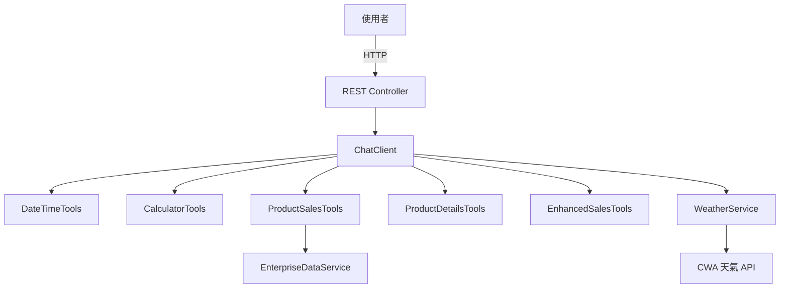
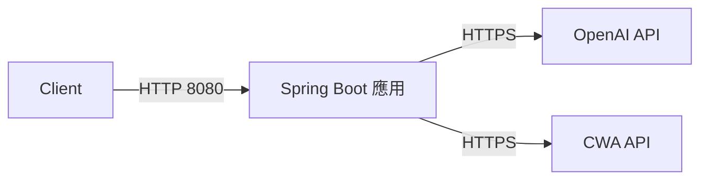
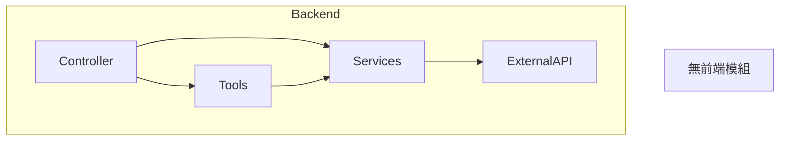
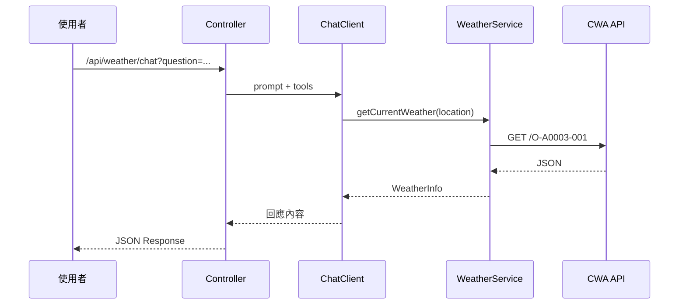
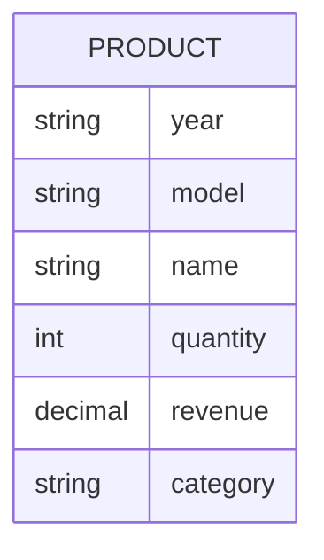
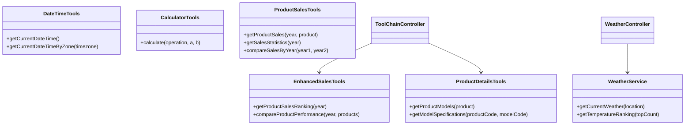
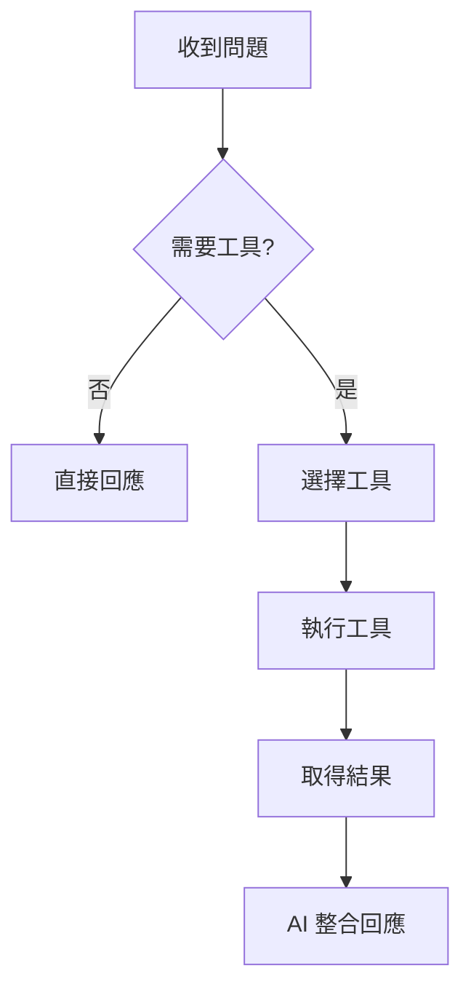
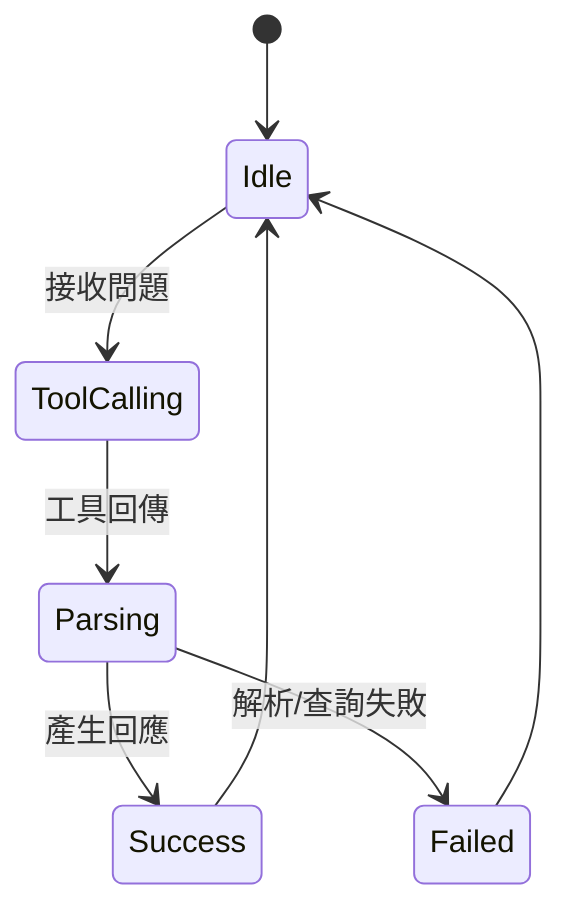

# 規格文件（spec.md）

> 專案：spring-ai-toolcalling（第 5 章 Tool Calling 範例）
> 日期：2026-01-29
> 狀態：已確認

---

## 1. 架構與選型

- 後端框架：Spring Boot 3.3.x
- AI 能力：Spring AI 1.0.3（OpenAI 模型，支援 Tool Calling）
- HTTP 服務：spring-boot-starter-web
- HTTP 客戶端：RestTemplate（呼叫中央氣象局 API）
- 資料處理：Jackson（JsonNode 解析）
- 執行環境：Java 21（JDK 路徑：D:\java\jdk-21）

**選型理由**：
- Spring AI 已內建 Tool Calling 流程與 ChatClient API
- Spring Boot Web 適合快速建置 REST API
- RestTemplate 足以滿足單一氣象 API 的同步查詢需求

---

## 2. 資料模型

- `AssistantRequest`：使用者輸入（message）
- `AssistantResponse`：智能助手回應（question、answer、success、executionTime、timestamp）
- `Product`：產品銷售資料（year、model、name、quantity、revenue、category）
- `ProductSalesResponse`：產品銷售查詢結果（products、totalQuantity、totalRevenue、queryYear、queryProduct）
- `SalesStatistics`：年度統計（topProducts、categoryStats）
- `CategoryStat`：分類統計（category、quantity、revenue、percentage）
- `ProductDetail`：產品詳情（product、productName、models、category、description）
- `ProductModel`：產品型號規格（modelCode、modelName、specifications、price、availability）
- `SalesRanking`：年度排行（topProducts、bestSeller、totalVolume、totalRevenue、analysisYear）
- `WeatherInfo`：天氣資訊（location、temperature、humidity、weather、rainfall、windDirection、windSpeed、success、error、observationTime）
- `TemperatureRanking`：溫度排行（rankings、success、error、updateTime）
- `LocationTemperature`：地點溫度（location、temperature）

---

## 3. 關鍵流程

1. **基礎 Tool Calling**：使用者輸入 → ChatClient → 工具調用（時間/計算）→ AI 回應
2. **企業資料查詢**：使用者輸入 → ProductSalesTools → EnterpriseDataService → 統計分析 → AI 回應
3. **工具鏈**：使用者輸入 → EnhancedSalesTools → ProductDetailsTools → AI 整合 → 回應
4. **即時天氣**：使用者輸入 → WeatherService → CWA API → JSON 解析 → AI 回應

---

## 4. 虛擬碼

```text
if (question 需要時間) {
  使用 DateTimeTools 取得時間
}
if (question 需要計算) {
  使用 CalculatorTools 計算
}
if (question 需要銷售資料) {
  使用 ProductSalesTools 查詢統計
}
if (question 需要產品詳情) {
  使用 ProductDetailsTools 取得型號與規格
}
if (question 需要天氣) {
  呼叫 CWA API 並解析回傳 JSON
}
return AI 整合後的回應
```

---

## 5. 系統脈絡圖



---

## 6. 容器/部署概觀



---

## 7. 模組關係圖（Backend / Frontend）



---

## 8. 序列圖



---

## 9. ER 圖



---

## 10. 類別圖（後端關鍵類別）



---

## 11. 流程圖



---

## 12. 狀態圖



---

## 確認事項

1. 僅後端 REST 範例（不含前端）
2. 企業資料採記憶體模擬（不接資料庫）
3. 氣象 API 固定使用中央氣象局（CWA）
