# Chapter 7.1-7.2: RAG 基礎系統實現 - 專案規格書

## 專案概述

### 專案名稱
**chapter7-rag-basic** - Spring AI RAG 基礎系統

### 專案目標
實現一個完整的 RAG (Retrieval-Augmented Generation) 基礎系統，涵蓋：
- RAG 系統核心架構與流程
- 文本向量化處理
- 向量資料庫整合
- 基礎文檔檢索與生成

### 適用章節
- 7.1 RAG 流程詳解
- 7.2 如何將內容向量化

---

## 1. 架構與選型

### 1.1 系統架構

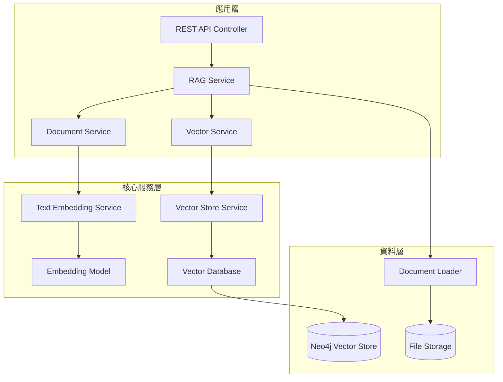

### 1.2 技術選型

| 組件 | 技術 | 版本 | 說明 |
|------|------|------|------|
| **基礎框架** | Spring Boot | 3.5.7 | 應用框架 |
| **AI 框架** | Spring AI | 1.0.3 | AI 整合框架 |
| **LLM** | OpenAI GPT-4 | gpt-4o | 語言模型 |
| **Embedding** | OpenAI Embeddings | text-embedding-3-small | 向量化模型 |
| **Vector DB** | Neo4j | 5.x | 向量資料庫 |
| **Build Tool** | Maven | 3.9+ | 構建工具 |
| **Java** | JDK | 21 | 開發語言 |

### 1.3 Spring AI 組件使用

| Spring AI 組件 | 用途 | 實現方式 |
|---------------|------|----------|
| **ChatClient** | RAG 對話管理 | ChatClient.builder(chatModel).defaultAdvisors(questionAnswerAdvisor).build() |
| **QuestionAnswerAdvisor** | RAG 檢索增強 | 自動檢索文檔並組裝上下文 |
| **EmbeddingModel** | 文本向量化 | OpenAiEmbeddingModel |
| **VectorStore** | 向量存儲管理 | Neo4jVectorStore |
| **Document** | 文檔模型 | Spring AI Document 模型 |
| **SearchRequest** | 檢索請求 | 向量相似性搜尋 |

---

## 2. 資料模型

### 2.1 核心實體

#### Document (Spring AI 標準模型)
```java
public class Document {
    private String id;                      // 文檔唯一ID
    private String content;                 // 文檔內容
    private Map<String, Object> metadata;   // 元資料
    private float[] embedding;              // 向量嵌入(自動管理)
}
```

#### RAG 查詢請求
```java
@Data
@Builder
public class RAGQueryRequest {
    private String question;                // 用戶問題
    private int topK = 5;                   // 檢索文檔數量
    private double similarityThreshold = 0.7; // 相似度閾值
    private Map<String, Object> filters;    // 過濾條件
}
```

#### RAG 查詢響應
```java
@Data
@Builder
public class RAGQueryResponse {
    private String question;                // 原始問題
    private String answer;                  // 生成答案
    private List<DocumentSource> sources;   // 引用來源
    private long processingTimeMs;          // 處理時間
    private LocalDateTime timestamp;        // 時間戳
}
```

#### 文檔來源
```java
@Data
@Builder
public class DocumentSource {
    private String documentId;              // 文檔ID
    private String title;                   // 文檔標題
    private String excerpt;                 // 摘錄內容
    private double relevanceScore;          // 相關性分數
    private Map<String, Object> metadata;   // 元資料
}
```

### 2.2 向量化配置

#### Embedding 配置模型
```java
@Data
@Builder
public class EmbeddingConfig {
    private String provider = "openai";     // 提供商
    private String modelName = "text-embedding-3-small";  // 模型名稱
    private int dimensions = 1536;          // 向量維度
    private Duration timeout = Duration.ofSeconds(30);    // 超時時間
}
```

### 2.3 元資料結構

| 欄位名稱 | 類型 | 說明 | 範例 |
|---------|------|------|------|
| `source_file` | String | 來源文件名 | "product_manual.pdf" |
| `document_type` | String | 文檔類型 | "PDF", "TEXT", "MARKDOWN" |
| `created_at` | String | 創建時間 | "2024-01-15T10:30:00" |
| `author` | String | 作者 | "John Doe" |
| `category` | String | 分類 | "技術文檔", "產品說明" |
| `language` | String | 語言 | "zh-TW", "en" |
| `page_number` | Integer | 頁碼 | 1 |
| `chunk_index` | Integer | 分塊索引 | 0 |

---

## 3. 關鍵流程

### 3.1 RAG 完整流程

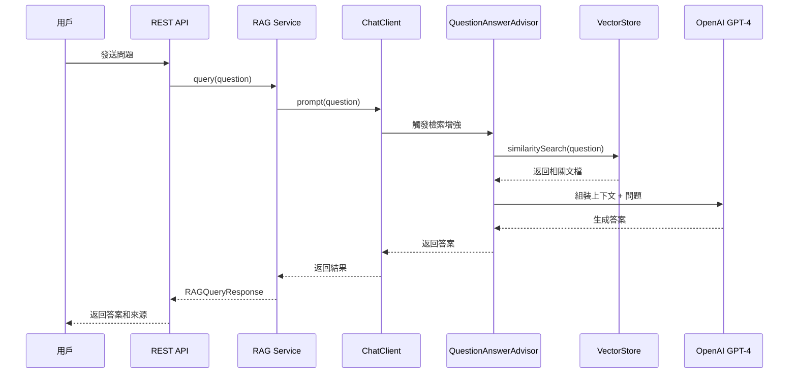

### 3.2 文檔上傳與向量化流程

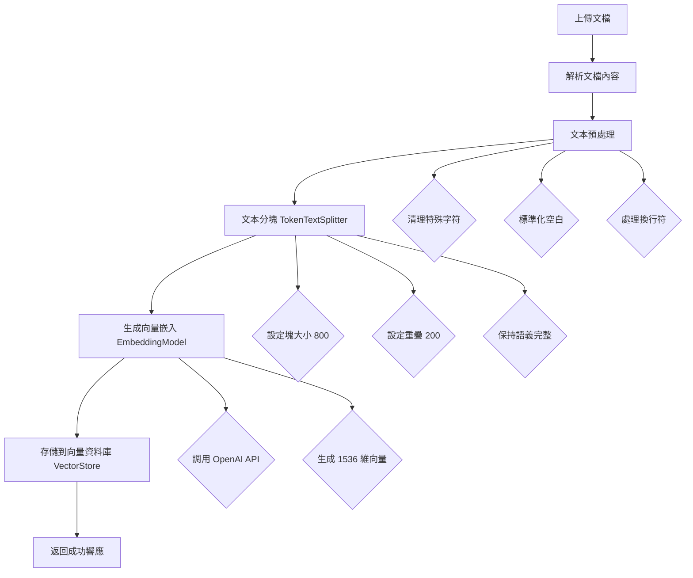

### 3.3 向量相似性搜尋流程

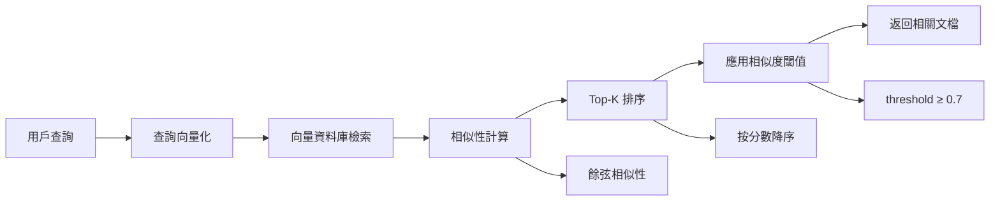

---

## 4. 虛擬碼

### 4.1 RAG 服務核心實現

```java
/**
 * RAG 服務實現 - 使用 Spring AI QuestionAnswerAdvisor
 */
@Service
@RequiredArgsConstructor
@Slf4j
public class RAGService {

    private final ChatClient ragChatClient;
    private final VectorStore vectorStore;
    private final DocumentProcessingService documentProcessor;

    /**
     * RAG 查詢 - Spring AI 自動處理檢索增強
     */
    public RAGQueryResponse query(RAGQueryRequest request) {
        log.info("Processing RAG query: {}", request.getQuestion());

        long startTime = System.currentTimeMillis();

        try {
            // Spring AI QuestionAnswerAdvisor 會自動：
            // 1. 向量化問題
            // 2. 檢索相關文檔
            // 3. 組裝上下文
            // 4. 調用 LLM 生成答案
            String answer = ragChatClient.prompt()
                .user(request.getQuestion())
                .call()
                .content();

            long processingTime = System.currentTimeMillis() - startTime;

            return RAGQueryResponse.builder()
                .question(request.getQuestion())
                .answer(answer)
                .processingTimeMs(processingTime)
                .timestamp(LocalDateTime.now())
                .build();

        } catch (Exception e) {
            log.error("RAG query failed", e);
            throw new RAGException("RAG 查詢失敗", e);
        }
    }

    /**
     * 帶過濾條件的 RAG 查詢
     */
    public RAGQueryResponse queryWithFilter(RAGQueryRequest request) {
        String filterExpression = buildFilterExpression(request.getFilters());

        String answer = ragChatClient.prompt()
            .user(request.getQuestion())
            .advisors(a -> a.param(QuestionAnswerAdvisor.FILTER_EXPRESSION, filterExpression))
            .call()
            .content();

        return RAGQueryResponse.builder()
            .question(request.getQuestion())
            .answer(answer)
            .timestamp(LocalDateTime.now())
            .build();
    }

    /**
     * 添加文檔到知識庫
     */
    public void addDocuments(List<Resource> resources) {
        log.info("Adding {} documents to knowledge base", resources.size());

        List<Document> documents = new ArrayList<>();

        for (Resource resource : resources) {
            try {
                // 處理文檔
                List<Document> processedDocs = documentProcessor.process(resource);
                documents.addAll(processedDocs);

            } catch (Exception e) {
                log.error("Failed to process document: {}", resource.getFilename(), e);
            }
        }

        // 寫入向量資料庫（自動生成嵌入向量）
        vectorStore.write(documents);

        log.info("Successfully added {} document chunks", documents.size());
    }

    private String buildFilterExpression(Map<String, Object> filters) {
        if (filters == null || filters.isEmpty()) {
            return null;
        }

        // 構建過濾表達式
        List<String> conditions = filters.entrySet().stream()
            .map(entry -> String.format("metadata['%s'] == '%s'", entry.getKey(), entry.getValue()))
            .collect(Collectors.toList());

        return String.join(" && ", conditions);
    }
}
```

### 4.2 文本向量化服務

```java
/**
 * 文本向量化服務 - 使用 Spring AI EmbeddingModel
 */
@Service
@RequiredArgsConstructor
@Slf4j
public class TextEmbeddingService {

    private final EmbeddingModel embeddingModel;
    private final MeterRegistry meterRegistry;

    /**
     * 單一文本向量化
     */
    public float[] embedText(String text) {
        Timer.Sample sample = Timer.start(meterRegistry);

        try {
            // 預處理文本
            String processedText = preprocessText(text);

            // 使用 Spring AI EmbeddingModel 生成向量
            float[] embedding = embeddingModel.embed(processedText);

            sample.stop(Timer.builder("embedding.generation.time")
                .register(meterRegistry));

            meterRegistry.counter("embedding.generation.count").increment();

            return embedding;

        } catch (Exception e) {
            meterRegistry.counter("embedding.generation.errors").increment();
            log.error("Failed to generate embedding", e);
            throw new EmbeddingException("向量化失敗", e);
        }
    }

    /**
     * 批次文本向量化
     */
    public List<float[]> embedTexts(List<String> texts) {
        log.info("Generating embeddings for {} texts", texts.size());

        try {
            // 預處理所有文本
            List<String> processedTexts = texts.stream()
                .map(this::preprocessText)
                .collect(Collectors.toList());

            // 批次生成向量
            return embeddingModel.embed(processedTexts);

        } catch (Exception e) {
            log.error("Failed to generate batch embeddings", e);
            throw new EmbeddingException("批次向量化失敗", e);
        }
    }

    /**
     * 文本預處理
     */
    private String preprocessText(String text) {
        return text
            .trim()
            .replaceAll("\\s+", " ")
            .replaceAll("[\\r\\n]+", " ")
            .substring(0, Math.min(text.length(), 8000));
    }

    /**
     * 計算向量相似性
     */
    public double calculateSimilarity(float[] vector1, float[] vector2) {
        // 餘弦相似性計算
        double dotProduct = 0.0;
        double norm1 = 0.0;
        double norm2 = 0.0;

        for (int i = 0; i < vector1.length; i++) {
            dotProduct += vector1[i] * vector2[i];
            norm1 += Math.pow(vector1[i], 2);
            norm2 += Math.pow(vector2[i], 2);
        }

        return dotProduct / (Math.sqrt(norm1) * Math.sqrt(norm2));
    }
}
```

### 4.3 文檔處理服務

```java
/**
 * 文檔處理服務 - 使用 Spring AI TokenTextSplitter
 */
@Service
@RequiredArgsConstructor
@Slf4j
public class DocumentProcessingService {

    private final TokenTextSplitter textSplitter;

    public DocumentProcessingService() {
        // 配置文本分割器
        this.textSplitter = new TokenTextSplitter(
            800,    // defaultChunkSize
            200,    // minChunkSizeChars
            10,     // minChunkLengthToEmbed
            10000,  // maxNumChunks
            true    // keepSeparator
        );
    }

    /**
     * 處理單個文檔
     */
    public List<Document> process(Resource resource) {
        try {
            // 1. 讀取文檔內容
            DocumentReader reader = createDocumentReader(resource);
            List<Document> documents = reader.read();

            // 2. 文本分割
            List<Document> chunks = textSplitter.apply(documents);

            // 3. 添加元資料
            chunks.forEach(doc -> enrichMetadata(doc, resource));

            return chunks;

        } catch (Exception e) {
            log.error("Failed to process document", e);
            throw new DocumentProcessingException("文檔處理失敗", e);
        }
    }

    private DocumentReader createDocumentReader(Resource resource) {
        String filename = resource.getFilename();

        if (filename.endsWith(".pdf")) {
            return new PagePdfDocumentReader(resource);
        } else if (filename.endsWith(".txt")) {
            return new TextReader(resource);
        } else if (filename.endsWith(".md")) {
            return new MarkdownDocumentReader(resource);
        }

        throw new UnsupportedOperationException("不支援的文件格式: " + filename);
    }

    private void enrichMetadata(Document document, Resource resource) {
        Map<String, Object> metadata = document.getMetadata();
        metadata.put("source_file", resource.getFilename());
        metadata.put("processed_at", LocalDateTime.now().toString());
        metadata.put("document_type", getDocumentType(resource.getFilename()));
    }
}
```

### 4.4 RAG 配置類

```java
/**
 * RAG 系統配置 - 使用 Spring AI 組件
 */
@Configuration
@EnableConfigurationProperties(RAGProperties.class)
public class RAGConfig {

    /**
     * 配置 Neo4j 向量資料庫
     */
    @Bean
    public VectorStore vectorStore(
            EmbeddingModel embeddingModel,
            Neo4jClient neo4jClient) {

        return Neo4jVectorStore.builder()
            .neo4jClient(neo4jClient)
            .embeddingModel(embeddingModel)
            .indexName("document-embeddings")
            .embeddingProperty("embedding")
            .build();
    }

    /**
     * 配置 QuestionAnswerAdvisor
     */
    @Bean
    public QuestionAnswerAdvisor questionAnswerAdvisor(
            VectorStore vectorStore,
            RAGProperties properties) {

        return QuestionAnswerAdvisor.builder(vectorStore)
            .searchRequest(SearchRequest.builder()
                .topK(properties.getTopK())
                .similarityThreshold(properties.getSimilarityThreshold())
                .build())
            .build();
    }

    /**
     * 配置 RAG ChatClient
     */
    @Bean
    public ChatClient ragChatClient(
            ChatModel chatModel,
            QuestionAnswerAdvisor questionAnswerAdvisor) {

        return ChatClient.builder(chatModel)
            .defaultAdvisors(questionAnswerAdvisor)
            .build();
    }

    /**
     * 配置 OpenAI Embedding Model
     */
    @Bean
    public EmbeddingModel embeddingModel() {
        OpenAiApi openAiApi = OpenAiApi.builder()
            .apiKey(System.getenv("OPENAI_API_KEY"))
            .build();

        return new OpenAiEmbeddingModel(
            openAiApi,
            MetadataMode.EMBED,
            OpenAiEmbeddingOptions.builder()
                .withModel("text-embedding-3-small")
                .withDimensions(1536)
                .build(),
            RetryUtils.DEFAULT_RETRY_TEMPLATE
        );
    }
}
```

---

## 5. 系統脈絡圖 (C4 Model)

### 5.1 系統上下文圖 (Level 1)

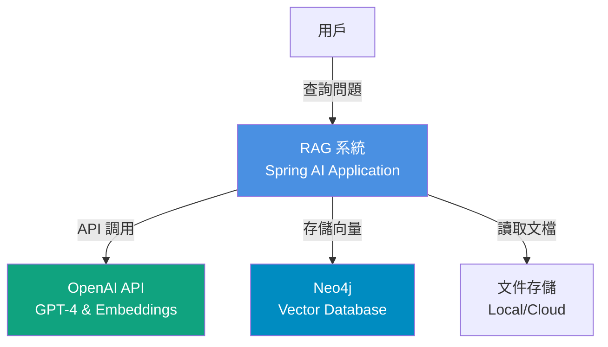

### 5.2 容器圖 (Level 2)

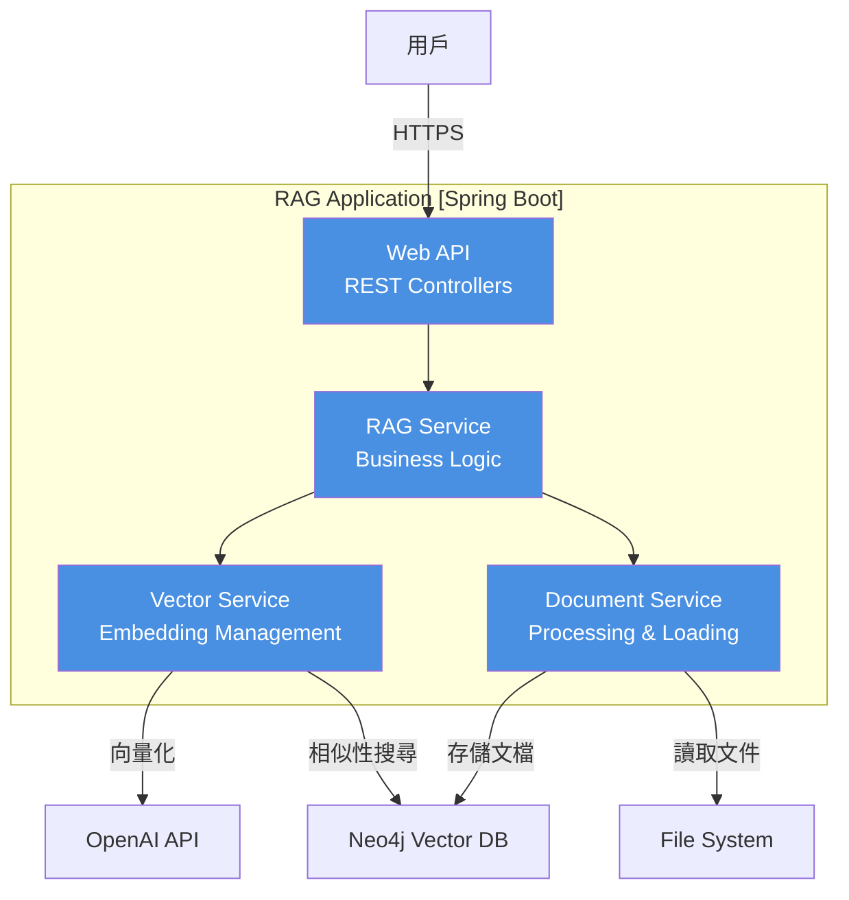

### 5.3 組件圖 (Level 3)

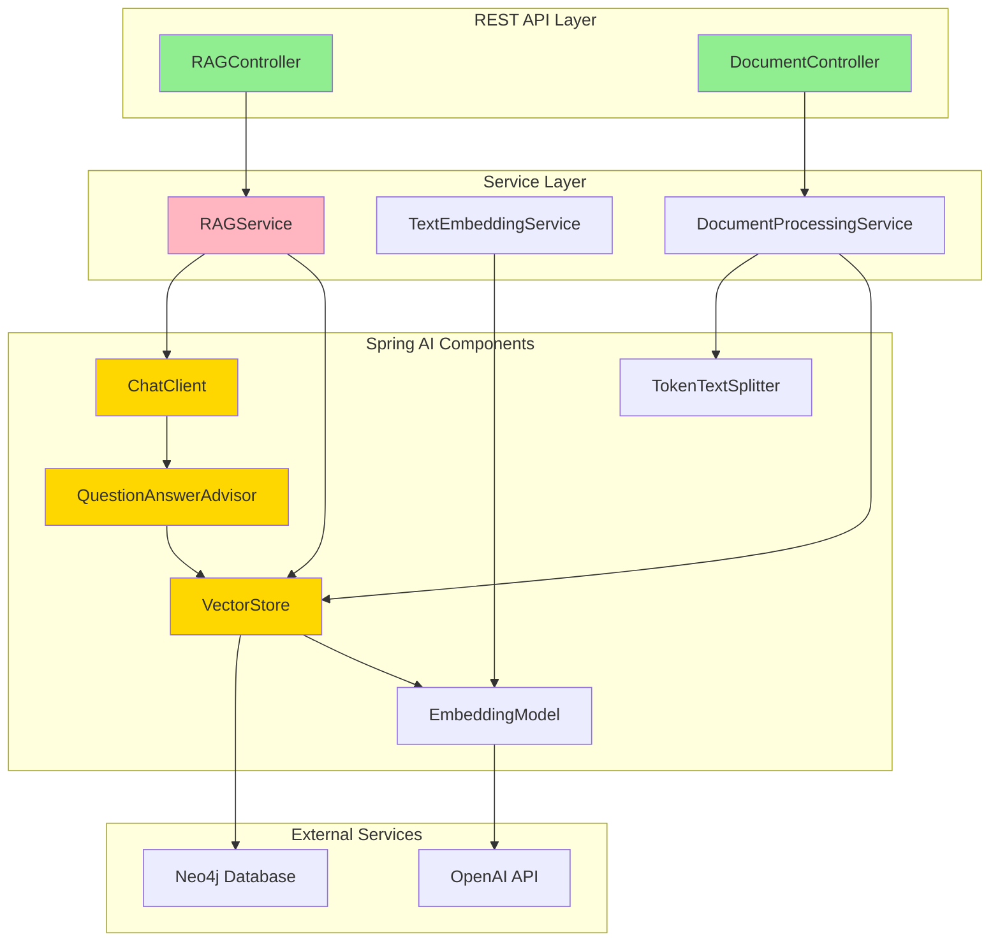

---

## 6. 模組關係圖

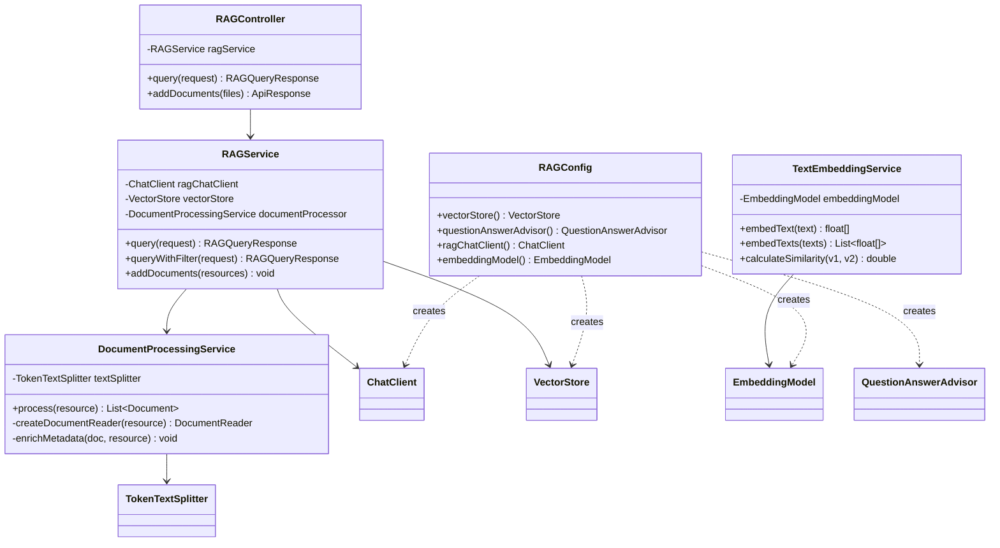

---

## 7. 序列圖

### 7.1 RAG 查詢序列圖

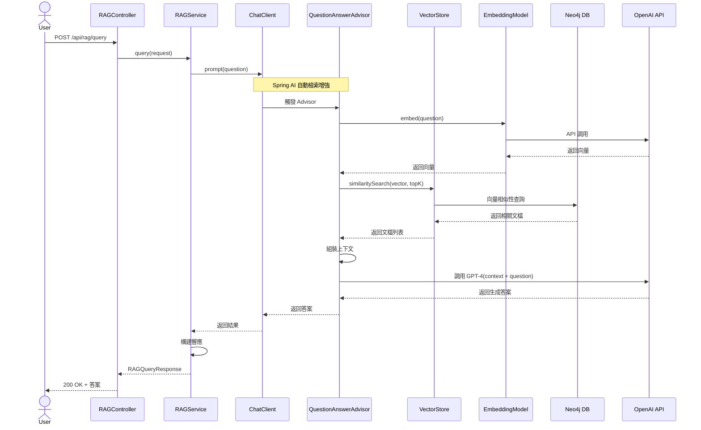

### 7.2 文檔上傳與向量化序列圖

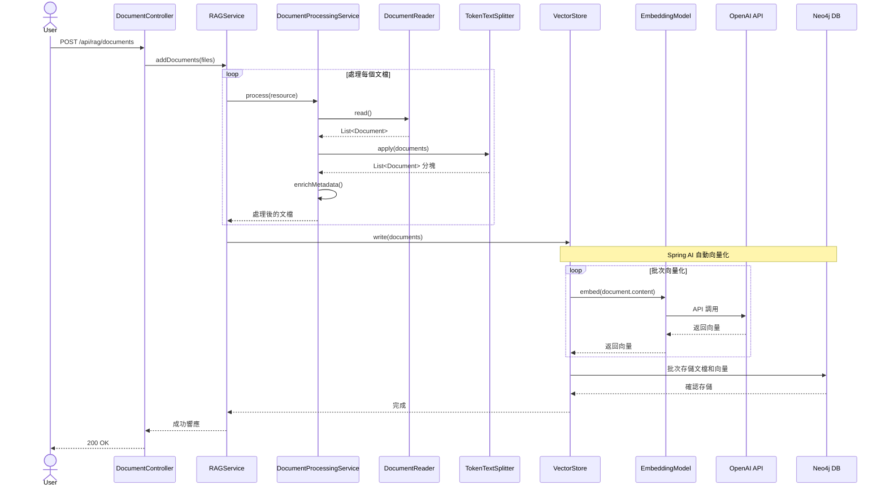

---

## 8. 類別圖

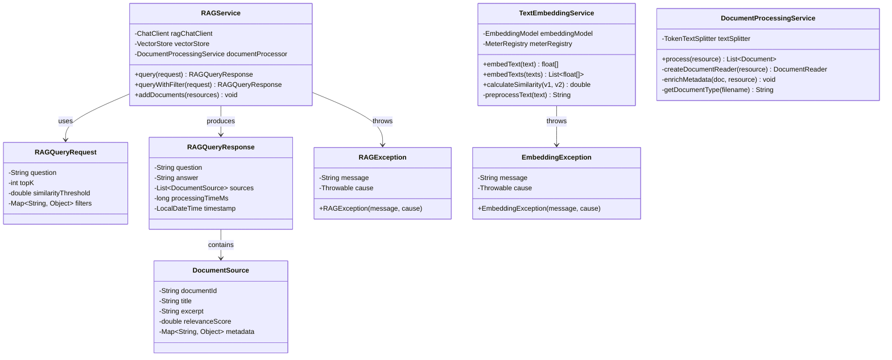

---

## 9. 流程圖

### 9.1 RAG 查詢主流程

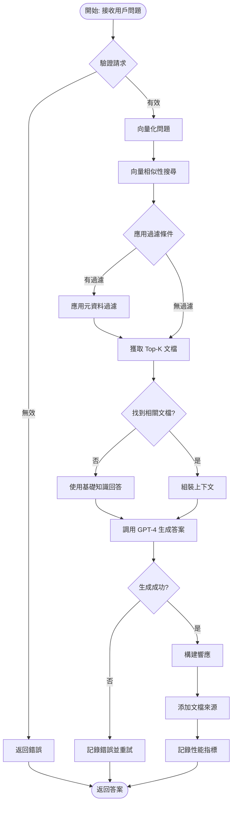

### 9.2 文檔處理流程

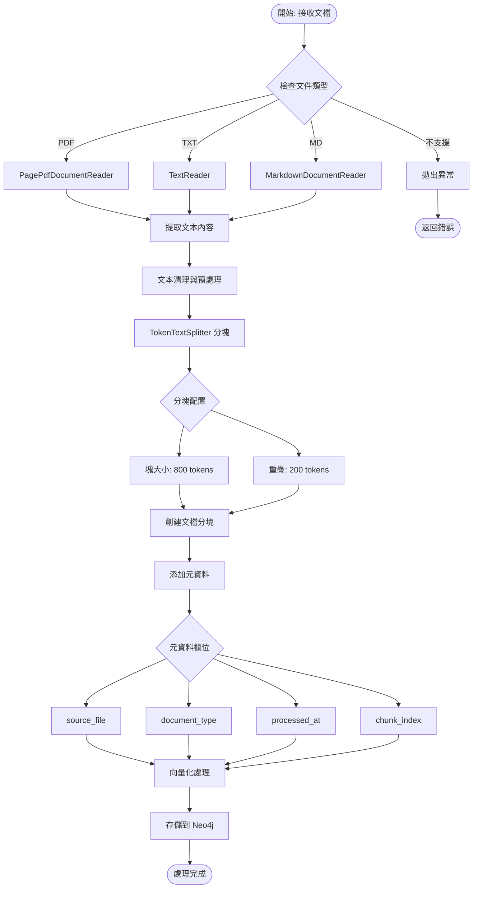

### 9.3 向量化處理流程

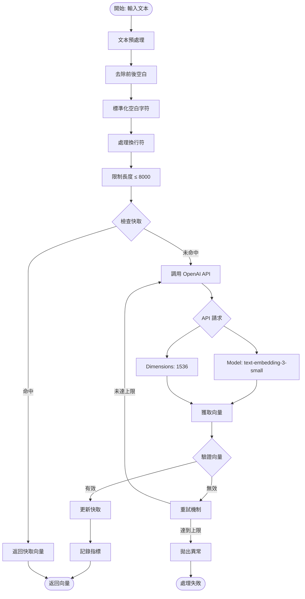

---

## 10. 狀態圖

### 10.1 文檔處理狀態

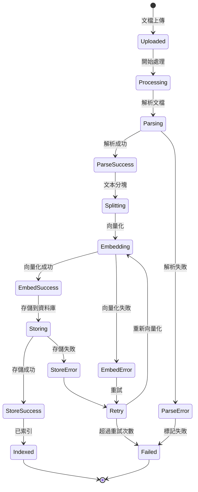

### 10.2 RAG 查詢狀態

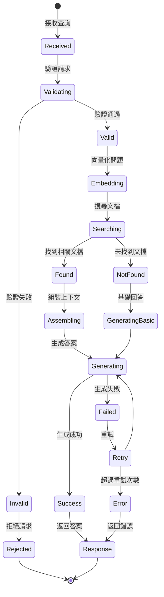

---

## 11. 部署架構

### 11.1 開發環境部署

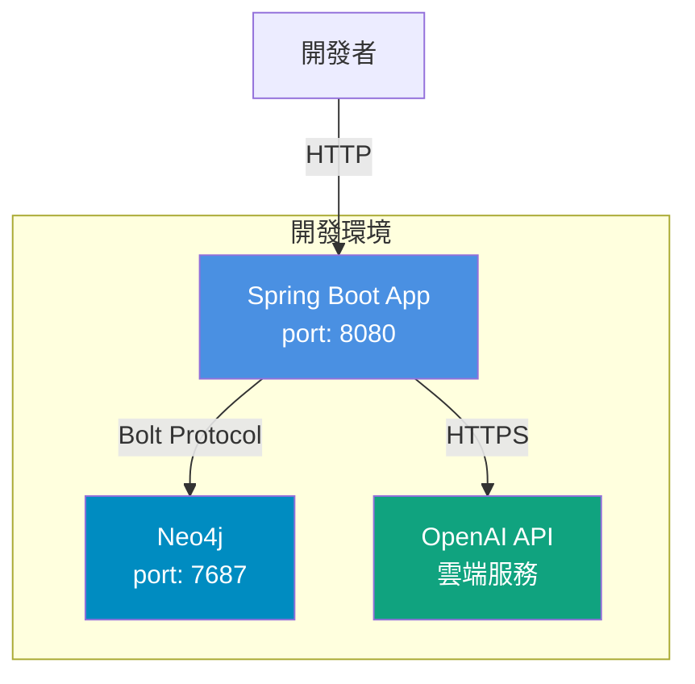

### 11.2 配置檔案結構

```yaml
# application.yml
spring:
  application:
    name: chapter7-rag-basic
  ai:
    openai:
      api-key: ${OPENAI_API_KEY}
      chat:
        model: gpt-4o
      embedding:
        model: text-embedding-3-small
        dimensions: 1536

    neo4j:
      uri: ${NEO4J_URI:bolt://localhost:7687}
      username: ${NEO4J_USERNAME:neo4j}
      password: ${NEO4J_PASSWORD}
      database: ${NEO4J_DATABASE:neo4j}

# RAG 配置
app:
  rag:
    top-k: 5
    similarity-threshold: 0.7
    chunk-size: 800
    chunk-overlap: 200

# 監控配置
management:
  endpoints:
    web:
      exposure:
        include: health,metrics,prometheus
  metrics:
    export:
      prometheus:
        enabled: true
```

---

## 12. API 文檔

### 12.1 RAG 查詢 API

**端點**: `POST /api/rag/query`

**請求體**:
```json
{
  "question": "Spring Boot 如何配置資料庫連接?",
  "topK": 5,
  "similarityThreshold": 0.7,
  "filters": {
    "category": "技術文檔",
    "language": "zh-TW"
  }
}
```

**響應**:
```json
{
  "question": "Spring Boot 如何配置資料庫連接?",
  "answer": "在 Spring Boot 中配置資料庫連接主要有以下幾種方式...",
  "sources": [
    {
      "documentId": "doc-001",
      "title": "Spring Boot 資料庫配置指南",
      "excerpt": "Spring Boot 提供了自動配置功能...",
      "relevanceScore": 0.92,
      "metadata": {
        "source_file": "spring-boot-guide.pdf",
        "page_number": 15
      }
    }
  ],
  "processingTimeMs": 1250,
  "timestamp": "2024-01-15T10:30:00"
}
```

### 12.2 文檔上傳 API

**端點**: `POST /api/rag/documents`

**請求**: `multipart/form-data`

**響應**:
```json
{
  "success": true,
  "message": "成功添加 3 個文檔到知識庫",
  "documentsProcessed": 3,
  "chunksCreated": 45,
  "timestamp": "2024-01-15T10:30:00"
}
```

---

## 13. 測試策略

### 13.1 單元測試

```java
@SpringBootTest
class RAGServiceTest {

    @MockBean
    private ChatClient ragChatClient;

    @MockBean
    private VectorStore vectorStore;

    @Autowired
    private RAGService ragService;

    @Test
    void testQuery_Success() {
        // Arrange
        RAGQueryRequest request = RAGQueryRequest.builder()
            .question("測試問題")
            .topK(5)
            .build();

        when(ragChatClient.prompt()).thenReturn(mockPromptSpec);

        // Act
        RAGQueryResponse response = ragService.query(request);

        // Assert
        assertNotNull(response);
        assertEquals("測試問題", response.getQuestion());
        assertNotNull(response.getAnswer());
    }
}
```

### 13.2 整合測試

```java
@SpringBootTest(webEnvironment = SpringBootTest.WebEnvironment.RANDOM_PORT)
@Testcontainers
class RAGIntegrationTest {

    @Container
    static Neo4jContainer<?> neo4j = new Neo4jContainer<>("neo4j:5.15")
        .withAdminPassword("test1234");

    @Test
    void testEndToEndRAGFlow() {
        // 1. 上傳文檔
        // 2. 執行查詢
        // 3. 驗證結果
    }
}
```

---

## 14. 效能指標

| 指標 | 目標值 | 說明 |
|------|--------|------|
| RAG 查詢響應時間 | < 2秒 | 從接收問題到返回答案 |
| 文檔處理時間 | < 5秒/文檔 | 包含解析、分塊、向量化 |
| 向量搜尋時間 | < 500ms | Top-5 相似性搜尋 |
| 並發查詢支援 | ≥ 50 QPS | 同時處理的查詢數量 |
| 系統可用性 | ≥ 99% | 正常運行時間 |

---

## 15. 依賴清單

```xml
<dependencies>
    <!-- Spring AI Core -->
    <dependency>
        <groupId>org.springframework.ai</groupId>
        <artifactId>spring-ai-starter-model-openai</artifactId>
    </dependency>

    <!-- Neo4j Vector Store -->
    <dependency>
        <groupId>org.springframework.ai</groupId>
        <artifactId>spring-ai-neo4j-store-spring-boot-starter</artifactId>
    </dependency>

    <!-- PDF Document Reader -->
    <dependency>
        <groupId>org.springframework.ai</groupId>
        <artifactId>spring-ai-pdf-document-reader</artifactId>
    </dependency>

    <!-- Spring Boot Web -->
    <dependency>
        <groupId>org.springframework.boot</groupId>
        <artifactId>spring-boot-starter-web</artifactId>
    </dependency>

    <!-- Spring Boot Actuator -->
    <dependency>
        <groupId>org.springframework.boot</groupId>
        <artifactId>spring-boot-starter-actuator</artifactId>
    </dependency>

    <!-- Micrometer Prometheus -->
    <dependency>
        <groupId>io.micrometer</groupId>
        <artifactId>micrometer-registry-prometheus</artifactId>
    </dependency>

    <!-- Lombok -->
    <dependency>
        <groupId>org.projectlombok</groupId>
        <artifactId>lombok</artifactId>
        <optional>true</optional>
    </dependency>
</dependencies>
```

---

## 16. 專案結構

```
chapter7-rag-basic/
├── src/
│   ├── main/
│   │   ├── java/
│   │   │   └── com/example/rag/
│   │   │       ├── config/
│   │   │       │   ├── RAGConfig.java
│   │   │       │   └── RAGProperties.java
│   │   │       ├── controller/
│   │   │       │   ├── RAGController.java
│   │   │       │   └── DocumentController.java
│   │   │       ├── service/
│   │   │       │   ├── RAGService.java
│   │   │       │   ├── TextEmbeddingService.java
│   │   │       │   └── DocumentProcessingService.java
│   │   │       ├── model/
│   │   │       │   ├── RAGQueryRequest.java
│   │   │       │   ├── RAGQueryResponse.java
│   │   │       │   └── DocumentSource.java
│   │   │       ├── exception/
│   │   │       │   ├── RAGException.java
│   │   │       │   └── EmbeddingException.java
│   │   │       └── RagBasicApplication.java
│   │   └── resources/
│   │       ├── application.yml
│   │       ├── application-dev.yml
│   │       └── sample-documents/
│   └── test/
│       └── java/
│           └── com/example/rag/
│               ├── service/
│               │   └── RAGServiceTest.java
│               └── integration/
│                   └── RAGIntegrationTest.java
├── pom.xml
└── README.md
```

---

## 17. 開發檢查清單

- [ ] Spring AI 依賴配置完成
- [ ] Neo4j 資料庫配置與連接
- [ ] OpenAI API Key 配置
- [ ] RAGService 核心實現
- [ ] TextEmbeddingService 實現
- [ ] DocumentProcessingService 實現
- [ ] REST API Controller 實現
- [ ] 異常處理機制
- [ ] 單元測試編寫
- [ ] 整合測試編寫
- [ ] API 文檔完善
- [ ] 效能指標監控
- [ ] 日誌記錄完善
- [ ] README 文檔

---

**文檔版本**: 1.0
**最後更新**: 2024-01-15
**負責人**: Spring AI Team
