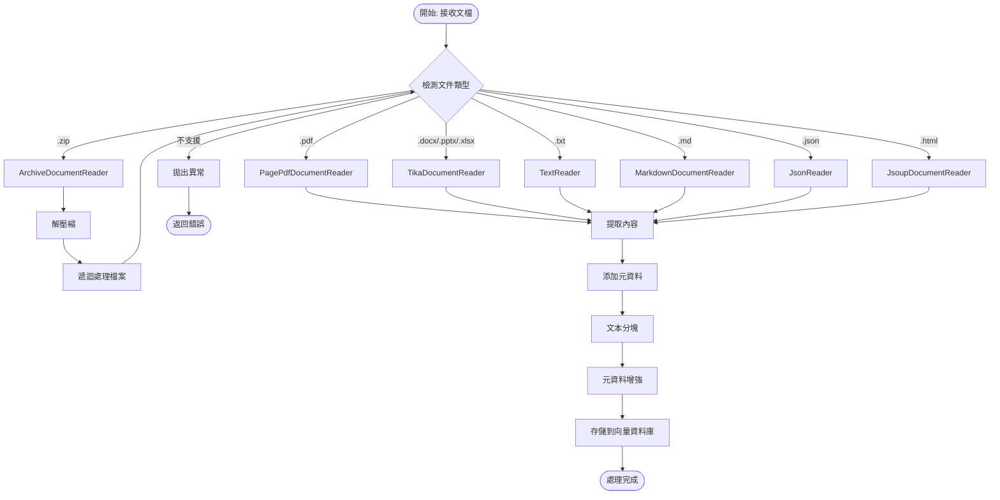

# Chapter 7.3-7.4: RAG ETL 管道系統 - 專案規格書

## 專案概述

### 專案名稱
**chapter7-rag-etl-pipeline** - Spring AI ETL 管道與多格式文檔處理

### 專案目標
實現完整的 ETL (Extract, Transform, Load) 管道系統，支援多種文檔格式處理：
- 多格式文檔讀取 (PDF, Word, Excel, PowerPoint, HTML, JSON, Markdown)
- 文檔轉換與分塊處理
- 向量化與資料載入
- 壓縮檔案批次處理

### 適用章節
- 7.3 ETL (上) - RAG 的知識來源
- 7.4 ETL (中) - 擷取進階文件類型

---

## 1. 架構與選型

### 1.1 系統架構


### 1.2 技術選型

| 組件 | 技術 | 版本 | 說明 |
|------|------|------|------|
| **基礎框架** | Spring Boot | 3.5.7 | 應用框架 |
| **AI 框架** | Spring AI | 1.0.3 | ETL Pipeline |
| **PDF 處理** | Spring AI PDF Reader | 1.0.3 | PDF 文檔讀取 |
| **Office 處理** | Spring AI Tika Reader | 1.0.3 | Office 文檔讀取 |
| **HTML 處理** | Jsoup | 內建 | HTML 解析 |
| **壓縮處理** | Java ZIP API | 內建 | 壓縮檔案處理 |
| **Vector DB** | Neo4j | 5.x | 向量資料庫 |
| **Build Tool** | Maven | 3.9+ | 構建工具 |
| **Java** | JDK | 21 | 開發語言 |

### 1.3 Spring AI ETL 組件

| Spring AI 組件 | 用途 | 實現方式 |
|---------------|------|----------|
| **DocumentReader** | 文檔讀取接口 | Supplier<List<Document>> |
| **PagePdfDocumentReader** | PDF 分頁讀取 | 每頁一個 Document |
| **ParagraphPdfDocumentReader** | PDF 段落讀取 | 每段一個 Document |
| **TikaDocumentReader** | Office 文檔讀取 | Word, Excel, PPT |
| **TextReader** | 文本文件讀取 | TXT, CSV |
| **MarkdownDocumentReader** | Markdown 讀取 | MD 文件 |
| **JsonReader** | JSON 文件讀取 | JSON 數據 |
| **JsoupDocumentReader** | HTML 讀取 | 網頁內容 |
| **DocumentTransformer** | 文檔轉換接口 | Function<List<Document>, List<Document>> |
| **TokenTextSplitter** | 文本分塊 | 智能分塊 |
| **ContentFormatTransformer** | 內容格式化 | 格式轉換 |
| **KeywordMetadataEnricher** | 關鍵詞提取 | AI 關鍵詞 |
| **SummaryMetadataEnricher** | 摘要生成 | AI 摘要 |
| **DocumentWriter** | 文檔寫入接口 | Consumer<List<Document>> |
| **VectorStore** | 向量存儲 | write() 方法 |
| **FileDocumentWriter** | 文件寫入 | 文件輸出 |

---

## 2. 資料模型

### 2.1 核心實體

#### ETL Pipeline 配置
```java
@Data
@Builder
public class EtlPipelineConfig {
    private List<DataSource> dataSources;          // 資料來源列表
    private ChunkingConfig chunkingConfig;         // 分塊配置
    private MetadataEnrichmentConfig enrichmentConfig;  // 元資料增強
    private ContentFormatConfig formatConfig;      // 格式配置
    private FilterConfig filterConfig;             // 過濾配置
    private LoadConfig loadConfig;                 // 載入配置
}
```

#### 資料來源
```java
@Data
@Builder
public class DataSource {
    private String name;                           // 資料源名稱
    private DataSourceType type;                   // 類型
    private Resource resource;                     // 資源
    private String path;                           // 路徑
    private Map<String, Object> metadata;          // 元資料
}

enum DataSourceType {
    PDF, TEXT, MARKDOWN, JSON, HTML,
    WORD, EXCEL, POWERPOINT,
    ARCHIVE
}
```

#### 分塊配置
```java
@Data
@Builder
public class ChunkingConfig {
    private int defaultChunkSize = 1000;           // 默認塊大小(tokens)
    private int minChunkSizeChars = 350;           // 最小塊大小(字符)
    private int minChunkLengthToEmbed = 10;        // 最小嵌入長度
    private int maxNumChunks = 10000;              // 最大塊數量
    private boolean keepSeparator = true;          // 保留分隔符
    private TextCleaningConfig cleaningConfig;     // 清理配置
}
```

#### 文本清理配置
```java
@Data
@Builder
public class TextCleaningConfig {
    private boolean removeExtraWhitespace = true;   // 移除多餘空白
    private boolean removeSpecialCharacters = false; // 移除特殊字符
    private boolean normalizeLineBreaks = true;     // 標準化換行
    private boolean removeSensitiveInfo = true;     // 移除敏感資訊
    private String language;                        // 語言
    private List<TextCleaningRule> customRules;     // 自定義規則
}
```

#### 元資料增強配置
```java
@Data
@Builder
public class MetadataEnrichmentConfig {
    private boolean enableBasicMetadata = true;     // 基礎元資料
    private boolean enableLanguageDetection = true; // 語言檢測
    private boolean enableContentStatistics = true; // 內容統計
    private boolean enableKeywordExtraction = true; // 關鍵詞提取
    private int keywordCount = 5;                   // 關鍵詞數量
    private boolean enableSummaryGeneration = true; // 摘要生成
    private List<SummaryType> summaryTypes;         // 摘要類型
    private boolean enableCustomClassification = false; // 自定義分類
    private List<DocumentClassifier> customClassifiers; // 分類器
}
```


#### 壓縮檔案配置
```java
@Data
@Builder
public class ArchiveConfig {
    private List<String> supportedTypes;            // 支援的文件類型
    private boolean recursive = true;               // 遞迴處理
    private int maxDepth = 3;                       // 最大遞迴深度
    private long maxFileSize = 100 * 1024 * 1024;   // 最大文件大小(100MB)
    private boolean skipCorrupted = true;           // 跳過損壞文件
}
```

### 2.2 處理結果模型

#### ETL Pipeline 結果
```java
@Data
@Builder
public class EtlPipelineResult {
    private boolean success;                        // 是否成功
    private int extractedCount;                     // 提取文檔數
    private int transformedCount;                   // 轉換文檔數
    private int loadedCount;                        // 載入文檔數
    private long processingTime;                    // 處理時間(ms)
    private String errorMessage;                    // 錯誤訊息
    private Map<String, Object> metrics;            // 處理指標
}
```

#### 文檔處理統計
```java
@Data
@Builder
public class DocumentProcessingStats {
    private int totalDocuments;                     // 總文檔數
    private int successfulDocuments;                // 成功處理數
    private int failedDocuments;                    // 失敗數
    private Map<String, Integer> documentsByType;   // 按類型統計
    private long totalProcessingTime;               // 總處理時間
    private long averageProcessingTime;             // 平均處理時間
}
```

### 2.3 元資料標準結構

| 欄位名稱 | 類型 | 說明 | 範例 |
|---------|------|------|------|
| `source_file` | String | 來源文件 | "report.pdf" |
| `document_type` | String | 文檔類型 | "PDF", "EXCEL", "WORD" |
| `extraction_method` | String | 提取方法 | "TIKA", "PAGE_PDF" |
| `processed_at` | String | 處理時間 | "2024-01-15T10:30:00" |
| `chunk_index` | Integer | 分塊索引 | 0, 1, 2... |
| `chunk_method` | String | 分塊方法 | "token", "semantic" |
| `character_count` | Integer | 字符數 | 1500 |
| `word_count` | Integer | 單詞數 | 300 |
| `estimated_tokens` | Integer | 預估 tokens | 400 |
| `detected_language` | String | 檢測語言 | "zh-TW", "en" |
| `language_confidence` | Double | 語言置信度 | 0.95 |
| `keywords` | List<String> | 關鍵詞 | ["Spring", "AI", "RAG"] |
| `summary` | String | 摘要 | "本文介紹..." |
| `page_number` | Integer | 頁碼 | 1 |
| `archive_source` | String | 壓縮源 | "documents.zip" |
| `archive_entry` | String | 壓縮條目 | "folder/doc.pdf" |

---

## 3. 關鍵流程

### 3.1 完整 ETL Pipeline 流程


### 3.2 多格式文檔處理流程



### 3.3 壓縮檔案處理流程


---

## 4. 虛擬碼

### 4.1 ETL Pipeline 核心實現

```java
/**
 * ETL Pipeline 服務 - 完整的提取、轉換、載入流程
 */
@Service
@RequiredArgsConstructor
@Slf4j
public class EtlPipelineService {

    private final DocumentChunkingService chunkingService;
    private final MetadataEnrichmentService metadataEnrichmentService;
    private final VectorStore vectorStore;
    private final MeterRegistry meterRegistry;

    /**
     * 執行完整的 ETL 管道
     */
    public EtlPipelineResult executeEtlPipeline(EtlPipelineConfig config) {
        Timer.Sample sample = Timer.start(meterRegistry);
        EtlPipelineResult result = new EtlPipelineResult();

        try {
            // Phase 1: Extract - 提取文檔
            log.info("Starting Extract phase");
            List<Document> extractedDocuments = extractDocuments(config.getDataSources());
            result.setExtractedCount(extractedDocuments.size());
            log.info("Extracted {} documents", extractedDocuments.size());

            // Phase 2: Transform - 轉換處理
            log.info("Starting Transform phase");
            List<Document> transformedDocuments = transformDocuments(extractedDocuments, config);
            result.setTransformedCount(transformedDocuments.size());
            log.info("Transformed into {} documents", transformedDocuments.size());

            // Phase 3: Load - 載入向量資料庫
            log.info("Starting Load phase");
            loadDocuments(transformedDocuments, config.getLoadConfig());
            result.setLoadedCount(transformedDocuments.size());
            log.info("Loaded {} documents to vector store", transformedDocuments.size());

            result.setSuccess(true);
            result.setProcessingTime(sample.stop(Timer.builder("etl.pipeline.time")
                .register(meterRegistry)));

            meterRegistry.counter("etl.pipeline.success").increment();

        } catch (Exception e) {
            log.error("ETL pipeline execution failed", e);
            result.setSuccess(false);
            result.setErrorMessage(e.getMessage());
            meterRegistry.counter("etl.pipeline.errors").increment();
            throw new EtlPipelineException("ETL 管道執行失敗", e);
        }

        return result;
    }

    /**
     * Extract Phase - 提取文檔
     */
    private List<Document> extractDocuments(List<DataSource> dataSources) {
        List<Document> allDocuments = new ArrayList<>();

        for (DataSource dataSource : dataSources) {
            try {
                DocumentReader reader = createDocumentReader(dataSource);
                List<Document> documents = reader.read();

                // 添加數據源元資料
                documents = documents.stream()
                    .map(doc -> addDataSourceMetadata(doc, dataSource))
                    .collect(Collectors.toList());

                allDocuments.addAll(documents);
                log.info("Extracted {} documents from {}", documents.size(), dataSource.getName());

            } catch (Exception e) {
                log.error("Failed to extract from data source: {}", dataSource.getName(), e);
            }
        }

        return allDocuments;
    }

    /**
     * Transform Phase - 轉換文檔
     */
    private List<Document> transformDocuments(List<Document> documents, EtlPipelineConfig config) {
        List<Document> transformedDocuments = documents;

        // 1. 元資料增強
        if (config.getEnrichmentConfig() != null) {
            transformedDocuments = metadataEnrichmentService.enrichMetadata(
                transformedDocuments,
                config.getEnrichmentConfig()
            );
            log.info("Metadata enrichment completed");
        }

        // 2. 文檔分塊
        if (config.getChunkingConfig() != null) {
            transformedDocuments = chunkingService.chunkDocuments(
                transformedDocuments,
                config.getChunkingConfig()
            );
            log.info("Document chunking completed: {} chunks", transformedDocuments.size());
        }

        // 3. 內容格式化
        if (config.getFormatConfig() != null) {
            ContentFormatTransformer formatter = new ContentFormatTransformer(
                config.getFormatConfig().getMetadataMode()
            );
            transformedDocuments = formatter.apply(transformedDocuments);
            log.info("Content formatting completed");
        }

        // 4. 過濾和驗證
        transformedDocuments = filterAndValidateDocuments(
            transformedDocuments,
            config.getFilterConfig()
        );

        return transformedDocuments;
    }

    /**
     * Load Phase - 載入文檔
     */
    private void loadDocuments(List<Document> documents, LoadConfig loadConfig) {
        if (loadConfig.getBatchSize() <= 1) {
            // 單批次載入
            vectorStore.write(documents);
        } else {
            // 批次載入
            List<List<Document>> batches = partitionList(documents, loadConfig.getBatchSize());

            for (int i = 0; i < batches.size(); i++) {
                List<Document> batch = batches.get(i);
                try {
                    vectorStore.write(batch);
                    log.info("Loaded batch {}/{}: {} documents", i + 1, batches.size(), batch.size());

                    if (loadConfig.getBatchDelayMs() > 0) {
                        Thread.sleep(loadConfig.getBatchDelayMs());
                    }

                } catch (Exception e) {
                    log.error("Failed to load batch {}", i + 1, e);
                    if (!loadConfig.isContinueOnError()) {
                        throw e;
                    }
                }
            }
        }
    }

    /**
     * 創建文檔讀取器
     */
    private DocumentReader createDocumentReader(DataSource dataSource) {
        return switch (dataSource.getType()) {
            case PDF -> new PagePdfDocumentReader(dataSource.getResource());
            case TEXT -> new TextReader(dataSource.getResource());
            case MARKDOWN -> new MarkdownDocumentReader(dataSource.getResource());
            case JSON -> new JsonReader(dataSource.getResource());
            case HTML -> new JsoupDocumentReader(dataSource.getResource());
            case WORD, EXCEL, POWERPOINT -> new TikaDocumentReader(dataSource.getResource());
            case ARCHIVE -> throw new UnsupportedOperationException(
                "Archive type should be handled separately"
            );
        };
    }

    private Document addDataSourceMetadata(Document document, DataSource dataSource) {
        Map<String, Object> metadata = new HashMap<>(document.getMetadata());
        metadata.put("data_source_type", dataSource.getType().name());
        metadata.put("data_source_name", dataSource.getName());
        metadata.put("data_source_path", dataSource.getPath());

        return Document.builder()
            .content(document.getContent())
            .metadata(metadata)
            .build();
    }

    private List<Document> filterAndValidateDocuments(List<Document> documents, FilterConfig config) {
        if (config == null) {
            return documents;
        }

        return documents.stream()
            .filter(doc -> doc.getContent() != null && !doc.getContent().trim().isEmpty())
            .filter(doc -> doc.getContent().length() >= config.getMinContentLength())
            .filter(doc -> doc.getContent().length() <= config.getMaxContentLength())
            .collect(Collectors.toList());
    }

    private <T> List<List<T>> partitionList(List<T> list, int batchSize) {
        List<List<T>> partitions = new ArrayList<>();
        for (int i = 0; i < list.size(); i += batchSize) {
            partitions.add(list.subList(i, Math.min(i + batchSize, list.size())));
        }
        return partitions;
    }
}
```

### 4.2 多格式文檔讀取服務

```java
/**
 * 多格式文檔讀取服務 - 統一的文檔處理接口
 */
@Service
@RequiredArgsConstructor
@Slf4j
public class MultiFormatDocumentReader {

    private final TesseractOCRService ocrService;
    private final DocumentReaderFactory readerFactory;

    /**
     * 讀取 PDF 文檔
     */
    public List<Document> readPdfDocument(Resource resource) {
        log.info("Reading PDF document: {}", resource.getFilename());

        PagePdfDocumentReader pdfReader = new PagePdfDocumentReader(resource,
            PdfDocumentReaderConfig.builder()
                .withPageTopMargin(0)
                .withPageExtractedTextFormatter(ExtractedTextFormatter.builder()
                    .withNumberOfTopTextLinesToDelete(0)
                    .build())
                .withPagesPerDocument(1)
                .build());

        return pdfReader.read();
    }

    /**
     * 讀取 Office 文檔 (Word, Excel, PowerPoint)
     */
    public List<Document> readOfficeDocument(Resource resource) {
        log.info("Reading Office document with Tika: {}", resource.getFilename());

        TikaDocumentReader tikaReader = new TikaDocumentReader(resource);
        List<Document> documents = tikaReader.read();

        // 添加文檔類型元資料
        documents.forEach(doc -> {
            String filename = resource.getFilename();
            String docType = determineDocumentType(filename);
            doc.getMetadata().put("document_type", docType);
            doc.getMetadata().put("source_file", filename);
            doc.getMetadata().put("extraction_method", "TIKA");
        });

        return documents;
    }

    /**
     * 讀取文本文件
     */
    public List<Document> readTextDocument(Resource resource) {
        log.info("Reading text file: {}", resource.getFilename());

        TextReader textReader = new TextReader(resource);
        textReader.setCharset(StandardCharsets.UTF_8);
        textReader.getCustomMetadata().put("filename", resource.getFilename());
        textReader.getCustomMetadata().put("content_type", "TEXT");

        return textReader.read();
    }

    /**
     * 讀取 Markdown 文件
     */
    public List<Document> readMarkdownDocument(Resource resource) {
        log.info("Reading markdown file: {}", resource.getFilename());

        MarkdownDocumentReaderConfig config = MarkdownDocumentReaderConfig.builder()
            .withHorizontalRuleCreateDocument(true)
            .withIncludeCodeBlock(true)
            .withIncludeBlockquote(true)
            .withAdditionalMetadata("filename", resource.getFilename())
            .build();

        MarkdownDocumentReader markdownReader = new MarkdownDocumentReader(resource, config);
        return markdownReader.read();
    }

    /**
     * 讀取 JSON 文件
     */
    public List<Document> readJsonDocument(Resource resource, String... jsonKeysToUse) {
        log.info("Reading JSON file: {}", resource.getFilename());

        JsonReader jsonReader = new JsonReader(resource, jsonKeysToUse);
        return jsonReader.read();
    }

    /**
     * 讀取 HTML 文件
     */
    public List<Document> readHtmlDocument(Resource resource) {
        log.info("Reading HTML file: {}", resource.getFilename());

        JsoupDocumentReaderConfig config = JsoupDocumentReaderConfig.builder()
            .selector("article p, div.content")
            .charset("UTF-8")
            .includeLinkUrls(true)
            .metadataTags(List.of("description", "keywords", "author"))
            .additionalMetadata("source", resource.getFilename())
            .build();

        JsoupDocumentReader htmlReader = new JsoupDocumentReader(resource, config);
        return htmlReader.read();
    }

    /**
     * 讀取壓縮檔案
     */
    public List<Document> readArchiveDocument(Resource resource) {
        log.info("Reading archive file: {}", resource.getFilename());

        ArchiveDocumentReader archiveReader = new ArchiveDocumentReader(resource, readerFactory);
        return archiveReader.read();
    }

    /**
     * 智能讀取文檔 (自動檢測格式)
     */
    public List<Document> readDocument(Resource resource) {
        String filename = resource.getFilename();
        if (filename == null) {
            throw new IllegalArgumentException("Filename cannot be null");
        }

        String lowerFilename = filename.toLowerCase();

        if (lowerFilename.endsWith(".pdf")) {
            return readPdfDocument(resource);
        } else if (lowerFilename.matches(".*\\.(docx?|xlsx?|pptx?)$")) {
            return readOfficeDocument(resource);
        } else if (lowerFilename.endsWith(".txt")) {
            return readTextDocument(resource);
        } else if (lowerFilename.endsWith(".md")) {
            return readMarkdownDocument(resource);
        } else if (lowerFilename.endsWith(".json")) {
            return readJsonDocument(resource);
        } else if (lowerFilename.matches(".*\\.(html?|htm)$")) {
            return readHtmlDocument(resource);
        } else if (lowerFilename.endsWith(".zip")) {
            return readArchiveDocument(resource);
        } else {
            throw new UnsupportedOperationException("Unsupported file format: " + filename);
        }
    }

    private String determineDocumentType(String filename) {
        if (filename.endsWith(".docx") || filename.endsWith(".doc")) {
            return "WORD";
        } else if (filename.endsWith(".xlsx") || filename.endsWith(".xls")) {
            return "EXCEL";
        } else if (filename.endsWith(".pptx") || filename.endsWith(".ppt")) {
            return "POWERPOINT";
        }
        return "UNKNOWN";
    }
}
```

### 4.3 壓縮檔案處理器

```java
/**
 * 壓縮檔案 DocumentReader - 實現 Spring AI DocumentReader 接口
 */
@Component
@Slf4j
public class ArchiveDocumentReader implements DocumentReader {

    private final Resource archiveResource;
    private final DocumentReaderFactory documentReaderFactory;

    public ArchiveDocumentReader(Resource archiveResource, DocumentReaderFactory documentReaderFactory) {
        this.archiveResource = archiveResource;
        this.documentReaderFactory = documentReaderFactory;
    }

    @Override
    public List<Document> read() {
        log.info("Extracting archive file: {}", archiveResource.getFilename());

        String fileName = archiveResource.getFilename().toLowerCase();

        try {
            if (fileName.endsWith(".zip")) {
                return extractZipFile();
            } else {
                log.warn("Unsupported archive format: {}", fileName);
                return List.of();
            }
        } catch (Exception e) {
            log.error("Failed to extract archive: {}", archiveResource.getFilename(), e);
            throw new RuntimeException("壓縮檔案處理失敗", e);
        }
    }

    /**
     * 提取 ZIP 檔案
     */
    private List<Document> extractZipFile() throws IOException {
        List<Document> documents = new ArrayList<>();

        try (InputStream inputStream = archiveResource.getInputStream();
             ZipInputStream zipInputStream = new ZipInputStream(inputStream)) {

            ZipEntry entry;
            while ((entry = zipInputStream.getNextEntry()) != null) {

                if (!entry.isDirectory() && isSupportedFileType(entry.getName())) {
                    try {
                        List<Document> entryDocuments = extractZipEntry(zipInputStream, entry);
                        documents.addAll(entryDocuments);
                        log.debug("Extracted {} documents from {}", entryDocuments.size(), entry.getName());
                    } catch (Exception e) {
                        log.warn("Failed to extract zip entry {}: {}", entry.getName(), e.getMessage());
                    }
                }

                zipInputStream.closeEntry();
            }
        }

        log.info("Extracted {} total documents from archive", documents.size());
        return documents;
    }

    /**
     * 提取 ZIP 條目
     */
    private List<Document> extractZipEntry(ZipInputStream zipInputStream, ZipEntry entry) throws IOException {
        String entryName = entry.getName();

        // 讀取條目內容到記憶體
        ByteArrayOutputStream baos = new ByteArrayOutputStream();
        byte[] buffer = new byte[8192];
        int bytesRead;

        while ((bytesRead = zipInputStream.read(buffer)) != -1) {
            baos.write(buffer, 0, bytesRead);
        }

        byte[] entryData = baos.toByteArray();

        // 建立記憶體資源
        Resource entryResource = new ByteArrayResource(entryData, entryName);

        try {
            // 根據文件類型選擇適當的 DocumentReader
            DocumentReader reader = documentReaderFactory.createReader(entryResource);
            List<Document> documents = reader.read();

            // 添加壓縮檔案相關的元資料
            documents.forEach(doc -> {
                doc.getMetadata().put("archive_source", archiveResource.getFilename());
                doc.getMetadata().put("archive_entry", entryName);
                doc.getMetadata().put("extraction_method", "ZIP_ARCHIVE");
            });

            return documents;

        } catch (Exception e) {
            log.warn("No suitable reader found for archive entry: {}", entryName);
            return List.of();
        }
    }

    /**
     * 檢查檔案類型是否支援
     */
    private boolean isSupportedFileType(String fileName) {
        String lowerFileName = fileName.toLowerCase();

        List<String> supportedTypes = Arrays.asList(
            ".pdf", ".doc", ".docx", ".xls", ".xlsx", ".ppt", ".pptx",
            ".txt", ".md", ".html", ".htm", ".xml", ".json"
        );

        return supportedTypes.stream().anyMatch(lowerFileName::endsWith);
    }
}

/**
 * DocumentReader 工廠
 */
@Component
@Slf4j
public class DocumentReaderFactory {

    /**
     * 根據資源類型創建對應的 DocumentReader
     */
    public DocumentReader createReader(Resource resource) {
        String filename = resource.getFilename();
        if (filename == null) {
            throw new IllegalArgumentException("無法判斷文件類型");
        }

        String lowerFilename = filename.toLowerCase();

        // 根據文件擴展名選擇合適的 DocumentReader
        if (lowerFilename.endsWith(".pdf")) {
            return new PagePdfDocumentReader(resource);
        } else if (lowerFilename.endsWith(".txt") || lowerFilename.endsWith(".md")) {
            return new TextReader(resource);
        } else if (lowerFilename.endsWith(".html") || lowerFilename.endsWith(".htm")) {
            return new JsoupDocumentReader(resource);
        } else if (lowerFilename.endsWith(".json")) {
            return new JsonReader(resource);
        } else if (isTikaSupported(lowerFilename)) {
            return new TikaDocumentReader(resource);
        } else {
            throw new UnsupportedOperationException("不支援的文件類型: " + filename);
        }
    }

    private boolean isTikaSupported(String filename) {
        List<String> tikaSupported = Arrays.asList(
            ".doc", ".docx", ".xls", ".xlsx", ".ppt", ".pptx"
        );
        return tikaSupported.stream().anyMatch(filename::endsWith);
    }
}
```

---

## 5. 系統脈絡圖 (C4 Model)

### 5.1 系統上下文圖 (Level 1)


### 5.2 容器圖 (Level 2)


---

## 6. 依賴清單

```xml
<dependencies>
    <!-- Spring AI Core -->
    <dependency>
        <groupId>org.springframework.ai</groupId>
        <artifactId>spring-ai-starter-model-openai</artifactId>
    </dependency>

    <!-- Spring AI PDF Document Reader -->
    <dependency>
        <groupId>org.springframework.ai</groupId>
        <artifactId>spring-ai-pdf-document-reader</artifactId>
    </dependency>

    <!-- Spring AI Tika Document Reader (Office files) -->
    <dependency>
        <groupId>org.springframework.ai</groupId>
        <artifactId>spring-ai-tika-document-reader</artifactId>
    </dependency>

    <!-- Neo4j Vector Store -->
    <dependency>
        <groupId>org.springframework.ai</groupId>
        <artifactId>spring-ai-neo4j-store-spring-boot-starter</artifactId>
    </dependency>

    <!-- Spring Boot Web -->
    <dependency>
        <groupId>org.springframework.boot</groupId>
        <artifactId>spring-boot-starter-web</artifactId>
    </dependency>

    <!-- Micrometer Prometheus -->
    <dependency>
        <groupId>io.micrometer</groupId>
        <artifactId>micrometer-registry-prometheus</artifactId>
    </dependency>

    <!-- Lombok -->
    <dependency>
        <groupId>org.projectlombok</groupId>
        <artifactId>lombok</artifactId>
        <optional>true</optional>
    </dependency>
</dependencies>
```

---

## 7. 配置檔案

```yaml
# application.yml
spring:
  application:
    name: chapter7-rag-etl-pipeline
  servlet:
    multipart:
      max-file-size: 100MB
      max-request-size: 100MB

  ai:
    openai:
      api-key: ${OPENAI_API_KEY}
      chat:
        model: gpt-4o
      embedding:
        model: text-embedding-3-small
        dimensions: 1536

    neo4j:
      uri: ${NEO4J_URI:bolt://localhost:7687}
      username: ${NEO4J_USERNAME:neo4j}
      password: ${NEO4J_PASSWORD}
      database: ${NEO4J_DATABASE:neo4j}

# ETL Pipeline 配置
app:
  etl:
    chunking:
      default-chunk-size: 1000
      min-chunk-size-chars: 350
      min-chunk-length-to-embed: 10
      max-num-chunks: 10000
      keep-separator: true

    enrichment:
      enable-basic-metadata: true
      enable-language-detection: true
      enable-content-statistics: true
      enable-keyword-extraction: true
      keyword-count: 5
      enable-summary-generation: true

    load:
      batch-size: 50
      batch-delay-ms: 100
      continue-on-error: true

# 監控配置
management:
  endpoints:
    web:
      exposure:
        include: health,metrics,prometheus
```

---

## 8. 專案結構

```
chapter7-rag-etl-pipeline/
├── src/
│   ├── main/
│   │   ├── java/
│   │   │   └── com/example/etl/
│   │   │       ├── config/
│   │   │       │   ├── EtlConfig.java
│   │   │       │   └── EtlProperties.java
│   │   │       ├── controller/
│   │   │       │   └── EtlController.java
│   │   │       ├── service/
│   │   │       │   ├── EtlPipelineService.java
│   │   │       │   ├── MultiFormatDocumentReader.java
│   │   │       │   ├── DocumentChunkingService.java
│   │   │       │   └── MetadataEnrichmentService.java
│   │   │       ├── reader/
│   │   │       │   ├── ArchiveDocumentReader.java
│   │   │       │   └── DocumentReaderFactory.java
│   │   │       ├── model/
│   │   │       │   ├── EtlPipelineConfig.java
│   │   │       │   ├── EtlPipelineResult.java
│   │   │       │   ├── DataSource.java
│   │   │       │   ├── ChunkingConfig.java
│   │   │       │   └── MetadataEnrichmentConfig.java
│   │   │       ├── exception/
│   │   │       │   └── EtlPipelineException.java
│   │   │       └── EtlPipelineApplication.java
│   │   └── resources/
│   │       ├── application.yml
│   │       ├── application-dev.yml
│   │       └── sample-documents/
│   │           ├── sample.pdf
│   │           ├── sample.docx
│   │           ├── sample.xlsx
│   │           └── documents.zip
│   └── test/
│       └── java/
│           └── com/example/etl/
│               ├── service/
│               │   └── EtlPipelineServiceTest.java
│               └── integration/
│                   └── EtlIntegrationTest.java
├── pom.xml
└── README.md
```

---

## 9. API 文檔

### 9.1 執行 ETL Pipeline

**端點**: `POST /api/etl/pipeline`

**請求體**:
```json
{
  "dataSources": [
    {
      "name": "技術文檔集合",
      "type": "ARCHIVE",
      "path": "/data/documents.zip"
    }
  ],
  "chunkingConfig": {
    "defaultChunkSize": 1000,
    "minChunkSizeChars": 350
  },
  "enrichmentConfig": {
    "enableKeywordExtraction": true,
    "keywordCount": 5,
    "enableSummaryGeneration": true
  }
}
```

**響應**:
```json
{
  "success": true,
  "extractedCount": 25,
  "transformedCount": 150,
  "loadedCount": 150,
  "processingTime": 45000,
  "metrics": {
    "pdfDocuments": 10,
    "wordDocuments": 8,
    "excelDocuments": 5
  }
}
```

---

## 10. 測試策略

### 10.1 單元測試覆蓋
- DocumentReader 實現測試
- 壓縮檔案處理測試
- 元資料增強測試
- 文本分塊測試

### 10.2 整合測試覆蓋
- 完整 ETL Pipeline 測試
- 多格式文檔處理測試
- 批次處理測試
- 錯誤恢復測試

---

## 11. 效能指標

| 指標 | 目標值 | 說明 |
|------|--------|------|
| PDF 處理速度 | < 2秒/頁 | 包含提取和分塊 |
| Office 文檔處理 | < 5秒/文檔 | Word, Excel, PowerPoint |
| 壓縮檔案處理 | < 30秒/10文檔 | 批次處理 |
| 批次載入速度 | ≥ 100 文檔/分鐘 | 向量資料庫寫入 |

---

## 12. 開發檢查清單

- [x] Spring AI ETL 依賴配置
- [x] 多格式 DocumentReader 實現
- [x] 壓縮檔案處理器實現
- [x] 元資料增強服務
- [x] 完整 ETL Pipeline 實現
- [x] 錯誤處理與重試機制
- [x] 批次處理優化
- [ ] 單元測試完整覆蓋
- [ ] 整合測試完整覆蓋
- [ ] 效能測試與優化
- [ ] API 文檔完善
- [ ] README 文檔

---

**文檔版本**: 1.0
**最後更新**: 2024-01-15
**負責人**: Spring AI ETL Team
