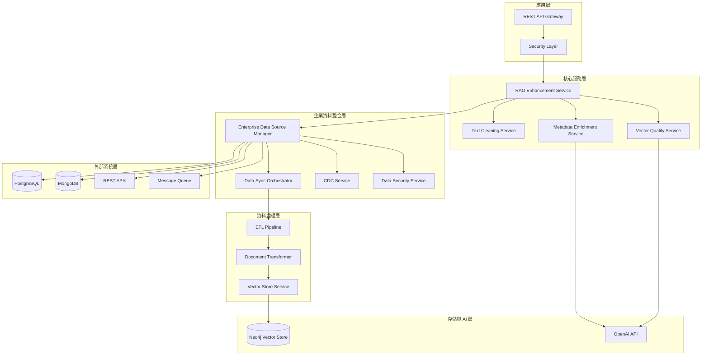
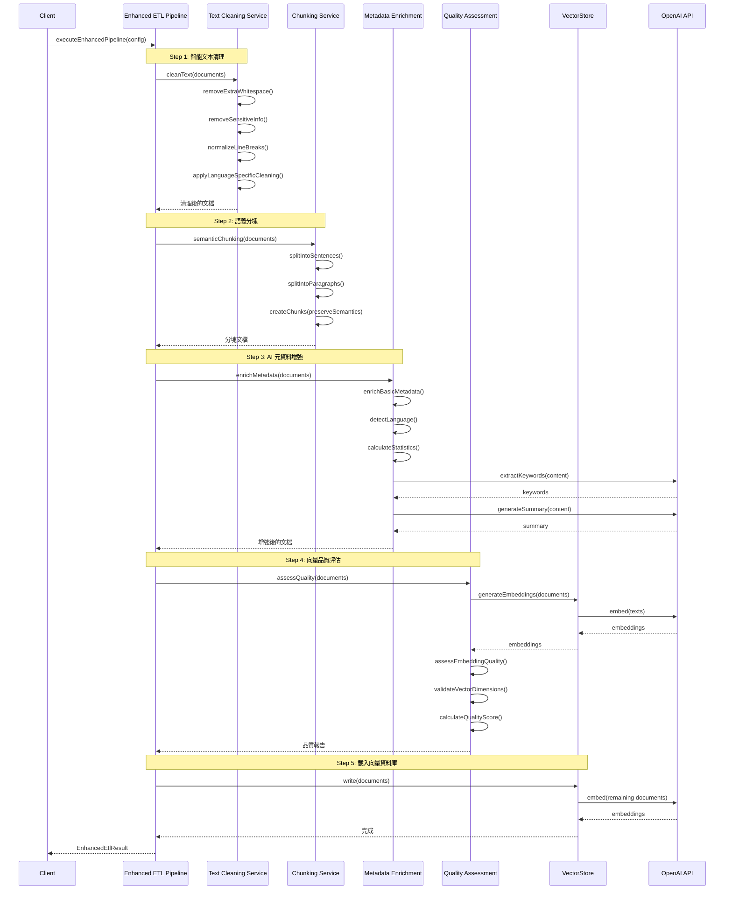
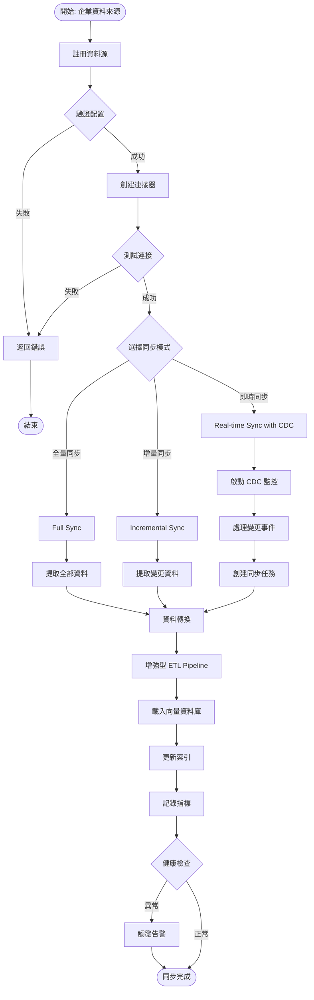
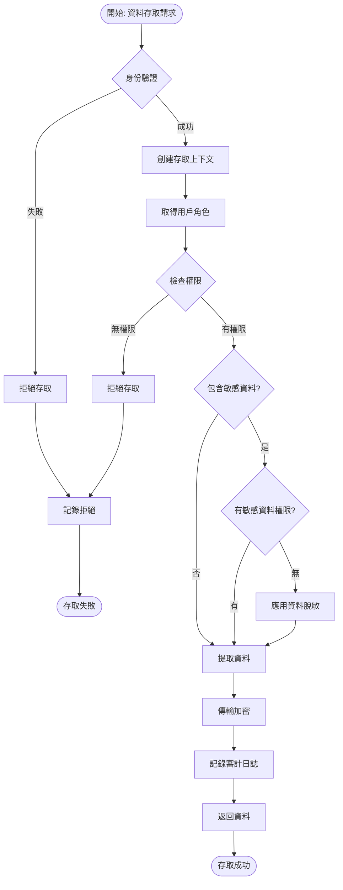

# Chapter 7.5-7.7: RAG 向量增強與企業級優化 - 專案規格書

## 專案概述

### 專案名稱
**chapter7-rag-vector-enhancement** - RAG 向量品質增強與企業級部署

### 專案目標
實現 RAG 系統的向量品質增強、企業資料整合和生產級部署：
- 智能文本清理與預處理
- 文本分塊策略優化
- 元資料增強（AI 關鍵詞提取、摘要生成）
- 向量品質評估與優化
- 企業資料來源整合（資料庫、API、即時同步）
- 資料安全與權限控制
- 生產級部署與監控

### 適用章節
- 7.5 ETL (下) - 給向量資料加上 Buff
- 7.6 企業 RAG 真正的資料來源
- 7.7 RAG 的最後一哩路

---

## 1. 架構與選型

### 1.1 系統架構



### 1.2 技術選型

| 組件 | 技術 | 版本 | 說明 |
|------|------|------|------|
| **基礎框架** | Spring Boot | 3.5.7 | 應用框架 |
| **AI 框架** | Spring AI | 1.0.3 | AI 整合 |
| **LLM** | OpenAI GPT-4 | gpt-4o | 元資料增強 |
| **Embedding** | OpenAI Embeddings | text-embedding-3-small | 向量化 |
| **Vector DB** | Neo4j | 5.x | 向量資料庫 |
| **關聯式 DB** | PostgreSQL | 15+ | 元資料存儲 |
| **NoSQL DB** | MongoDB | 6.x | 文檔存儲（可選） |
| **快取** | Redis | 7.x | 快取與會話 |
| **訊息佇列** | Kafka | 3.x | CDC 與事件流（可選） |
| **監控** | Prometheus + Grafana | Latest | 系統監控 |
| **Build Tool** | Maven | 3.9+ | 構建工具 |
| **Java** | JDK | 21 | 開發語言 |

### 1.3 Spring AI 進階組件

| Spring AI 組件 | 用途 | 實現方式 |
|---------------|------|----------|
| **KeywordMetadataEnricher** | AI 關鍵詞提取 | 使用 ChatModel 提取關鍵詞 |
| **SummaryMetadataEnricher** | AI 摘要生成 | 生成 CURRENT/PREVIOUS/NEXT 摘要 |
| **ContentFormatTransformer** | 內容格式化 | 標準化文檔格式 |
| **TokenTextSplitter** | 智能分塊 | 基於 token 的分塊 |
| **VectorStore** | 向量管理 | CRUD + 相似性搜尋 |
| **Filter.Expression** | 元資料過濾 | 動態過濾查詢 |

---

## 2. 資料模型

### 2.1 核心實體

#### 文本清理配置
```java
@Data
@Builder
@AllArgsConstructor
@NoArgsConstructor
public class TextCleaningConfig {
    @Builder.Default
    private boolean removeExtraWhitespace = true;      // 移除多餘空白

    @Builder.Default
    private boolean removeSpecialCharacters = false;   // 移除特殊字符

    @Builder.Default
    private boolean normalizeLineBreaks = true;        // 標準化換行

    @Builder.Default
    private boolean removeSensitiveInfo = true;        // 移除敏感資訊

    private String language;                           // 語言
    private List<TextCleaningRule> customRules;        // 自定義規則
}
```

#### 語義分塊配置
```java
@Data
@Builder
@AllArgsConstructor
@NoArgsConstructor
public class SemanticChunkingConfig {
    @Builder.Default
    private int maxTokensPerChunk = 1000;              // 每塊最大 tokens

    @Builder.Default
    private int overlapTokens = 100;                   // 重疊 tokens

    @Builder.Default
    private boolean preserveParagraphs = true;         // 保持段落完整

    @Builder.Default
    private boolean preserveSentences = true;          // 保持句子完整
}
```

#### 元資料增強配置
```java
@Data
@Builder
public class MetadataEnrichmentConfig {
    private boolean enableBasicMetadata = true;        // 基礎元資料
    private boolean enableLanguageDetection = true;    // 語言檢測
    private boolean enableContentStatistics = true;    // 內容統計
    private boolean enableKeywordExtraction = true;    // 關鍵詞提取
    private int keywordCount = 5;                      // 關鍵詞數量
    private boolean enableSummaryGeneration = true;    // 摘要生成
    private List<SummaryType> summaryTypes;            // 摘要類型
    private boolean enableCustomClassification = false; // 自定義分類
    private List<DocumentClassifier> customClassifiers; // 分類器列表
}
```

#### 向量品質評估結果
```java
@Data
@Builder
public class EmbeddingQuality {
    private int dimension;                             // 向量維度
    private double norm;                               // 向量範數
    private double mean;                               // 平均值
    private double standardDeviation;                  // 標準差
    private double qualityScore;                       // 品質分數 0-1
    private boolean isValid;                           // 是否有效
    private boolean validDimension;                    // 維度檢查
    private boolean validRange;                        // 範圍檢查
    private boolean validNorm;                         // 範數檢查
    private boolean notZeroVector;                     // 非零向量
    private boolean validTextLength;                   // 文本長度檢查
    private double minValue;                           // 最小值
    private double maxValue;                           // 最大值
}
```

### 2.2 企業資料整合模型

#### 資料來源配置
```java
@Data
@Builder
public class DataSourceConfig {
    private String name;                               // 資料源名稱
    private DataSourceType type;                       // 類型
    private String connectionString;                   // 連接字串
    private Map<String, String> properties;            // 屬性
    private SecurityConfig security;                   // 安全配置
    private SyncConfig sync;                          // 同步配置
    private RetryConfig retry;                        // 重試配置

    @Data
    @Builder
    public static class SecurityConfig {
        private String username;                       // 用戶名
        private String password;                       // 密碼
        private String certificatePath;                // 證書路徑
        private boolean sslEnabled;                    // SSL 啟用
        private List<String> allowedRoles;             // 允許角色
    }

    @Data
    @Builder
    public static class SyncConfig {
        private boolean enabled;                       // 啟用同步
        private Duration interval;                     // 同步間隔
        private SyncMode mode;                        // 同步模式
        private String changeDetectionColumn;          // 變更檢測欄位
    }

    @Data
    @Builder
    public static class RetryConfig {
        private int maxAttempts;                       // 最大重試次數
        private Duration initialDelay;                 // 初始延遲
        private Duration maxDelay;                     // 最大延遲
        private double backoffMultiplier;              // 退避倍數
    }
}

enum DataSourceType {
    RELATIONAL_DATABASE,   // 關聯式資料庫
    NOSQL_DATABASE,        // NoSQL 資料庫
    REST_API,              // REST API
    FILE_SYSTEM,           // 文件系統
    MESSAGE_QUEUE,         // 訊息佇列
    CLOUD_STORAGE          // 雲端存儲
}

enum SyncMode {
    FULL_SYNC,             // 全量同步
    INCREMENTAL_SYNC,      // 增量同步
    REAL_TIME_SYNC         // 即時同步
}
```

#### 同步任務
```java
@Data
@Builder
public class SyncTask {
    private String id;                                 // 任務 ID
    private String dataSourceName;                     // 資料源名稱
    private SyncOperation operation;                   // 操作類型
    private String entityId;                           // 實體 ID
    private String entityType;                         // 實體類型
    private Object changeData;                         // 變更資料
    private LocalDateTime timestamp;                   // 時間戳
    private TaskPriority priority;                     // 優先級
    private int retryCount;                           // 重試次數
    private LocalDateTime nextRetryTime;              // 下次重試時間

    @PostConstruct
    private void generateId() {
        if (id == null) {
            id = UUID.randomUUID().toString();
        }
    }
}

enum SyncOperation {
    CREATE, UPDATE, DELETE
}

enum TaskPriority {
    HIGH, MEDIUM, LOW
}
```

### 2.3 安全與權限模型

#### 資料存取上下文
```java
@Data
@Builder
public class DataAccessContext {
    private String userId;                             // 用戶 ID
    private String sessionId;                          // 會話 ID
    private UserInfo userInfo;                         // 用戶資訊
    private List<Permission> permissions;              // 權限列表
    private LocalDateTime createdAt;                   // 創建時間
    private LocalDateTime expiresAt;                   // 過期時間
}
```

#### 權限定義
```java
@Data
@Builder
public class Permission {
    private String id;                                 // 權限 ID
    private String dataSource;                         // 資料源
    private String entityType;                         // 實體類型
    private AccessType accessType;                     // 存取類型
    private List<String> conditions;                   // 條件列表
}

enum AccessType {
    READ,              // 讀取
    WRITE,             // 寫入
    DELETE,            // 刪除
    VIEW_SENSITIVE,    // 查看敏感資料
    EXPORT             // 導出
}
```

#### 資料脫敏策略
```java
@Data
@Builder
public class DataMaskingPolicy {
    private String policyName;                         // 策略名稱
    private String dataSource;                         // 資料源
    private String entityType;                         // 實體類型
    private MaskingType maskingType;                   // 脫敏類型
    private int visibleCharacters;                     // 可見字符數
    private String salt;                               // 鹽值
}

enum MaskingType {
    PARTIAL_MASK,      // 部分脫敏
    FULL_MASK,         // 完全脫敏
    HASH_MASK,         // 雜湊脫敏
    TOKENIZE           // 代幣化
}
```

### 2.4 監控與指標模型

#### 系統健康狀態
```java
@Data
@Builder
public class SystemHealthStatus {
    private Map<String, Boolean> componentHealth;      // 組件健康狀態
    private double overallHealthScore;                 // 整體健康分數
    private LocalDateTime timestamp;                   // 時間戳
    private Map<String, Object> metrics;               // 詳細指標
}
```

#### 查詢優化結果
```java
@Data
@Builder
public class QueryOptimizationResult {
    private String originalQuery;                      // 原始查詢
    private String optimizedQuery;                     // 優化查詢
    private SearchStrategy searchStrategy;             // 搜尋策略
    private long executionTime;                        // 執行時間
    private int documentsRetrieved;                    // 檢索文檔數
    private double averageSimilarity;                  // 平均相似度
}

enum SearchStrategy {
    SEMANTIC_SEARCH,   // 語義搜尋
    KEYWORD_SEARCH,    // 關鍵字搜尋
    HYBRID_SEARCH      // 混合搜尋
}
```

---

## 3. 關鍵流程

### 3.1 增強型 ETL 管道流程



### 3.2 企業資料同步流程



### 3.3 資料安全與權限控制流程



---

## 4. 虛擬碼

### 4.1 智能文本清理服務

```java
/**
 * 智能文本清理服務 - 多語言支援的文本預處理
 */
@Service
@Slf4j
public class TextCleaningService {

    private static final Pattern EMAIL_PATTERN =
        Pattern.compile("[a-zA-Z0-9._%+-]+@[a-zA-Z0-9.-]+\\.[a-zA-Z]{2,}");

    private static final Pattern URL_PATTERN =
        Pattern.compile("https?://[\\w\\-._~:/?#\\[\\]@!$&'()*+,;=%]+");

    private static final Pattern PHONE_PATTERN =
        Pattern.compile("\\b\\d{2,4}[-\\s]?\\d{3,4}[-\\s]?\\d{3,4}\\b");

    /**
     * 綜合文本清理
     */
    public String cleanText(String rawText, TextCleaningConfig config) {
        if (rawText == null || rawText.trim().isEmpty()) {
            return "";
        }

        String cleanedText = rawText;

        // 1. 基礎清理
        if (config.isRemoveExtraWhitespace()) {
            cleanedText = removeExtraWhitespace(cleanedText);
        }

        // 2. 移除特殊字符
        if (config.isRemoveSpecialCharacters()) {
            cleanedText = removeSpecialCharacters(cleanedText);
        }

        // 3. 標準化換行符
        if (config.isNormalizeLineBreaks()) {
            cleanedText = normalizeLineBreaks(cleanedText);
        }

        // 4. 移除敏感資訊
        if (config.isRemoveSensitiveInfo()) {
            cleanedText = removeSensitiveInformation(cleanedText);
        }

        // 5. 語言特定清理
        if (config.getLanguage() != null) {
            cleanedText = applyLanguageSpecificCleaning(cleanedText, config.getLanguage());
        }

        // 6. 自定義清理規則
        if (config.getCustomRules() != null && !config.getCustomRules().isEmpty()) {
            cleanedText = applyCustomRules(cleanedText, config.getCustomRules());
        }

        return cleanedText.trim();
    }

    /**
     * 移除多餘空白字符
     */
    private String removeExtraWhitespace(String text) {
        return text
            .replaceAll("\\s+", " ")
            .replaceAll("\\n\\s*\\n", "\\n\\n")
            .trim();
    }

    /**
     * 移除敏感資訊
     */
    private String removeSensitiveInformation(String text) {
        String result = text;

        // 移除電子郵件
        result = EMAIL_PATTERN.matcher(result).replaceAll("[EMAIL]");

        // 移除 URL
        result = URL_PATTERN.matcher(result).replaceAll("[URL]");

        // 移除電話號碼
        result = PHONE_PATTERN.matcher(result).replaceAll("[PHONE]");

        // 移除身分證號碼（台灣格式）
        result = result.replaceAll("\\b[A-Z]\\d{9}\\b", "[ID]");

        // 移除信用卡號碼
        result = result.replaceAll("\\b\\d{4}[-\\s]?\\d{4}[-\\s]?\\d{4}[-\\s]?\\d{4}\\b", "[CARD]");

        return result;
    }

    /**
     * 語言特定清理
     */
    private String applyLanguageSpecificCleaning(String text, String language) {
        return switch (language.toLowerCase()) {
            case "zh", "zh-tw", "zh-cn" -> cleanChineseText(text);
            case "en" -> cleanEnglishText(text);
            case "ja" -> cleanJapaneseText(text);
            default -> text;
        };
    }

    /**
     * 中文文本清理
     */
    private String cleanChineseText(String text) {
        return text
            .replaceAll("，", "，")
            .replaceAll("。", "。")
            .replaceAll("！", "！")
            .replaceAll("？", "？")
            .replaceAll("　", " ")
            .replaceAll("[""]", "\"")
            .replaceAll("['']", "'");
    }

    private String removeSpecialCharacters(String text) {
        return text.replaceAll("[^\\p{L}\\p{N}\\p{P}\\p{Z}\\r\\n]", "");
    }

    private String normalizeLineBreaks(String text) {
        return text
            .replaceAll("\\r\\n", "\\n")
            .replaceAll("\\r", "\\n");
    }

    private String cleanEnglishText(String text) {
        return text
            .replaceAll("[""]", "\"")
            .replaceAll("['']", "'")
            .replaceAll("\\s+", " ");
    }

    private String cleanJapaneseText(String text) {
        return text
            .replaceAll("、", "、")
            .replaceAll("。", "。")
            .replaceAll("　", " ");
    }

    private String applyCustomRules(String text, List<TextCleaningRule> customRules) {
        String result = text;
        for (TextCleaningRule rule : customRules) {
            result = rule.apply(result);
        }
        return result;
    }
}
```

### 4.2 元資料增強服務（使用 Spring AI）

```java
/**
 * 元資料增強服務 - 使用 Spring AI 的 KeywordMetadataEnricher 和 SummaryMetadataEnricher
 */
@Service
@RequiredArgsConstructor
@Slf4j
public class MetadataEnrichmentService {

    private final ChatModel chatModel;
    private final LanguageDetectionService languageDetector;

    /**
     * 使用 Spring AI KeywordMetadataEnricher 增強關鍵詞
     */
    public List<Document> enrichWithKeywords(List<Document> documents, int keywordCount) {
        log.info("Enriching documents with keywords using Spring AI");

        // 使用 Spring AI 的 KeywordMetadataEnricher
        KeywordMetadataEnricher enricher = new KeywordMetadataEnricher(chatModel, keywordCount);
        return enricher.apply(documents);
    }

    /**
     * 使用 Spring AI SummaryMetadataEnricher 增強摘要
     */
    public List<Document> enrichWithSummaries(List<Document> documents,
                                             List<SummaryType> summaryTypes) {
        log.info("Enriching documents with summaries using Spring AI");

        // 使用 Spring AI 的 SummaryMetadataEnricher
        SummaryMetadataEnricher enricher = new SummaryMetadataEnricher(chatModel, summaryTypes);
        return enricher.apply(documents);
    }

    /**
     * 綜合元資料增強
     */
    public List<Document> enrichMetadata(List<Document> documents,
                                        MetadataEnrichmentConfig config) {
        log.info("Starting comprehensive metadata enrichment for {} documents", documents.size());

        List<Document> enrichedDocuments = new ArrayList<>(documents);

        // 1. 基礎元資料增強
        if (config.isEnableBasicMetadata()) {
            enrichedDocuments = enrichBasicMetadata(enrichedDocuments);
            log.info("Basic metadata enrichment completed");
        }

        // 2. 語言檢測
        if (config.isEnableLanguageDetection()) {
            enrichedDocuments = enrichLanguageMetadata(enrichedDocuments);
            log.info("Language detection completed");
        }

        // 3. 內容統計
        if (config.isEnableContentStatistics()) {
            enrichedDocuments = enrichContentStatistics(enrichedDocuments);
            log.info("Content statistics enrichment completed");
        }

        // 4. 關鍵詞提取（使用 AI）
        if (config.isEnableKeywordExtraction() && config.getKeywordCount() > 0) {
            enrichedDocuments = enrichWithKeywords(enrichedDocuments, config.getKeywordCount());
            log.info("AI keyword extraction completed");
        }

        // 5. 摘要生成（使用 AI）
        if (config.isEnableSummaryGeneration() && config.getSummaryTypes() != null) {
            enrichedDocuments = enrichWithSummaries(enrichedDocuments, config.getSummaryTypes());
            log.info("AI summary generation completed");
        }

        // 6. 自定義分類
        if (config.isEnableCustomClassification()) {
            enrichedDocuments = enrichCustomClassification(
                enrichedDocuments,
                config.getCustomClassifiers()
            );
            log.info("Custom classification completed");
        }

        return enrichedDocuments;
    }

    /**
     * 基礎元資料增強
     */
    private List<Document> enrichBasicMetadata(List<Document> documents) {
        return documents.stream()
            .map(this::enrichBasicMetadataForDocument)
            .collect(Collectors.toList());
    }

    private Document enrichBasicMetadataForDocument(Document document) {
        Map<String, Object> metadata = new HashMap<>(document.getMetadata());

        // 處理時間戳
        metadata.put("processed_at", LocalDateTime.now().toString());

        // 內容哈希（用於去重）
        metadata.put("content_hash", calculateContentHash(document.getContent()));

        // 文檔 ID
        if (!metadata.containsKey("id")) {
            metadata.put("id", UUID.randomUUID().toString());
        }

        return Document.builder()
            .content(document.getContent())
            .metadata(metadata)
            .build();
    }

    /**
     * 語言檢測增強
     */
    private List<Document> enrichLanguageMetadata(List<Document> documents) {
        return documents.stream()
            .map(this::detectLanguageForDocument)
            .collect(Collectors.toList());
    }

    private Document detectLanguageForDocument(Document document) {
        LanguageDetectionResult detection = languageDetector.detectLanguage(document.getContent());

        Map<String, Object> metadata = new HashMap<>(document.getMetadata());
        metadata.put("detected_language", detection.getLanguage());
        metadata.put("language_confidence", detection.getConfidence());

        return Document.builder()
            .content(document.getContent())
            .metadata(metadata)
            .build();
    }

    /**
     * 內容統計增強
     */
    private List<Document> enrichContentStatistics(List<Document> documents) {
        return documents.stream()
            .map(this::calculateContentStatistics)
            .collect(Collectors.toList());
    }

    private Document calculateContentStatistics(Document document) {
        String content = document.getContent();

        Map<String, Object> metadata = new HashMap<>(document.getMetadata());

        // 基本統計
        metadata.put("character_count", content.length());
        metadata.put("word_count", countWords(content));
        metadata.put("sentence_count", countSentences(content));
        metadata.put("paragraph_count", countParagraphs(content));
        metadata.put("estimated_tokens", estimateTokenCount(content));

        // 內容特徵
        metadata.put("has_code_blocks", containsCodeBlocks(content));
        metadata.put("has_tables", containsTables(content));
        metadata.put("has_urls", containsUrls(content));
        metadata.put("has_emails", containsEmails(content));

        return Document.builder()
            .content(document.getContent())
            .metadata(metadata)
            .build();
    }

    private List<Document> enrichCustomClassification(List<Document> documents,
                                                     List<DocumentClassifier> classifiers) {
        return documents.stream()
            .map(doc -> classifyDocument(doc, classifiers))
            .collect(Collectors.toList());
    }

    private Document classifyDocument(Document document, List<DocumentClassifier> classifiers) {
        Map<String, Object> metadata = new HashMap<>(document.getMetadata());

        for (DocumentClassifier classifier : classifiers) {
            ClassificationResult result = classifier.classify(document.getContent());
            metadata.put(classifier.getMetadataKey(), result.getCategory());
            metadata.put(classifier.getMetadataKey() + "_confidence", result.getConfidence());
        }

        return Document.builder()
            .content(document.getContent())
            .metadata(metadata)
            .build();
    }

    // 輔助方法
    private String calculateContentHash(String content) {
        return DigestUtils.md5Hex(content);
    }

    private int countWords(String text) {
        return text.trim().isEmpty() ? 0 : text.trim().split("\\s+").length;
    }

    private int countSentences(String text) {
        return text.split("[.!?]+").length;
    }

    private int countParagraphs(String text) {
        return text.split("\\n\\s*\\n").length;
    }

    private int estimateTokenCount(String text) {
        return (int) Math.ceil(text.length() * 0.25);
    }

    private boolean containsCodeBlocks(String text) {
        return text.contains("```") || (text.contains("    ") && text.contains("\\n"));
    }

    private boolean containsTables(String text) {
        return text.contains("|") && text.contains("\\n");
    }

    private boolean containsUrls(String text) {
        return text.matches(".*https?://.*");
    }

    private boolean containsEmails(String text) {
        return text.matches(".*[a-zA-Z0-9._%+-]+@[a-zA-Z0-9.-]+\\.[a-zA-Z]{2,}.*");
    }
}
```

### 4.3 企業資料來源管理服務

```java
/**
 * 企業資料來源管理服務
 */
@Service
@RequiredArgsConstructor
@Slf4j
public class EnterpriseDataSourceManager {

    private final Map<String, DataSourceConnector> connectors = new ConcurrentHashMap<>();
    private final DataSourceRegistry dataSourceRegistry;
    private final SecurityManager securityManager;
    private final MetricsCollector metricsCollector;

    /**
     * 註冊資料來源
     */
    public void registerDataSource(DataSourceConfig config) {
        log.info("Registering data source: {}", config.getName());

        try {
            // 1. 驗證配置
            validateDataSourceConfig(config);

            // 2. 安全檢查
            securityManager.validateDataSourceAccess(config);

            // 3. 建立連接器
            DataSourceConnector connector = createConnector(config);

            // 4. 測試連接
            testConnection(connector);

            // 5. 註冊到系統
            dataSourceRegistry.register(config.getName(), config);
            connectors.put(config.getName(), connector);

            log.info("Successfully registered data source: {}", config.getName());

        } catch (Exception e) {
            log.error("Failed to register data source: {}", config.getName(), e);
            throw new DataSourceRegistrationException("Registration failed", e);
        }
    }

    /**
     * 取得資料來源連接器
     */
    public DataSourceConnector getConnector(String dataSourceName) {
        DataSourceConnector connector = connectors.get(dataSourceName);
        if (connector == null) {
            throw new DataSourceNotFoundException("Data source not found: " + dataSourceName);
        }

        // 檢查連接狀態
        if (!connector.isHealthy()) {
            log.warn("Data source {} is unhealthy, attempting reconnection", dataSourceName);
            reconnectDataSource(dataSourceName);
        }

        return connector;
    }

    /**
     * 建立連接器
     */
    private DataSourceConnector createConnector(DataSourceConfig config) {
        return switch (config.getType()) {
            case RELATIONAL_DATABASE -> new JdbcDataSourceConnector(config);
            case NOSQL_DATABASE -> new NoSqlDataSourceConnector(config);
            case REST_API -> new RestApiDataSourceConnector(config);
            case FILE_SYSTEM -> new FileSystemDataSourceConnector(config);
            case MESSAGE_QUEUE -> new MessageQueueDataSourceConnector(config);
            case CLOUD_STORAGE -> new CloudStorageDataSourceConnector(config);
            default -> throw new UnsupportedDataSourceException("Unsupported type: " + config.getType());
        };
    }

    /**
     * 測試連接
     */
    private void testConnection(DataSourceConnector connector) {
        try {
            ConnectionTestResult result = connector.testConnection();
            if (!result.isSuccessful()) {
                throw new DataSourceConnectionException(
                    "Connection test failed: " + result.getErrorMessage());
            }
        } catch (Exception e) {
            throw new DataSourceConnectionException("Connection test failed", e);
        }
    }

    /**
     * 重新連接資料來源
     */
    private void reconnectDataSource(String dataSourceName) {
        try {
            DataSourceConfig config = dataSourceRegistry.getConfig(dataSourceName);
            DataSourceConnector newConnector = createConnector(config);
            testConnection(newConnector);

            // 替換舊連接器
            DataSourceConnector oldConnector = connectors.put(dataSourceName, newConnector);
            if (oldConnector != null) {
                oldConnector.close();
            }

            log.info("Successfully reconnected data source: {}", dataSourceName);

        } catch (Exception e) {
            log.error("Failed to reconnect data source: {}", dataSourceName, e);
            metricsCollector.recordConnectionFailure(dataSourceName);
        }
    }

    private void validateDataSourceConfig(DataSourceConfig config) {
        if (config.getName() == null || config.getName().trim().isEmpty()) {
            throw new IllegalArgumentException("Data source name cannot be empty");
        }

        if (config.getType() == null) {
            throw new IllegalArgumentException("Data source type must be specified");
        }

        if (config.getConnectionString() == null || config.getConnectionString().trim().isEmpty()) {
            throw new IllegalArgumentException("Connection string cannot be empty");
        }

        if (dataSourceRegistry.exists(config.getName())) {
            throw new DataSourceAlreadyExistsException(
                "Data source already exists: " + config.getName());
        }
    }

    /**
     * 取得所有資料來源狀態
     */
    public List<DataSourceStatus> getAllDataSourceStatus() {
        return connectors.entrySet().stream()
            .map(entry -> {
                String name = entry.getKey();
                DataSourceConnector connector = entry.getValue();

                return DataSourceStatus.builder()
                    .name(name)
                    .type(connector.getType())
                    .healthy(connector.isHealthy())
                    .lastChecked(LocalDateTime.now())
                    .connectionCount(connector.getActiveConnectionCount())
                    .build();
            })
            .collect(Collectors.toList());
    }

    /**
     * 關閉所有連接
     */
    @PreDestroy
    public void shutdown() {
        log.info("Shutting down data source manager");

        connectors.values().parallelStream().forEach(connector -> {
            try {
                connector.close();
            } catch (Exception e) {
                log.warn("Error closing connector", e);
            }
        });

        connectors.clear();
    }
}
```

### 4.4 資料安全服務

```java
/**
 * 資料安全管理服務
 */
@Service
@RequiredArgsConstructor
@Slf4j
public class DataSecurityService {

    private final PermissionRepository permissionRepository;
    private final RoleRepository roleRepository;
    private final AuditLogger auditLogger;
    private final EncryptionService encryptionService;

    /**
     * 檢查資料存取權限
     */
    public boolean hasDataAccess(String userId, String dataSourceName,
                                String entityType, AccessType accessType) {
        try {
            // 1. 取得使用者角色
            List<String> userRoles = getUserRoles(userId);

            // 2. 檢查角色權限
            for (String role : userRoles) {
                if (hasRolePermission(role, dataSourceName, entityType, accessType)) {
                    auditLogger.logAccessGranted(userId, dataSourceName, entityType, accessType);
                    return true;
                }
            }

            // 3. 檢查直接權限
            if (hasDirectPermission(userId, dataSourceName, entityType, accessType)) {
                auditLogger.logAccessGranted(userId, dataSourceName, entityType, accessType);
                return true;
            }

            auditLogger.logAccessDenied(userId, dataSourceName, entityType, accessType);
            return false;

        } catch (Exception e) {
            log.error("Error checking data access permission", e);
            auditLogger.logAccessError(userId, dataSourceName, entityType, accessType, e);
            return false; // 預設拒絕存取
        }
    }

    /**
     * 資料脫敏處理
     */
    public Object maskSensitiveData(Object data, String userId, DataMaskingPolicy policy) {
        if (data == null || policy == null) {
            return data;
        }

        try {
            // 1. 檢查是否需要脫敏
            if (!needsDataMasking(userId, policy)) {
                return data;
            }

            // 2. 根據策略進行脫敏
            Object maskedData = applyDataMasking(data, policy);

            // 3. 記錄脫敏操作
            auditLogger.logDataMasking(userId, policy.getPolicyName());

            return maskedData;

        } catch (Exception e) {
            log.error("Error applying data masking", e);
            // 發生錯誤時，返回完全脫敏的資料
            return applyFullMasking(data);
        }
    }

    /**
     * 建立資料存取上下文
     */
    public DataAccessContext createAccessContext(String userId, String sessionId) {
        try {
            // 1. 取得使用者資訊
            UserInfo userInfo = getUserInfo(userId);

            // 2. 取得使用者權限
            List<Permission> permissions = getUserPermissions(userId);

            // 3. 建立存取上下文
            return DataAccessContext.builder()
                .userId(userId)
                .sessionId(sessionId)
                .userInfo(userInfo)
                .permissions(permissions)
                .createdAt(LocalDateTime.now())
                .expiresAt(LocalDateTime.now().plusHours(8))
                .build();

        } catch (Exception e) {
            log.error("Failed to create access context for user: {}", userId, e);
            throw new SecurityException("Access context creation failed", e);
        }
    }

    /**
     * 驗證資料存取上下文
     */
    public boolean validateAccessContext(DataAccessContext context) {
        if (context == null) {
            return false;
        }

        // 1. 檢查是否過期
        if (context.getExpiresAt().isBefore(LocalDateTime.now())) {
            log.warn("Access context expired for user: {}", context.getUserId());
            return false;
        }

        // 2. 檢查會話有效性
        if (!isValidSession(context.getSessionId())) {
            log.warn("Invalid session for user: {}", context.getUserId());
            return false;
        }

        // 3. 檢查使用者狀態
        if (!isUserActive(context.getUserId())) {
            log.warn("User is not active: {}", context.getUserId());
            return false;
        }

        return true;
    }

    private Object applyDataMasking(Object data, DataMaskingPolicy policy) {
        return switch (policy.getMaskingType()) {
            case PARTIAL_MASK -> applyPartialMasking(data, policy);
            case FULL_MASK -> applyFullMasking(data);
            case HASH_MASK -> applyHashMasking(data, policy);
            case TOKENIZE -> applyTokenization(data, policy);
        };
    }

    private Object applyPartialMasking(Object data, DataMaskingPolicy policy) {
        if (data instanceof String str) {
            int visibleChars = policy.getVisibleCharacters();
            if (str.length() <= visibleChars * 2) {
                return "*".repeat(str.length());
            }
            return str.substring(0, visibleChars) +
                   "*".repeat(str.length() - visibleChars * 2) +
                   str.substring(str.length() - visibleChars);
        }
        return data;
    }

    private Object applyFullMasking(Object data) {
        if (data instanceof String str) {
            return "*".repeat(str.length());
        } else if (data instanceof Number) {
            return 0;
        }
        return "[MASKED]";
    }

    private Object applyHashMasking(Object data, DataMaskingPolicy policy) {
        if (data instanceof String str) {
            return encryptionService.hashSHA256(str, policy.getSalt());
        }
        return data;
    }

    private Object applyTokenization(Object data, DataMaskingPolicy policy) {
        if (data instanceof String) {
            return "TOKEN_" + UUID.randomUUID().toString().substring(0, 8);
        }
        return data;
    }

    // 輔助方法省略...
    private List<String> getUserRoles(String userId) { return List.of(); }
    private boolean hasRolePermission(String role, String ds, String et, AccessType at) { return false; }
    private boolean hasDirectPermission(String uid, String ds, String et, AccessType at) { return false; }
    private boolean needsDataMasking(String userId, DataMaskingPolicy policy) { return true; }
    private UserInfo getUserInfo(String userId) { return null; }
    private List<Permission> getUserPermissions(String userId) { return List.of(); }
    private boolean isValidSession(String sessionId) { return true; }
    private boolean isUserActive(String userId) { return true; }
}
```

---

## 5. 部署架構

### 5.1 Docker Compose 部署

```yaml
version: '3.8'

services:
  # RAG 應用服務
  rag-app:
    build: .
    ports:
      - "8080:8080"
    environment:
      - SPRING_PROFILES_ACTIVE=prod
      - SPRING_DATASOURCE_URL=jdbc:postgresql://postgres:5432/ragdb
      - SPRING_AI_NEO4J_URI=bolt://neo4j:7687
      - SPRING_AI_OPENAI_API_KEY=${OPENAI_API_KEY}
      - SPRING_DATA_REDIS_HOST=redis
    depends_on:
      - postgres
      - neo4j
      - redis
    volumes:
      - ./logs:/app/logs
      - ./data:/app/data
    networks:
      - rag-network
    restart: unless-stopped
    deploy:
      resources:
        limits:
          cpus: '2.0'
          memory: 4G

  # PostgreSQL 資料庫
  postgres:
    image: postgres:15-alpine
    environment:
      - POSTGRES_DB=ragdb
      - POSTGRES_USER=raguser
      - POSTGRES_PASSWORD=${POSTGRES_PASSWORD}
    volumes:
      - postgres_data:/var/lib/postgresql/data
    ports:
      - "5432:5432"
    networks:
      - rag-network

  # Neo4j 向量資料庫
  neo4j:
    image: neo4j:5.15-community
    environment:
      - NEO4J_AUTH=neo4j/${NEO4J_PASSWORD}
      - NEO4J_PLUGINS=["apoc"]
    volumes:
      - neo4j_data:/data
    ports:
      - "7474:7474"
      - "7687:7687"
    networks:
      - rag-network

  # Redis 快取
  redis:
    image: redis:7-alpine
    command: redis-server --appendonly yes
    volumes:
      - redis_data:/data
    ports:
      - "6379:6379"
    networks:
      - rag-network

  # Prometheus 監控
  prometheus:
    image: prom/prometheus:latest
    ports:
      - "9090:9090"
    volumes:
      - ./prometheus/prometheus.yml:/etc/prometheus/prometheus.yml
      - prometheus_data:/prometheus
    networks:
      - rag-network

  # Grafana 視覺化
  grafana:
    image: grafana/grafana:latest
    ports:
      - "3000:3000"
    environment:
      - GF_SECURITY_ADMIN_PASSWORD=${GRAFANA_PASSWORD}
    volumes:
      - grafana_data:/var/lib/grafana
    networks:
      - rag-network

volumes:
  postgres_data:
  neo4j_data:
  redis_data:
  prometheus_data:
  grafana_data:

networks:
  rag-network:
    driver: bridge
```

---

## 6. 配置檔案

```yaml
# application.yml
spring:
  application:
    name: chapter7-rag-vector-enhancement

  # PostgreSQL 配置
  datasource:
    url: ${SPRING_DATASOURCE_URL:jdbc:postgresql://localhost:5432/ragdb}
    username: ${POSTGRES_USERNAME:raguser}
    password: ${POSTGRES_PASSWORD}
    driver-class-name: org.postgresql.Driver
    hikari:
      maximum-pool-size: 10
      minimum-idle: 5

  # Redis 配置
  data:
    redis:
      host: ${REDIS_HOST:localhost}
      port: 6379
      password: ${REDIS_PASSWORD:}
      timeout: 3000ms

  # Spring AI 配置
  ai:
    openai:
      api-key: ${OPENAI_API_KEY}
      chat:
        model: gpt-4o
      embedding:
        model: text-embedding-3-small
        dimensions: 1536

    neo4j:
      uri: ${NEO4J_URI:bolt://localhost:7687}
      username: ${NEO4J_USERNAME:neo4j}
      password: ${NEO4J_PASSWORD}
      database: ${NEO4J_DATABASE:neo4j}

# 文本清理配置
app:
  text-cleaning:
    remove-extra-whitespace: true
    remove-special-characters: false
    normalize-line-breaks: true
    remove-sensitive-info: true
    default-language: zh-TW

  # 元資料增強配置
  metadata-enrichment:
    enable-basic-metadata: true
    enable-language-detection: true
    enable-content-statistics: true
    enable-keyword-extraction: true
    keyword-count: 5
    enable-summary-generation: true
    summary-types:
      - CURRENT
      - PREVIOUS
      - NEXT

  # 向量品質配置
  vector-quality:
    min-dimension: 384
    max-dimension: 4096
    min-norm: 0.1
    max-norm: 10.0
    quality-threshold: 0.7

  # 資料安全配置
  security:
    enable-access-control: true
    enable-data-masking: true
    session-timeout: 8h
    enable-audit-logging: true

  # 企業資料源配置
  datasources:
    postgres:
      enabled: true
      sync-mode: INCREMENTAL_SYNC
      sync-interval: 5m
    mongodb:
      enabled: false
    rest-api:
      enabled: true

# 監控配置
management:
  endpoints:
    web:
      exposure:
        include: health,metrics,prometheus,info
  metrics:
    export:
      prometheus:
        enabled: true
    tags:
      application: ${spring.application.name}

  health:
    db:
      enabled: true
    redis:
      enabled: true
```

---

## 7. 專案結構

```
chapter7-rag-vector-enhancement/
├── src/
│   ├── main/
│   │   ├── java/
│   │   │   └── com/example/enhancement/
│   │   │       ├── config/
│   │   │       │   ├── EnhancementConfig.java
│   │   │       │   ├── SecurityConfig.java
│   │   │       │   └── EnterpriseDataSourceConfig.java
│   │   │       ├── controller/
│   │   │       │   ├── EnhancementController.java
│   │   │       │   └── DataSourceController.java
│   │   │       ├── service/
│   │   │       │   ├── TextCleaningService.java
│   │   │       │   ├── MetadataEnrichmentService.java
│   │   │       │   ├── VectorQualityService.java
│   │   │       │   ├── EnterpriseDataSourceManager.java
│   │   │       │   ├── DataSyncOrchestrator.java
│   │   │       │   └── DataSecurityService.java
│   │   │       ├── model/
│   │   │       │   ├── TextCleaningConfig.java
│   │   │       │   ├── MetadataEnrichmentConfig.java
│   │   │       │   ├── DataSourceConfig.java
│   │   │       │   ├── SyncTask.java
│   │   │       │   └── DataAccessContext.java
│   │   │       ├── security/
│   │   │       │   ├── PermissionRepository.java
│   │   │       │   ├── RoleRepository.java
│   │   │       │   └── AuditLogger.java
│   │   │       ├── exception/
│   │   │       │   ├── EnhancementException.java
│   │   │       │   └── SecurityException.java
│   │   │       └── EnhancementApplication.java
│   │   └── resources/
│   │       ├── application.yml
│   │       ├── application-dev.yml
│   │       ├── application-prod.yml
│   │       └── db/
│   │           └── migration/
│   │               └── V1__init_schema.sql
│   └── test/
│       └── java/
│           └── com/example/enhancement/
│               ├── service/
│               │   ├── TextCleaningServiceTest.java
│               │   ├── MetadataEnrichmentServiceTest.java
│               │   └── DataSecurityServiceTest.java
│               └── integration/
│                   └── EnhancementIntegrationTest.java
├── docker/
│   ├── Dockerfile
│   └── docker-compose.yml
├── prometheus/
│   └── prometheus.yml
├── pom.xml
└── README.md
```

---

## 8. 依賴清單

```xml
<dependencies>
    <!-- Spring AI Core -->
    <dependency>
        <groupId>org.springframework.ai</groupId>
        <artifactId>spring-ai-starter-model-openai</artifactId>
    </dependency>

    <!-- Neo4j Vector Store -->
    <dependency>
        <groupId>org.springframework.ai</groupId>
        <artifactId>spring-ai-neo4j-store-spring-boot-starter</artifactId>
    </dependency>

    <!-- PostgreSQL -->
    <dependency>
        <groupId>org.postgresql</groupId>
        <artifactId>postgresql</artifactId>
    </dependency>

    <!-- Redis -->
    <dependency>
        <groupId>org.springframework.boot</groupId>
        <artifactId>spring-boot-starter-data-redis</artifactId>
    </dependency>

    <!-- Spring Security -->
    <dependency>
        <groupId>org.springframework.boot</groupId>
        <artifactId>spring-boot-starter-security</artifactId>
    </dependency>

    <!-- Actuator & Metrics -->
    <dependency>
        <groupId>org.springframework.boot</groupId>
        <artifactId>spring-boot-starter-actuator</artifactId>
    </dependency>

    <dependency>
        <groupId>io.micrometer</groupId>
        <artifactId>micrometer-registry-prometheus</artifactId>
    </dependency>

    <!-- Apache Commons -->
    <dependency>
        <groupId>org.apache.commons</groupId>
        <artifactId>commons-lang3</artifactId>
    </dependency>

    <dependency>
        <groupId>commons-codec</groupId>
        <artifactId>commons-codec</artifactId>
    </dependency>

    <!-- Lombok -->
    <dependency>
        <groupId>org.projectlombok</groupId>
        <artifactId>lombok</artifactId>
        <optional>true</optional>
    </dependency>
</dependencies>
```

---

## 9. 效能指標

| 指標 | 目標值 | 說明 |
|------|--------|------|
| 文本清理速度 | < 100ms/文檔 | 包含所有清理規則 |
| 元資料增強速度 | < 2秒/文檔 | 包含 AI 關鍵詞和摘要 |
| 向量品質評估 | < 500ms/100向量 | 批次評估 |
| 資料同步延遲 | < 30秒 | 即時同步模式 |
| 權限檢查速度 | < 10ms/請求 | 快取命中 |
| 系統可用性 | ≥ 99.9% | 正常運行時間 |
| 並發處理能力 | ≥ 100 QPS | 同時處理請求 |

---

## 10. 開發檢查清單

- [ ] 文本清理服務實現
- [ ] Spring AI 元資料增強整合
- [ ] 向量品質評估服務
- [ ] 企業資料源管理器
- [ ] 資料同步協調器
- [ ] CDC 服務實現
- [ ] 資料安全服務
- [ ] 權限控制系統
- [ ] 資料脫敏機制
- [ ] Redis 快取整合
- [ ] PostgreSQL 整合
- [ ] Docker 部署配置
- [ ] Prometheus 監控
- [ ] 單元測試覆蓋
- [ ] 整合測試覆蓋
- [ ] API 文檔
- [ ] README 文檔

---

**文檔版本**: 1.0
**最後更新**: 2024-01-15
**負責人**: Spring AI Enhancement Team
