# Advanced RAG 系統技術規格文件

## 文檔版本
- **版本**: 1.0.0
- **建立日期**: 2025-01-30
- **最後更新**: 2025-01-30
- **專案代號**: chapter8-advanced-rag

---

## 一、專案概述

### 1.1 專案目標

建立一個企業級的 Advanced RAG（Retrieval-Augmented Generation）系統，提供高精度的知識檢索和智能問答能力。

**核心目標**：
- ✅ 實現多階段智能檢索（粗檢索 + Re-ranking 精檢索）
- ✅ 整合智能 Embedding 模型選擇與優化
- ✅ 提供完整的內容審核和安全防護
- ✅ 建立自動化評估測試框架
- ✅ 實現對話記憶和上下文管理
- ✅ 提供企業級監控和指標收集

### 1.2 技術選型

| 技術組件 | 選型 | 版本 | 說明 |
|---------|------|------|------|
| **Java** | OpenJDK | 21 | 語言運行環境 |
| **Spring Boot** | Spring Boot | 3.5.7 | 應用框架 |
| **Spring AI** | Spring AI | 1.0.3 | AI 整合框架 |
| **Vector Database** | PgVector | Latest | 向量數據庫 |
| **Cache** | Redis | Latest | 快取和會話管理 |
| **LLM Provider** | OpenAI | GPT-4o-mini | 大語言模型 |
| **Embedding Model** | OpenAI | text-embedding-3-small/large | 向量嵌入模型 |
| **Moderation** | OpenAI + Mistral AI | Latest | 內容審核 |
| **Build Tool** | Maven | 3.9+ | 構建工具 |
| **Monitoring** | Micrometer + Prometheus | Latest | 監控系統 |

### 1.3 系統特性

#### 核心功能特性
1. **智能查詢處理**
   - 查詢理解與重寫（Query Rewrite）
   - 查詢擴展（Multi-Query Expansion）
   - 查詢壓縮（Query Compression）
   - 多輪對話上下文理解

2. **多階段檢索優化**
   - 第一階段：粗檢索（Coarse Retrieval）- 使用向量相似度快速篩選
   - 第二階段：Re-ranking 精檢索 - 使用多因子評分精確排序
   - 第三階段：上下文優化 - 智能壓縮和組織檢索結果
   - 第四階段：LLM 生成 - 基於優化上下文生成答案

3. **智能 Embedding 管理**
   - 動態模型選擇（高精度 vs 成本效益）
   - Embedding 快取策略
   - 批量處理優化
   - 效能監控和自動調優

4. **內容安全與品質控制**
   - 多層內容審核（OpenAI + Mistral AI + 自定義規則）
   - 綜合風險評分機制
   - 實時內容安全監控
   - 個人信息保護（PII 檢測）

5. **自動化評估測試**
   - 相關性評估（Relevancy Evaluator）
   - 事實準確性評估（Fact-Checking Evaluator）
   - 完整性和連貫性評估
   - 持續品質監控和告警

6. **企業級特性**
   - 對話記憶管理（ChatMemory）
   - 多租戶支持
   - 詳細的審計日誌
   - 完整的指標收集和監控

---

## 二、系統架構設計

### 2.1 系統脈絡圖（C4 Model - Context Diagram）

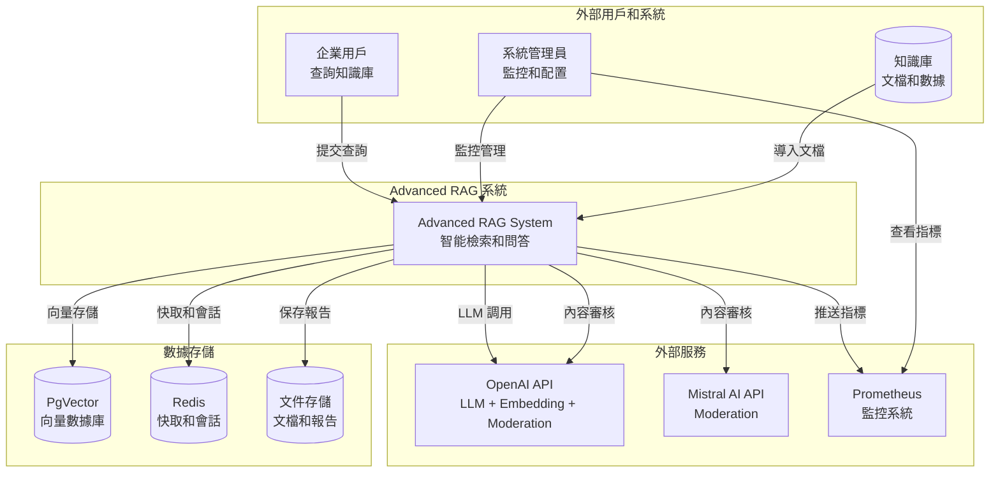

### 2.2 容器圖（C4 Model - Container Diagram）

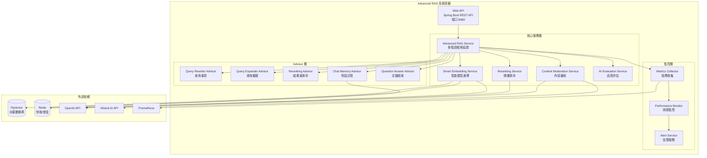

### 2.3 模組關係圖

```mermaid
graph TB
    subgraph "API 層"
        RAGController[RAG Controller]
        EvaluationController[Evaluation Controller]
        ModerationController[Moderation Controller]
        MonitoringController[Monitoring Controller]
    end

    subgraph "服務層 - 核心業務"
        AdvancedRAGService[Advanced RAG Service]
        SmartEmbeddingService[Smart Embedding Service]
        MultiStageRetrievalService[Multi-Stage Retrieval Service]
        RerankingService[Reranking Service]
    end

    subgraph "服務層 - 品質與安全"
        ContentModerationService[Content Moderation Service]
        AIEvaluationService[AI Evaluation Service]
        ContinuousEvaluationService[Continuous Evaluation Service]
    end

    subgraph "Advisor 層"
        QueryRewriterAdvisor[Query Rewriter Advisor]
        QueryExpanderAdvisor[Query Expander Advisor]
        RerankingAdvisor[Reranking Advisor]
        AnswerQualityAdvisor[Answer Quality Advisor]
    end

    subgraph "工具層"
        EmbeddingTextPreprocessor[Embedding Text Preprocessor]
        EmbeddingPerformanceMonitor[Embedding Performance Monitor]
        RerankingMetrics[Reranking Metrics]
    end

    subgraph "配置層"
        EnterpriseRAGConfiguration[Enterprise RAG Configuration]
        MultiEmbeddingConfiguration[Multi-Embedding Configuration]
        ModerationConfiguration[Moderation Configuration]
    end

    subgraph "數據存儲"
        VectorStore[(Vector Store)]
        ChatMemory[(Chat Memory)]
        RedisCache[(Redis Cache)]
    end

    RAGController --> AdvancedRAGService
    EvaluationController --> AIEvaluationService
    ModerationController --> ContentModerationService
    MonitoringController --> ContinuousEvaluationService

    AdvancedRAGService --> SmartEmbeddingService
    AdvancedRAGService --> MultiStageRetrievalService
    AdvancedRAGService --> RerankingService
    AdvancedRAGService --> ContentModerationService

    MultiStageRetrievalService --> QueryRewriterAdvisor
    MultiStageRetrievalService --> QueryExpanderAdvisor
    MultiStageRetrievalService --> RerankingAdvisor

    SmartEmbeddingService --> EmbeddingTextPreprocessor
    SmartEmbeddingService --> EmbeddingPerformanceMonitor
    SmartEmbeddingService --> RedisCache

    RerankingService --> RerankingAdvisor
    RerankingService --> RerankingMetrics

    AIEvaluationService --> AnswerQualityAdvisor
    ContinuousEvaluationService --> AIEvaluationService

    EnterpriseRAGConfiguration --> AdvancedRAGService
    MultiEmbeddingConfiguration --> SmartEmbeddingService
    ModerationConfiguration --> ContentModerationService

    AdvancedRAGService --> VectorStore
    AdvancedRAGService --> ChatMemory
```

---

## 三、關鍵流程設計

### 3.1 Advanced RAG 查詢處理流程圖

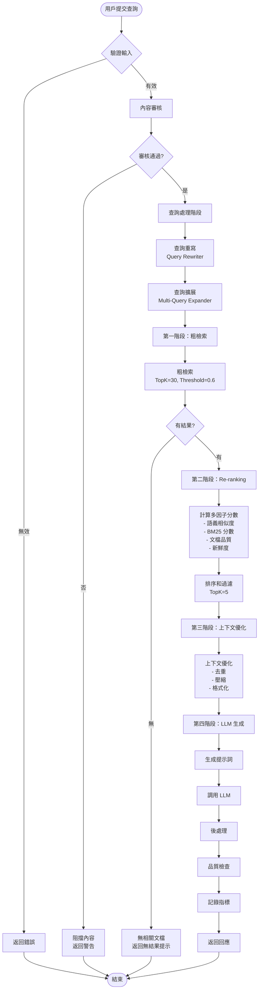

### 3.2 內容審核流程圖

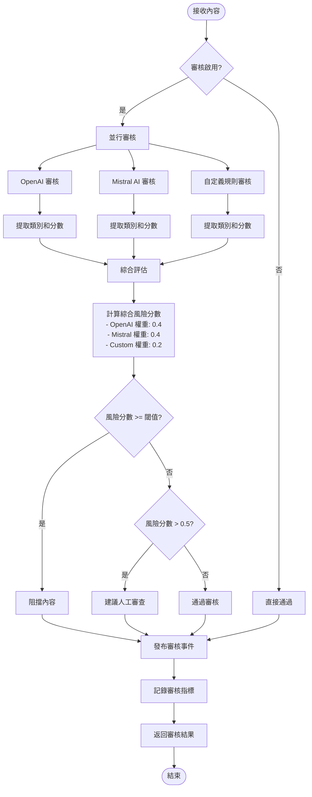

### 3.3 Re-ranking 處理序列圖

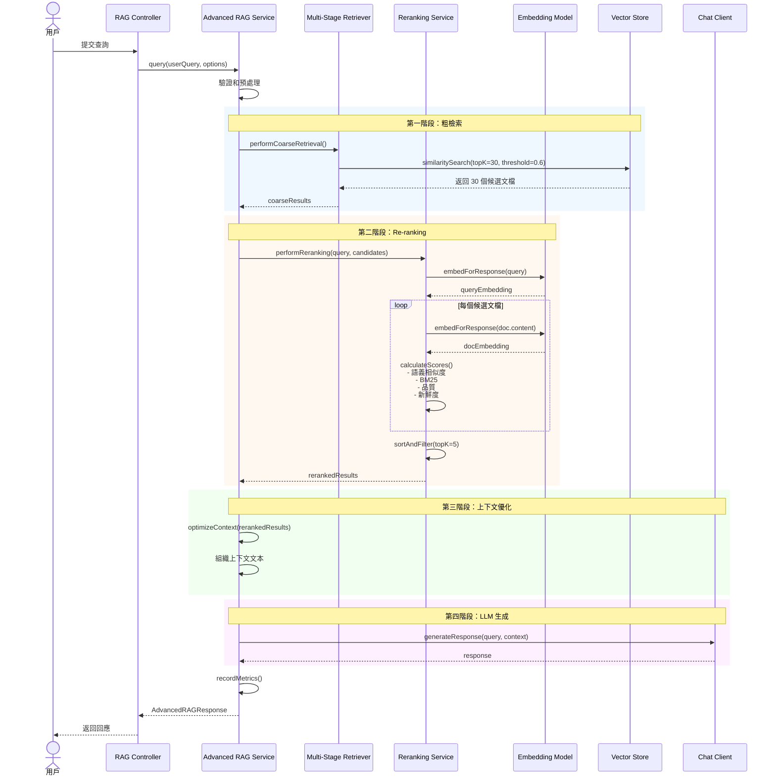

### 3.4 智能 Embedding 選擇流程圖

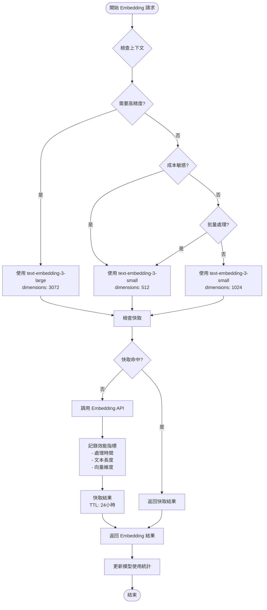

---

## 四、資料模型設計

### 4.1 核心實體 ER 圖

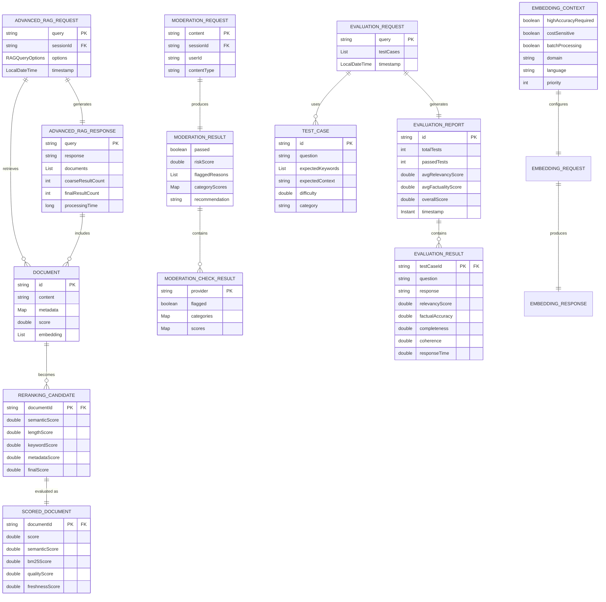

### 4.2 配置和狀態資料模型

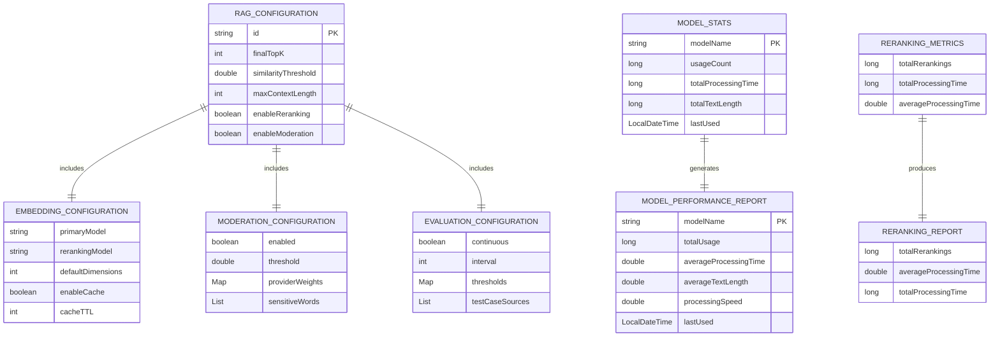

---

## 五、核心類別設計

### 5.1 主要服務類別圖

```mermaid
classDiagram
    class AdvancedRAGService {
        -VectorStore vectorStore
        -EmbeddingModel primaryEmbeddingModel
        -EmbeddingModel rerankingEmbeddingModel
        -ChatClient chatClient
        -RerankingMetrics rerankingMetrics
        +query(userQuery: String, options: RAGQueryOptions) AdvancedRAGResponse
        -performCoarseRetrieval(query: String, options: RAGQueryOptions) List~Document~
        -performReranking(query: String, candidates: List~Document~, options: RAGQueryOptions) List~Document~
        -optimizeContext(documents: List~Document~, options: RAGQueryOptions) String
        -generateResponse(query: String, context: String) String
    }

    class SmartEmbeddingService {
        -EmbeddingModel embeddingModel
        -EmbeddingModelPerformanceMonitor performanceMonitor
        -RedisTemplate redisTemplate
        +embedWithSmartSelection(text: String, context: EmbeddingContext) float[]
        +batchEmbed(texts: List~String~, context: EmbeddingContext) Map~String, float[]~
        -selectModelOptions(context: EmbeddingContext) OpenAiEmbeddingOptions
        -getCachedEmbedding(cacheKey: String) float[]
        -cacheEmbedding(cacheKey: String, embedding: float[]) void
    }

    class AIContentModerationService {
        -OpenAiModerationModel openAiModerationModel
        -MistralAiModerationModel mistralModerationModel
        -ApplicationEventPublisher eventPublisher
        -boolean moderationEnabled
        -double moderationThreshold
        +moderateContent(content: String, context: ModerationContext) ModerationResult
        -performOpenAiModeration(content: String, context: ModerationContext) ModerationCheckResult
        -performMistralModeration(content: String, context: ModerationContext) ModerationCheckResult
        -performCustomRuleModeration(content: String, context: ModerationContext) ModerationCheckResult
        -evaluateResults(results: List~ModerationCheckResult~, context: ModerationContext) ModerationResult
    }

    class AIEvaluationService {
        -ChatClient chatClient
        -RelevancyEvaluator relevancyEvaluator
        -FactCheckingEvaluator factCheckingEvaluator
        -VectorStore vectorStore
        +evaluateRagSystem(testCases: List~TestCase~) EvaluationReport
        -evaluateTestCase(testCase: TestCase) EvaluationResult
        -performCustomEvaluation(testCase: TestCase, response: String, context: List~Content~) CustomEvaluationResult
    }

    class MultiStageRetrievalService {
        -VectorStore vectorStore
        -ChatClient.Builder chatClientBuilder
        +createMultiStageConfig() MultiStageRetrievalConfig
        +performMultiStageRetrieval(queryText: String, filters: Map) List~Document~
        +performExpandedMultiStageRetrieval(queryText: String, numberOfExpansions: int) List~Document~
    }

    AdvancedRAGService --> SmartEmbeddingService
    AdvancedRAGService --> MultiStageRetrievalService
    AdvancedRAGService --> AIContentModerationService
    AdvancedRAGService --> AIEvaluationService
```

### 5.2 Advisor 類別圖

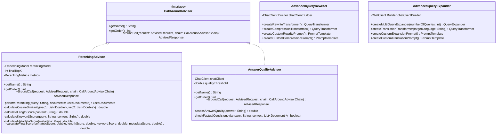

### 5.3 資料傳輸物件（DTO）類別圖

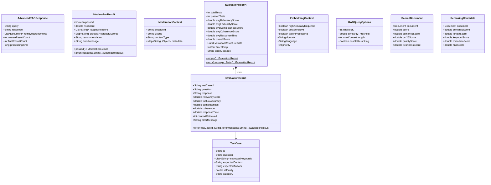

---

## 六、關鍵演算法設計

### 6.1 多因子 Re-ranking 評分演算法

**演算法描述**：
結合多個評分因子對檢索結果進行精確排序。

**虛擬碼**：
```
function calculateRerankingScore(query, document):
    // 1. 語義相似度分數（權重 0.4）
    queryEmbedding = embeddingModel.embed(query)
    docEmbedding = embeddingModel.embed(document.content)
    semanticScore = cosineSimilarity(queryEmbedding, docEmbedding)

    // 2. BM25 分數（權重 0.3）
    bm25Score = calculateBM25(query, document.content)

    // 3. 文檔品質分數（權重 0.2）
    qualityScore = 0.5  // 基礎分數
    if 100 <= document.length <= 2000:
        qualityScore += 0.2
    if document.hasStructure():
        qualityScore += 0.1
    if document.metadata.contains("title"):
        qualityScore += 0.1
    if document.metadata.source == "official":
        qualityScore += 0.1

    // 4. 新鮮度分數（權重 0.1）
    daysSinceUpdate = calculateDaysSince(document.lastUpdated)
    if daysSinceUpdate <= 30:
        freshnessScore = 1.0
    else if daysSinceUpdate <= 365:
        freshnessScore = 1.0 - (daysSinceUpdate - 30) / 335.0 * 0.5
    else:
        freshnessScore = 0.5

    // 5. 綜合分數計算
    finalScore = semanticScore * 0.4 +
                 bm25Score * 0.3 +
                 qualityScore * 0.2 +
                 freshnessScore * 0.1

    return finalScore

function performReranking(query, candidates, topK):
    scoredDocuments = []
    for each document in candidates:
        score = calculateRerankingScore(query, document)
        scoredDocuments.add(ScoredDocument(document, score))

    // 按分數降序排序
    scoredDocuments.sortDescending(by: score)

    // 取前 topK 個
    return scoredDocuments.take(topK)
```

**複雜度分析**：
- 時間複雜度：O(n * m)，其中 n 是候選文檔數量，m 是 Embedding 維度
- 空間複雜度：O(n)

### 6.2 BM25 評分演算法

**虛擬碼**：
```
function calculateBM25(query, content):
    k1 = 1.2  // 詞頻飽和參數
    b = 0.75  // 長度正規化參數

    queryTerms = tokenize(query.toLowerCase())
    lowerContent = content.toLowerCase()

    score = 0.0
    for each term in queryTerms:
        termFreq = countOccurrences(lowerContent, term)
        if termFreq > 0:
            // 簡化的 BM25 公式（不考慮 IDF）
            tf = termFreq / (termFreq + k1)
            score += tf

    return score / queryTerms.length
```

### 6.3 內容風險評分演算法

**虛擬碼**：
```
function evaluateModerationResults(results, context):
    categoryScores = Map()
    flaggedProviders = []

    // 1. 收集各提供商的評分
    for each result in results:
        if result.isFlagged():
            flaggedProviders.add(result.provider)

            providerWeight = getProviderWeight(result.provider)

            for each (category, score) in result.scores:
                if categoryScores.contains(category):
                    categoryScores[category] += score * providerWeight
                else:
                    categoryScores[category] = score * providerWeight

    // 2. 計算最終風險分數（取最大值）
    totalRiskScore = max(categoryScores.values())

    // 3. 決策判斷
    shouldBlock = (totalRiskScore >= moderationThreshold)

    // 4. 生成建議
    if shouldBlock:
        recommendation = "建議阻擋此內容，風險分數: " + totalRiskScore
    else if totalRiskScore > 0.5:
        recommendation = "內容可能有風險，建議人工審查，風險分數: " + totalRiskScore
    else:
        recommendation = "內容安全，可以通過"

    return ModerationResult(
        passed = !shouldBlock,
        riskScore = totalRiskScore,
        flaggedReasons = flaggedProviders,
        categoryScores = categoryScores,
        recommendation = recommendation
    )
```

---

## 七、API 設計概覽

### 7.1 RESTful API 端點總覽

| 端點 | 方法 | 說明 | 優先級 |
|------|------|------|--------|
| `/api/v1/rag/query` | POST | Advanced RAG 查詢 | P0 |
| `/api/v1/rag/documents` | POST | 批量添加文檔 | P0 |
| `/api/v1/moderation/check` | POST | 內容審核檢查 | P0 |
| `/api/v1/evaluation/run` | POST | 執行評估測試 | P1 |
| `/api/v1/evaluation/report` | GET | 獲取評估報告 | P1 |
| `/api/v1/monitoring/metrics` | GET | 獲取系統指標 | P1 |
| `/api/v1/monitoring/health` | GET | 健康檢查 | P0 |
| `/api/v1/embedding/models` | GET | 獲取可用 Embedding 模型 | P2 |
| `/api/v1/embedding/performance` | GET | Embedding 效能報告 | P2 |

詳細 API 規範請參考 `api.md` 文檔。

---

## 八、非功能性需求

### 8.1 效能需求

| 指標 | 目標 | 備註 |
|------|------|------|
| **查詢回應時間** | < 5 秒 | P95 |
| **粗檢索時間** | < 1 秒 | P95 |
| **Re-ranking 時間** | < 2 秒 | P95 |
| **LLM 生成時間** | < 3 秒 | P95 |
| **內容審核時間** | < 500 毫秒 | P95 |
| **Embedding 快取命中率** | > 70% | 平均值 |
| **並發請求處理** | 100 QPS | 最低要求 |
| **向量檢索準確率** | > 85% | 基於評估測試 |
| **Re-ranking 提升幅度** | +15~25% | 相對於傳統檢索 |

### 8.2 可靠性需求

- **系統可用性**: 99.5%（允許每月停機 3.6 小時）
- **資料一致性**: 強一致性（向量數據）、最終一致性（快取）
- **錯誤處理**:
  - API 調用失敗自動重試（最多 3 次）
  - 服務降級策略（審核服務失敗不影響主流程）
  - 詳細的錯誤日誌和告警
- **資料備份**: 向量數據每日備份，保留 7 天

### 8.3 安全性需求

- **API 安全**:
  - API Key 認證
  - Rate Limiting（每用戶 100 請求/分鐘）
  - 請求參數驗證
- **數據安全**:
  - 敏感數據加密存儲
  - PII 檢測和脫敏
  - 內容審核多層防護
- **審計日誌**: 記錄所有 API 請求、審核結果、評估報告

### 8.4 可擴展性需求

- **水平擴展**: 支持多實例部署
- **向量數據庫擴展**: 支持 10M+ 文檔向量
- **快取擴展**: Redis Cluster 支持
- **監控擴展**: Prometheus + Grafana 完整監控

### 8.5 可維護性需求

- **日誌**: 結構化日誌（JSON 格式）
- **監控**: 完整的指標收集和告警
- **文檔**: API 文檔、部署文檔、運維手冊
- **測試覆蓋率**: > 70%

---

## 九、部署架構

### 9.1 部署架構圖

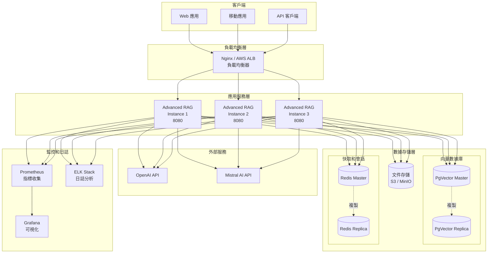

### 9.2 環境配置

| 環境 | 配置 | 說明 |
|------|------|------|
| **開發環境** | 1 應用實例 + PgVector + Redis | 本地開發 |
| **測試環境** | 2 應用實例 + PgVector + Redis | 功能測試 |
| **UAT 環境** | 2 應用實例 + PgVector Cluster + Redis Cluster | 用戶驗收 |
| **生產環境** | 3+ 應用實例 + PgVector HA + Redis Cluster | 正式服務 |

### 9.3 容器化部署（Docker Compose）

```yaml
version: '3.8'

services:
  advanced-rag-app:
    image: advanced-rag:latest
    ports:
      - "8080:8080"
    environment:
      - SPRING_PROFILES_ACTIVE=prod
      - OPENAI_API_KEY=${OPENAI_API_KEY}
      - MISTRAL_API_KEY=${MISTRAL_API_KEY}
    depends_on:
      - pgvector
      - redis
    deploy:
      replicas: 3
      resources:
        limits:
          cpus: '2'
          memory: 4G

  pgvector:
    image: ankane/pgvector:latest
    environment:
      - POSTGRES_DB=advanced_rag
      - POSTGRES_USER=raguser
      - POSTGRES_PASSWORD=${POSTGRES_PASSWORD}
    volumes:
      - pgvector_data:/var/lib/postgresql/data
    ports:
      - "5432:5432"

  redis:
    image: redis:7-alpine
    ports:
      - "6379:6379"
    volumes:
      - redis_data:/data

  prometheus:
    image: prom/prometheus:latest
    ports:
      - "9090:9090"
    volumes:
      - ./prometheus.yml:/etc/prometheus/prometheus.yml
      - prometheus_data:/prometheus

  grafana:
    image: grafana/grafana:latest
    ports:
      - "3000:3000"
    environment:
      - GF_SECURITY_ADMIN_PASSWORD=${GRAFANA_PASSWORD}
    volumes:
      - grafana_data:/var/lib/grafana

volumes:
  pgvector_data:
  redis_data:
  prometheus_data:
  grafana_data:
```

---

## 十、監控和指標

### 10.1 關鍵指標（KPI）

#### 業務指標
- **查詢成功率**: 目標 > 95%
- **用戶滿意度**: 基於評估分數，目標 > 4.0/5.0
- **平均回應時間**: 目標 < 5 秒
- **Re-ranking 效果提升**: 目標 +15~25%

#### 技術指標
- **Embedding 快取命中率**: 目標 > 70%
- **向量檢索準確率**: 目標 > 85%
- **內容審核攔截率**: 監控指標，無目標
- **API 錯誤率**: 目標 < 1%

#### 資源指標
- **CPU 使用率**: 目標 < 70%
- **記憶體使用率**: 目標 < 80%
- **向量數據庫連接數**: 監控指標
- **Redis 快取大小**: 監控指標

### 10.2 告警規則

| 告警名稱 | 條件 | 級別 | 處理 |
|---------|------|------|------|
| **高錯誤率** | 錯誤率 > 5% 持續 5 分鐘 | Critical | 立即處理 |
| **高回應時間** | P95 回應時間 > 10 秒 | Warning | 優化性能 |
| **服務不可用** | 健康檢查失敗 | Critical | 立即重啟 |
| **數據庫連接失敗** | 連接失敗 > 3 次 | Critical | 檢查數據庫 |
| **快取失效** | 快取命中率 < 50% | Warning | 檢查 Redis |
| **評估分數過低** | 綜合分數 < 0.7 | Warning | 優化模型 |

---

## 十一、測試策略

### 11.1 測試類型

#### 單元測試
- **目標覆蓋率**: > 70%
- **測試框架**: JUnit 5 + Mockito
- **測試範圍**: 所有服務類、Advisor、工具類

#### 整合測試
- **測試框架**: Spring Boot Test
- **測試範圍**: API 端點、服務整合、資料庫操作

#### 性能測試
- **測試工具**: JMeter / Gatling
- **測試場景**:
  - 正常負載（50 QPS）
  - 峰值負載（100 QPS）
  - 壓力測試（200 QPS）

#### 評估測試
- **自動化評估**: 每小時執行一次
- **測試案例**: > 50 個涵蓋不同場景
- **評估指標**: 相關性、準確性、完整性、連貫性

### 11.2 測試狀態圖

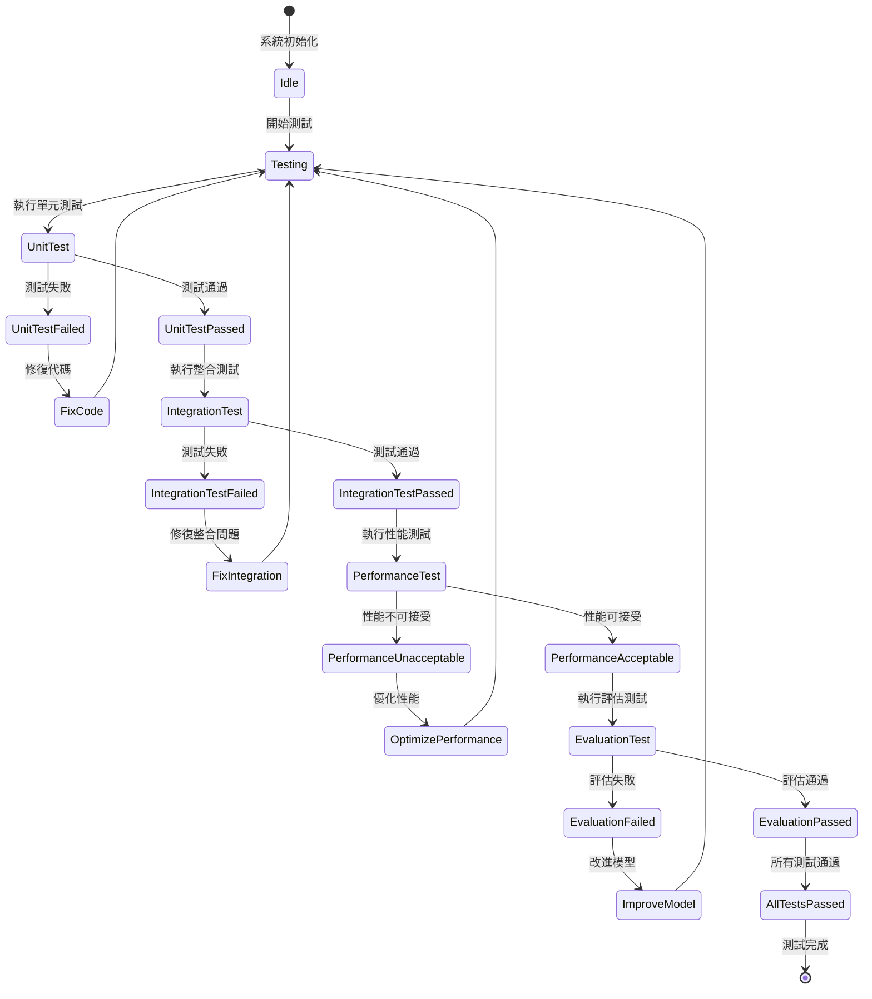

---

## 十二、風險評估與應對

### 12.1 技術風險

| 風險項 | 可能性 | 影響 | 應對措施 |
|-------|--------|------|---------|
| **OpenAI API 限流** | 高 | 高 | 實現快取、批量處理、降級策略 |
| **向量數據庫性能瓶頸** | 中 | 高 | 索引優化、讀寫分離、集群部署 |
| **Re-ranking 計算耗時過長** | 中 | 中 | 並行計算、快取、權重調優 |
| **記憶體溢出** | 低 | 高 | 限制批量大小、優化資料結構 |
| **依賴服務不可用** | 中 | 高 | 服務降級、熔斷機制、監控告警 |

### 12.2 業務風險

| 風險項 | 可能性 | 影響 | 應對措施 |
|-------|--------|------|---------|
| **檢索結果不相關** | 中 | 高 | 持續評估、模型優化、調整權重 |
| **內容審核漏報** | 低 | 高 | 多層審核、人工複核、持續更新規則 |
| **用戶體驗不佳** | 中 | 中 | A/B 測試、用戶反饋、持續優化 |
| **成本過高** | 中 | 中 | 成本監控、智能模型選擇、快取優化 |

---

## 十三、開發計劃與里程碑

### 13.1 開發階段

| 階段 | 任務 | 預計時間 | 交付物 |
|------|------|---------|--------|
| **階段一：基礎架構** | 專案初始化、依賴配置、基本架構搭建 | 1 天 | 可運行的專案骨架 |
| **階段二：核心功能** | Advanced RAG 服務、Embedding 服務、多階段檢索 | 3 天 | 基本 RAG 功能 |
| **階段三：Re-ranking** | Re-ranking Advisor、多因子評分、效果評估 | 2 天 | Re-ranking 功能 |
| **階段四：內容審核** | 內容審核服務、多層防護、風險評分 | 2 天 | 內容審核功能 |
| **階段五：評估測試** | 評估框架、持續監控、自動化測試 | 2 天 | 評估測試功能 |
| **階段六：監控優化** | 指標收集、告警配置、性能優化 | 1 天 | 完整監控系統 |
| **階段七：測試部署** | 整合測試、性能測試、部署配置 | 2 天 | 可部署的系統 |

### 13.2 里程碑

- ✅ **M1**: 完成規格文檔（第 1 天）
- 🔲 **M2**: 完成基礎架構和核心功能（第 4 天）
- 🔲 **M3**: 完成 Re-ranking 和內容審核（第 8 天）
- 🔲 **M4**: 完成評估測試和監控（第 11 天）
- 🔲 **M5**: 完成測試和部署準備（第 13 天）

---

## 十四、附錄

### 14.1 術語表

| 術語 | 全稱 | 說明 |
|------|------|------|
| **RAG** | Retrieval-Augmented Generation | 檢索增強生成 |
| **LLM** | Large Language Model | 大語言模型 |
| **Embedding** | Vector Embedding | 向量嵌入/向量化 |
| **Re-ranking** | Re-ranking | 重排序 |
| **BM25** | Best Matching 25 | 一種排序算法 |
| **PII** | Personally Identifiable Information | 個人可識別信息 |
| **QPS** | Queries Per Second | 每秒查詢數 |
| **P95** | 95th Percentile | 第 95 百分位數 |

### 14.2 參考文獻

1. [Retrieval-Augmented Generation for Knowledge-Intensive NLP Tasks](https://arxiv.org/abs/2005.11401)
2. [Advanced RAG Techniques](https://arxiv.org/abs/2312.10997)
3. [Spring AI Documentation](https://docs.spring.io/spring-ai/reference/)
4. [OpenAI API Documentation](https://platform.openai.com/docs/)
5. [PgVector Documentation](https://github.com/pgvector/pgvector)

### 14.3 變更記錄

| 版本 | 日期 | 變更內容 | 作者 |
|------|------|---------|------|
| 1.0.0 | 2025-01-30 | 初始版本 | AI Assistant |

---

**文檔結束**
