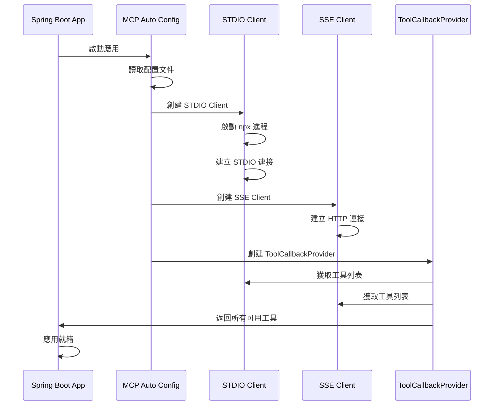
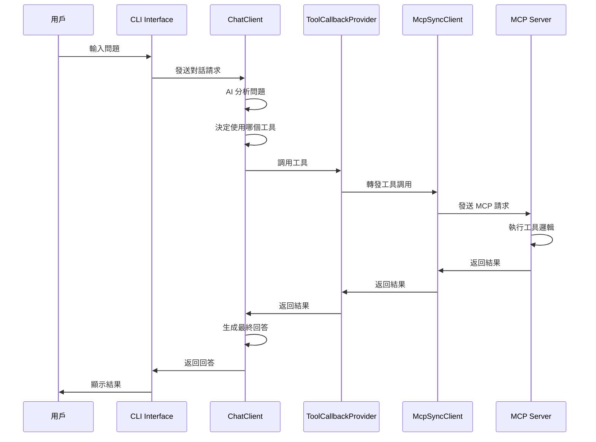
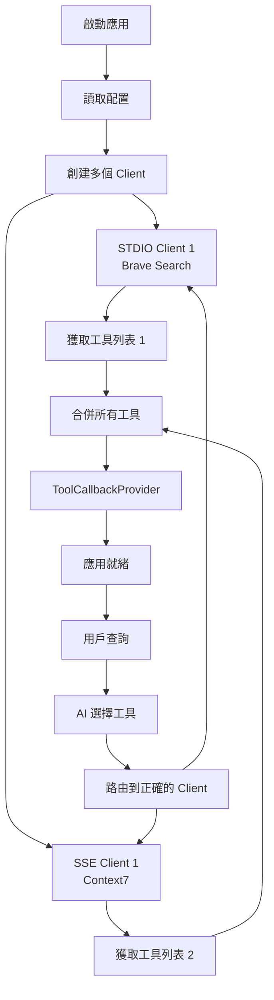
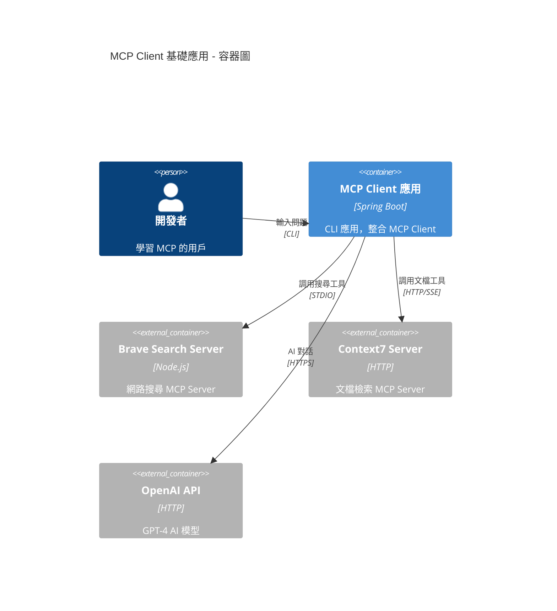
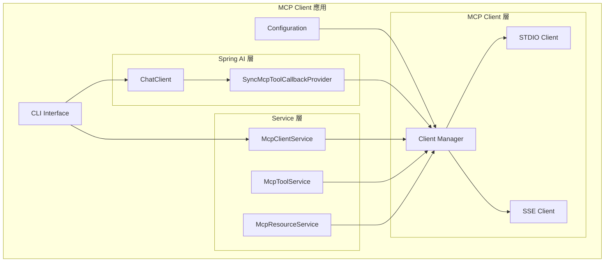
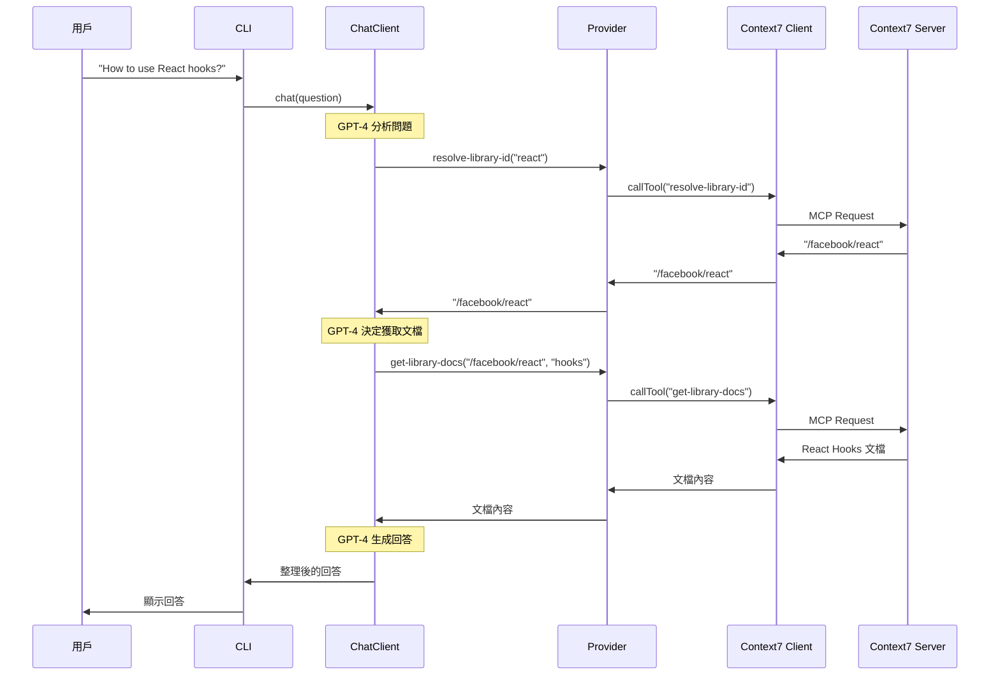
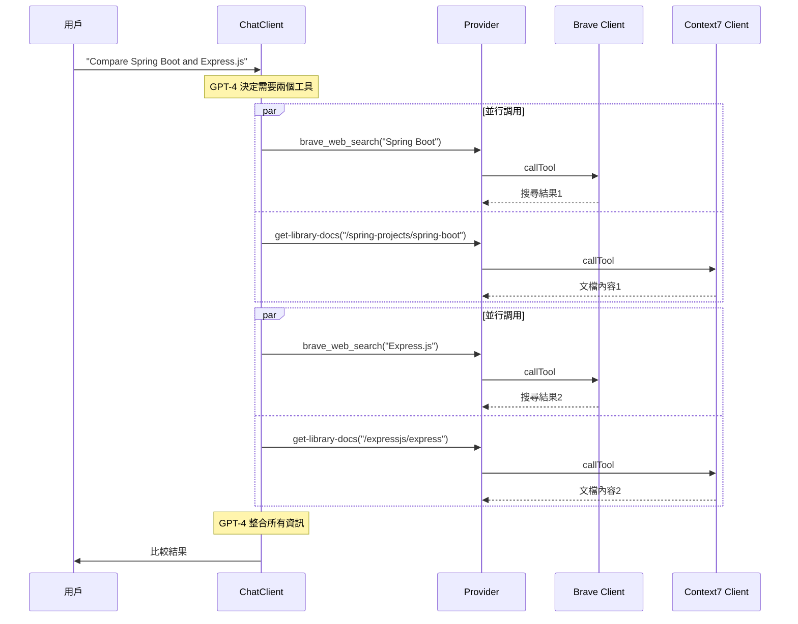
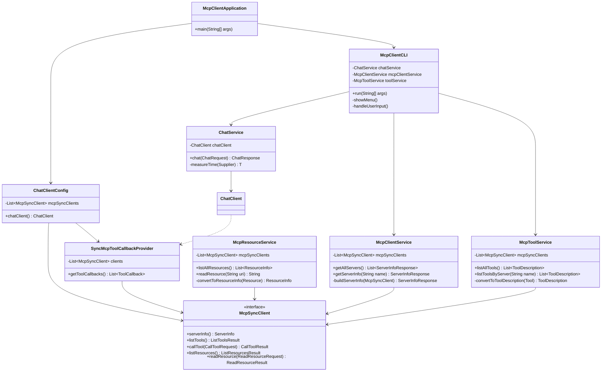

# 專案1：MCP Client 基礎應用 - 技術規格文件

**專案名稱**: chapter9-mcp-client-basic
**對應章節**: 9.1 MCP 協議基礎, 9.2 MCP Client 使用
**Spring AI 版本**: 1.0.3
**Spring Boot 版本**: 3.5.7
**文檔版本**: 1.0
**最後更新**: 2025-10-31

---

## 📋 目錄

1. [專案概述](#1-專案概述)
2. [架構與選型](#2-架構與選型)
3. [技術棧](#3-技術棧)
4. [資料模型](#4-資料模型)
5. [MCP Server 配置](#5-mcp-server-配置)
6. [關鍵流程](#6-關鍵流程)
7. [系統架構圖](#7-系統架構圖)
8. [序列圖](#8-序列圖)
9. [類別圖](#9-類別圖)
10. [API 設計](#10-api-設計)
11. [測試計劃](#11-測試計劃)
12. [部署說明](#12-部署說明)

---

## 1. 專案概述

### 1.1 專案目標

本專案旨在教學如何使用 Spring AI 的 MCP Client 連接和調用外部 MCP Server，展示 Model Context Protocol 的基本使用方式。讀者將學會：

- 配置 MCP Client 連接到多個 MCP Server
- 理解 STDIO 和 SSE 兩種傳輸方式的區別和使用場景
- 將 MCP 工具整合到 Spring AI ChatClient
- 實際調用真實的 MCP Server (Context7)
- 處理工具發現、調用和結果處理

### 1.2 學習重點

1. **MCP 協議理解**:
   - Client-Server 通訊模型
   - 工具發現機制
   - 傳輸層抽象

2. **配置管理**:
   - STDIO 傳輸配置 (本地進程)
   - SSE 傳輸配置 (HTTP)
   - 多 Server 管理

3. **Spring AI 整合**:
   - `spring-ai-starter-mcp-client` 自動配置
   - `ChatClient` 與 MCP 工具整合
   - `SyncMcpToolCallbackProvider` 使用

### 1.3 功能需求

#### 核心功能

| 功能 | 說明 | 優先級 |
|------|------|--------|
| **STDIO 傳輸連接** | 連接到本地 Node.js MCP Server | P0 |
| **SSE 傳輸連接** | 連接到遠端 HTTP MCP Server (Context7) | P0 |
| **工具發現** | 列出所有可用的 MCP 工具 | P0 |
| **工具調用** | 通過 ChatClient 調用 MCP 工具 | P0 |
| **Server 信息查詢** | 獲取 MCP Server 的元數據 | P1 |
| **資源讀取** | 讀取 MCP Server 提供的資源 | P1 |
| **錯誤處理** | 處理連接失敗和工具調用錯誤 | P1 |

#### 非功能需求

- **可用性**: 清晰的錯誤提示
- **可維護性**: 配置與程式碼分離
- **可測試性**: 提供單元測試和整合測試
- **文檔完整性**: 詳細的註解和使用說明

---

## 2. 架構與選型

### 2.1 整體架構

```
┌─────────────────────────────────────────────────────────────┐
│                     MCP Client 應用                          │
├─────────────────────────────────────────────────────────────┤
│                                                             │
│  ┌──────────────────────────────────────────────────────┐  │
│  │           Spring AI ChatClient                       │  │
│  │  (AI 對話管理、工具選擇、結果處理)                      │  │
│  └────────────────────┬─────────────────────────────────┘  │
│                       │                                     │
│  ┌────────────────────▼─────────────────────────────────┐  │
│  │      SyncMcpToolCallbackProvider                     │  │
│  │  (MCP 工具適配器、工具調用橋接)                         │  │
│  └────────────────────┬─────────────────────────────────┘  │
│                       │                                     │
│  ┌────────────────────▼─────────────────────────────────┐  │
│  │      List<McpSyncClient>                             │  │
│  │  (MCP Client 列表、連接管理)                           │  │
│  └──────┬────────────────────────────────┬──────────────┘  │
│         │                                │                 │
│  ┌──────▼──────────┐           ┌────────▼────────────┐    │
│  │  STDIO Client   │           │   SSE Client        │    │
│  │  (本地進程)      │           │   (HTTP)            │    │
│  └──────┬──────────┘           └────────┬────────────┘    │
│         │                                │                 │
└─────────┼────────────────────────────────┼─────────────────┘
          │                                │
          │                                │
  ┌───────▼────────┐             ┌────────▼──────────────┐
  │  Brave Search  │             │  Context7 MCP Server  │
  │  MCP Server    │             │  https://mcp.context7 │
  │  (npx)         │             │  .com/mcp             │
  └────────────────┘             └───────────────────────┘
```

### 2.2 架構決策

#### 2.2.1 為什麼使用 Spring AI MCP Client Starter?

✅ **自動配置**: 自動掃描和創建 McpSyncClient Bean
✅ **統一抽象**: 提供傳輸層抽象，支援 STDIO 和 SSE
✅ **工具整合**: 與 Spring AI ChatClient 無縫整合
✅ **配置驅動**: 通過配置文件管理多個 Server 連接

#### 2.2.2 為什麼選擇同步客戶端 (McpSyncClient)?

✅ **簡單易懂**: 適合教學和快速上手
✅ **直觀的 API**: 阻塞式調用，易於理解流程
✅ **足夠高效**: 對於大多數場景性能充足

> 注意: 專案4中會展示 WebFlux 異步客戶端的使用

#### 2.2.3 為什麼使用 Context7?

✅ **真實服務**: 公開的生產級 MCP Server
✅ **實用功能**: 提供文檔和代碼檢索
✅ **SSE 傳輸**: 展示 HTTP/SSE 連接方式
✅ **無需認證**: 簡化教學難度

---

## 3. 技術棧

### 3.1 核心依賴

```xml
<dependencies>
    <!-- Spring Boot -->
    <dependency>
        <groupId>org.springframework.boot</groupId>
        <artifactId>spring-boot-starter</artifactId>
        <version>3.5.7</version>
    </dependency>

    <!-- Spring AI MCP Client -->
    <dependency>
        <groupId>org.springframework.ai</groupId>
        <artifactId>spring-ai-starter-mcp-client</artifactId>
        <version>1.0.3</version>
    </dependency>

    <!-- Spring AI OpenAI -->
    <dependency>
        <groupId>org.springframework.ai</groupId>
        <artifactId>spring-ai-starter-openai</artifactId>
        <version>1.0.3</version>
    </dependency>

    <!-- Lombok (程式碼簡化) -->
    <dependency>
        <groupId>org.projectlombok</groupId>
        <artifactId>lombok</artifactId>
        <optional>true</optional>
    </dependency>
</dependencies>
```

### 3.2 依賴關係圖

```
spring-ai-starter-mcp-client (1.0.3)
├── spring-ai-mcp (1.0.3)
│   ├── SyncMcpToolCallbackProvider
│   ├── AsyncMcpToolCallbackProvider
│   └── McpSyncClientCustomizer
└── mcp-java-sdk (0.10.0)
    ├── McpSyncClient
    ├── McpAsyncClient
    └── Transport (STDIO, SSE)
```

### 3.3 開發環境

- **JDK**: 21+
- **Maven**: 3.9.11
- **IDE**: IntelliJ IDEA / VS Code
- **Node.js**: 18+ (用於運行 Brave Search MCP Server)

---

## 4. 資料模型

### 4.1 核心領域模型

#### 4.1.1 ServerInfo (Server 信息)

```java
/**
 * MCP Server 基本信息
 */
@Data
@Builder
public class ServerInfoResponse {
    /**
     * Server 名稱
     */
    private String name;

    /**
     * Server 版本
     */
    private String version;

    /**
     * Server 協議版本
     */
    private String protocolVersion;

    /**
     * Server 能力
     */
    private ServerCapabilities capabilities;

    /**
     * 傳輸方式 (STDIO/SSE)
     */
    private String transport;
}
```

#### 4.1.2 ServerCapabilities (Server 能力)

```java
/**
 * MCP Server 支援的功能
 */
@Data
@Builder
public class ServerCapabilities {
    /**
     * 是否支援工具
     */
    private boolean supportTools;

    /**
     * 是否支援資源
     */
    private boolean supportResources;

    /**
     * 是否支援提示
     */
    private boolean supportPrompts;

    /**
     * 是否支援日誌
     */
    private boolean supportLogging;
}
```

#### 4.1.3 ToolDescription (工具描述)

```java
/**
 * MCP 工具的元數據
 */
@Data
@Builder
public class ToolDescription {
    /**
     * 工具名稱
     */
    private String name;

    /**
     * 工具描述
     */
    private String description;

    /**
     * 參數 Schema (JSON Schema)
     */
    private Map<String, Object> inputSchema;

    /**
     * 來源 Server 名稱
     */
    private String serverName;
}
```

#### 4.1.4 ResourceInfo (資源信息)

```java
/**
 * MCP 資源的元數據
 */
@Data
@Builder
public class ResourceInfo {
    /**
     * 資源 URI
     */
    private String uri;

    /**
     * 資源名稱
     */
    private String name;

    /**
     * 資源描述
     */
    private String description;

    /**
     * 資源 MIME 類型
     */
    private String mimeType;
}
```

### 4.2 DTO 類別

#### 4.2.1 ChatRequest (對話請求)

```java
/**
 * AI 對話請求
 */
@Data
public class ChatRequest {
    /**
     * 用戶問題
     */
    private String question;

    /**
     * 是否啟用工具調用
     */
    @Builder.Default
    private boolean enableTools = true;

    /**
     * 指定使用的 Server (可選)
     */
    private String serverName;
}
```

#### 4.2.2 ChatResponse (對話回應)

```java
/**
 * AI 對話回應
 */
@Data
@Builder
public class ChatResponse {
    /**
     * AI 回答
     */
    private String answer;

    /**
     * 使用的工具列表
     */
    private List<String> usedTools;

    /**
     * 處理時間 (毫秒)
     */
    private long processingTime;
}
```

---

## 5. MCP Server 配置

### 5.1 配置文件結構

#### 5.1.1 application.yml

```yaml
spring:
  application:
    name: mcp-client-basic
  main:
    web-application-type: none  # CLI 應用
    banner-mode: off

  ai:
    # OpenAI 配置
    openai:
      api-key: ${OPENAI_API_KEY}
      chat:
        options:
          model: gpt-4
          temperature: 0.7

    # MCP Client 配置
    mcp:
      client:
        enabled: true
        type: SYNC  # 使用同步客戶端
        toolcallback:
          enabled: false  # Spring AI 1.0.3 手動管理

        # STDIO 傳輸配置
        stdio:
          # 方式1: 直接配置
          connections:
            brave-search:
              command: npx
              args:
                - -y
                - "@modelcontextprotocol/server-brave-search"
              env:
                BRAVE_API_KEY: ${BRAVE_API_KEY}

          # 方式2: 使用外部配置文件 (推薦)
          # servers-configuration: classpath:mcp-servers.json

        # SSE 傳輸配置 (HTTP)
        sse:
          connections:
            # Context7 MCP Server
            context7:
              url: https://mcp.context7.com/mcp
              timeout: 30000  # 30 秒超時

# 日誌配置
logging:
  level:
    root: INFO
    org.springframework.ai: DEBUG
    io.modelcontextprotocol: INFO
```

#### 5.1.2 mcp-servers.json (Claude Desktop 格式)

```json
{
  "mcpServers": {
    "brave-search": {
      "command": "npx",
      "args": [
        "-y",
        "@modelcontextprotocol/server-brave-search"
      ],
      "env": {
        "BRAVE_API_KEY": "${BRAVE_API_KEY}"
      }
    }
  }
}
```

### 5.2 Context7 MCP Server 詳細說明

#### 5.2.1 服務介紹

**Context7** 是一個提供程式庫文檔和代碼示例檢索的 MCP Server，支援多種熱門程式庫。

- **服務地址**: https://mcp.context7.com/mcp
- **傳輸方式**: HTTP/SSE
- **認證要求**: 無 (公開服務)
- **協議版本**: MCP 1.0

#### 5.2.2 提供的工具

| 工具名稱 | 功能說明 | 參數 |
|---------|---------|------|
| `resolve-library-id` | 解析程式庫名稱為 Context7 ID | `libraryName`: 程式庫名稱 |
| `get-library-docs` | 獲取程式庫文檔和範例 | `context7CompatibleLibraryID`: 程式庫 ID<br>`topic`: 主題 (可選)<br>`tokens`: 最大 Token 數 |

#### 5.2.3 使用範例

**範例1: 查詢 React 文檔**

```
問題: "How do I use React hooks?"

工具調用流程:
1. resolve-library-id(libraryName="react")
   → 返回: "/facebook/react"

2. get-library-docs(
     context7CompatibleLibraryID="/facebook/react",
     topic="hooks",
     tokens=5000
   )
   → 返回: React Hooks 文檔和範例
```

**範例2: 查詢 Spring Boot 文檔**

```
問題: "How to configure Spring Boot datasource?"

工具調用流程:
1. resolve-library-id(libraryName="spring-boot")
   → 返回: "/spring-projects/spring-boot"

2. get-library-docs(
     context7CompatibleLibraryID="/spring-projects/spring-boot",
     topic="datasource",
     tokens=3000
   )
   → 返回: Spring Boot DataSource 配置文檔
```

#### 5.2.4 連接測試

```bash
# 使用 curl 測試 Context7 連接
curl -X POST https://mcp.context7.com/mcp \
  -H "Content-Type: application/json" \
  -d '{
    "jsonrpc": "2.0",
    "method": "initialize",
    "params": {
      "protocolVersion": "1.0",
      "clientInfo": {
        "name": "test-client",
        "version": "1.0.0"
      }
    },
    "id": 1
  }'
```

### 5.3 Brave Search MCP Server 說明

#### 5.3.1 服務介紹

**Brave Search** 提供網路搜尋功能的 MCP Server。

- **安裝方式**: npm 套件 `@modelcontextprotocol/server-brave-search`
- **傳輸方式**: STDIO (本地進程)
- **認證要求**: Brave API Key (https://brave.com/search/api/)

#### 5.3.2 提供的工具

| 工具名稱 | 功能說明 | 參數 |
|---------|---------|------|
| `brave_web_search` | 網路搜尋 | `query`: 搜尋關鍵字<br>`count`: 結果數量 (預設 10) |

---

## 6. 關鍵流程

### 6.1 應用啟動流程



### 6.2 工具調用流程



### 6.3 多 Server 管理流程



---

## 7. 系統架構圖

### 7.1 容器圖 (Container Diagram)



### 7.2 元件圖 (Component Diagram)



---

## 8. 序列圖

### 8.1 Context7 查詢序列圖



### 8.2 多 Server 協同序列圖



---

## 9. 類別圖

### 9.1 核心類別關係



---

## 10. API 設計

### 10.1 Service API

#### 10.1.1 McpClientService

```java
/**
 * MCP Client 管理服務
 */
public interface McpClientService {
    /**
     * 獲取所有已連接的 Server 信息
     */
    List<ServerInfoResponse> getAllServers();

    /**
     * 獲取指定 Server 的詳細信息
     */
    ServerInfoResponse getServerInfo(String serverName);

    /**
     * 測試 Server 連接
     */
    boolean testConnection(String serverName);
}
```

#### 10.1.2 McpToolService

```java
/**
 * MCP 工具管理服務
 */
public interface McpToolService {
    /**
     * 列出所有可用的工具
     */
    List<ToolDescription> listAllTools();

    /**
     * 列出指定 Server 的工具
     */
    List<ToolDescription> listToolsByServer(String serverName);

    /**
     * 獲取工具的詳細信息
     */
    ToolDescription getToolInfo(String toolName);
}
```

#### 10.1.3 McpResourceService

```java
/**
 * MCP 資源管理服務
 */
public interface McpResourceService {
    /**
     * 列出所有可用的資源
     */
    List<ResourceInfo> listAllResources();

    /**
     * 讀取指定的資源
     */
    String readResource(String uri);

    /**
     * 列出指定 Server 的資源
     */
    List<ResourceInfo> listResourcesByServer(String serverName);
}
```

#### 10.1.4 ChatService

```java
/**
 * AI 對話服務
 */
public interface ChatService {
    /**
     * 發送對話請求
     */
    ChatResponse chat(ChatRequest request);

    /**
     * 串流對話 (可選)
     */
    Flux<String> chatStream(ChatRequest request);
}
```

---

## 11. 測試計劃

### 11.1 單元測試

#### 11.1.1 McpClientServiceTest

```java
@SpringBootTest
class McpClientServiceTest {

    @Autowired
    private McpClientService mcpClientService;

    @Test
    @DisplayName("應該能獲取所有 Server 信息")
    void shouldGetAllServers() {
        // Given & When
        List<ServerInfoResponse> servers = mcpClientService.getAllServers();

        // Then
        assertThat(servers).isNotEmpty();
        assertThat(servers).anyMatch(s -> s.getName().equals("context7"));
    }

    @Test
    @DisplayName("應該能獲取指定 Server 信息")
    void shouldGetServerInfoByName() {
        // Given
        String serverName = "context7";

        // When
        ServerInfoResponse info = mcpClientService.getServerInfo(serverName);

        // Then
        assertThat(info).isNotNull();
        assertThat(info.getName()).isEqualTo(serverName);
        assertThat(info.getTransport()).isEqualTo("SSE");
    }
}
```

#### 11.1.2 McpToolServiceTest

```java
@SpringBootTest
class McpToolServiceTest {

    @Autowired
    private McpToolService toolService;

    @Test
    @DisplayName("應該能列出所有工具")
    void shouldListAllTools() {
        // Given & When
        List<ToolDescription> tools = toolService.listAllTools();

        // Then
        assertThat(tools).isNotEmpty();
        assertThat(tools).anyMatch(t ->
            t.getName().equals("resolve-library-id"));
    }

    @Test
    @DisplayName("應該能列出 Context7 的工具")
    void shouldListContext7Tools() {
        // Given & When
        List<ToolDescription> tools = toolService.listToolsByServer("context7");

        // Then
        assertThat(tools).hasSize(2);
        assertThat(tools).extracting("name")
            .containsExactlyInAnyOrder(
                "resolve-library-id",
                "get-library-docs"
            );
    }
}
```

### 11.2 整合測試

#### 11.2.1 Context7IntegrationTest

```java
@SpringBootTest
@Tag("integration")
class Context7IntegrationTest {

    @Autowired
    private List<McpSyncClient> mcpSyncClients;

    private McpSyncClient context7Client;

    @BeforeEach
    void setUp() {
        // 找到 Context7 Client
        context7Client = mcpSyncClients.stream()
            .filter(c -> c.serverInfo().name().equals("context7"))
            .findFirst()
            .orElseThrow();
    }

    @Test
    @DisplayName("應該能解析 React 程式庫 ID")
    void shouldResolveReactLibraryId() {
        // Given
        var request = CallToolRequest.builder()
            .name("resolve-library-id")
            .arguments(Map.of("libraryName", "react"))
            .build();

        // When
        var result = context7Client.callTool(request);

        // Then
        assertThat(result).isNotNull();
        assertThat(result.content()).isNotEmpty();
        // 驗證返回的內容包含 /facebook/react
    }

    @Test
    @DisplayName("應該能獲取 Spring Boot 文檔")
    void shouldGetSpringBootDocs() {
        // Given
        var resolveRequest = CallToolRequest.builder()
            .name("resolve-library-id")
            .arguments(Map.of("libraryName", "spring-boot"))
            .build();

        var resolveResult = context7Client.callTool(resolveRequest);
        String libraryId = extractLibraryId(resolveResult);

        var docsRequest = CallToolRequest.builder()
            .name("get-library-docs")
            .arguments(Map.of(
                "context7CompatibleLibraryID", libraryId,
                "topic", "configuration",
                "tokens", 3000
            ))
            .build();

        // When
        var docsResult = context7Client.callTool(docsRequest);

        // Then
        assertThat(docsResult).isNotNull();
        assertThat(docsResult.content()).isNotEmpty();
        // 驗證返回的文檔內容
    }
}
```

#### 11.2.2 ChatClientIntegrationTest

```java
@SpringBootTest
@Tag("integration")
class ChatClientIntegrationTest {

    @Autowired
    private ChatService chatService;

    @Test
    @DisplayName("應該能使用 Context7 回答 React 問題")
    void shouldAnswerReactQuestionUsingContext7() {
        // Given
        var request = ChatRequest.builder()
            .question("How do I use React useState hook?")
            .enableTools(true)
            .build();

        // When
        var response = chatService.chat(request);

        // Then
        assertThat(response).isNotNull();
        assertThat(response.getAnswer()).isNotBlank();
        assertThat(response.getUsedTools())
            .contains("resolve-library-id", "get-library-docs");
    }

    @Test
    @DisplayName("應該能使用 Brave Search 搜尋信息")
    void shouldSearchUsingBrave() {
        // Given
        var request = ChatRequest.builder()
            .question("What is the latest version of Spring Boot?")
            .enableTools(true)
            .build();

        // When
        var response = chatService.chat(request);

        // Then
        assertThat(response).isNotNull();
        assertThat(response.getAnswer()).contains("Spring Boot");
        assertThat(response.getUsedTools())
            .contains("brave_web_search");
    }
}
```

### 11.3 測試數據

#### 11.3.1 測試用例清單

| 測試類型 | 測試場景 | 預期結果 |
|---------|---------|---------|
| 單元測試 | 獲取所有 Server | 返回包含 Context7 和 Brave 的列表 |
| 單元測試 | 列出所有工具 | 至少包含 3 個工具 |
| 整合測試 | Context7 解析程式庫 | 成功返回程式庫 ID |
| 整合測試 | Context7 獲取文檔 | 返回相關文檔內容 |
| 整合測試 | Brave 網路搜尋 | 返回搜尋結果 |
| 整合測試 | ChatClient 工具調用 | AI 正確選擇並調用工具 |

---

## 12. 部署說明

### 12.1 環境準備

#### 12.1.1 開發環境

```bash
# 1. 安裝 JDK 21
java -version  # 確認版本

# 2. 安裝 Maven
mvn -version  # 確認版本

# 3. 安裝 Node.js (用於 Brave Search)
node -version  # 確認版本 >= 18
npm -version

# 4. 設定環境變數
export OPENAI_API_KEY="your-openai-api-key"
export BRAVE_API_KEY="your-brave-api-key"  # 可選
```

#### 12.1.2 取得 API Keys

**OpenAI API Key** (必需):
1. 訪問 https://platform.openai.com/api-keys
2. 創建新的 API Key
3. 設定環境變數

**Brave API Key** (可選):
1. 訪問 https://brave.com/search/api/
2. 註冊並獲取 API Key
3. 設定環境變數

### 12.2 編譯和運行

#### 12.2.1 使用 Maven

```bash
# 1. 編譯專案
cd E:\Spring_AI_BOOK\code-examples\chapter9-mcp-integration\chapter9-mcp-client-basic
mvn clean compile

# 2. 運行測試
mvn test

# 3. 打包應用
mvn package -DskipTests

# 4. 運行應用
java -jar target/chapter9-mcp-client-basic-1.0.0.jar
```

#### 12.2.2 使用 Spring Boot Maven Plugin

```bash
# 直接運行 (開發模式)
mvn spring-boot:run

# 指定不同的問題
mvn spring-boot:run -Dspring-boot.run.arguments="--user.question='How to use React hooks?'"
```

### 12.3 配置檔案範本

#### 12.3.1 .env 範本

```bash
# .env (不要提交到 Git)
OPENAI_API_KEY=sk-...
BRAVE_API_KEY=BSA...
```

#### 12.3.2 application-dev.yml

```yaml
spring:
  ai:
    openai:
      chat:
        options:
          model: gpt-3.5-turbo  # 開發用便宜模型

logging:
  level:
    root: DEBUG
    org.springframework.ai: TRACE
```

#### 12.3.3 application-prod.yml

```yaml
spring:
  ai:
    openai:
      chat:
        options:
          model: gpt-4

logging:
  level:
    root: INFO
```

---

## 附錄

### A. 常見問題

**Q1: Context7 連接失敗怎麼辦？**

A: 檢查以下項目：
1. 網路連接是否正常
2. URL 是否正確: `https://mcp.context7.com/mcp`
3. 防火牆是否阻擋連接
4. 查看日誌中的詳細錯誤信息

**Q2: Brave Search 啟動失敗？**

A: 可能原因：
1. Node.js 版本過低 (需要 18+)
2. npm 安裝失敗
3. API Key 未設定或無效
4. 可以先只使用 Context7 進行測試

**Q3: 工具調用沒有被觸發？**

A: 確認：
1. `ChatClientConfig` 中是否正確注入 `SyncMcpToolCallbackProvider`
2. OpenAI API Key 是否有效
3. 問題是否明確需要使用工具
4. 查看日誌中的工具選擇過程

### B. 參考資源

- [Spring AI MCP 官方文檔](https://docs.spring.io/spring-ai/reference/api/mcp/)
- [MCP 協議規範](https://spec.modelcontextprotocol.io/)
- [Context7 官網](https://context7.com/)
- [MCP Java SDK](https://github.com/modelcontextprotocol/java-sdk)
- [Spring AI Examples](https://github.com/spring-projects/spring-ai-examples)

### C. 版本歷史

| 版本 | 日期 | 變更說明 |
|------|------|---------|
| 1.0 | 2025-10-31 | 初始版本，包含 Context7 整合 |

---

**文檔維護**: 本規格文件持續更新中
**最後更新**: 2025-10-31
**作者**: Spring AI 書籍專案團隊
