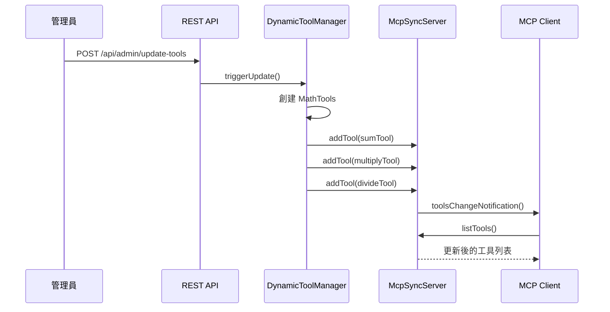
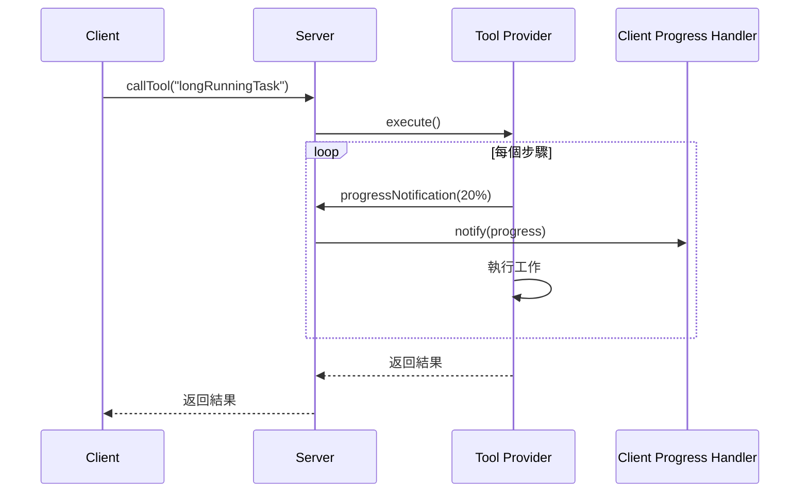
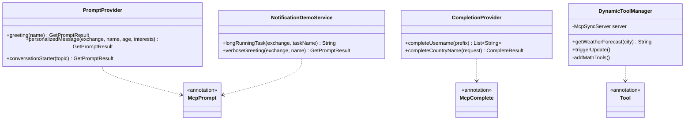

# 專案3：MCP Server - 提示與動態功能 - 技術規格文件

**專案名稱**: chapter9-mcp-server-advanced
**對應章節**: 9.4 MCP Server 開發進階
**Spring AI 版本**: 1.0.3
**Spring Boot 版本**: 3.5.7
**文檔版本**: 1.0
**最後更新**: 2025-10-31

---

## 1. 專案概述

### 1.1 專案目標

掌握 MCP 的進階特性：提示系統、自動完成、動態工具更新。學習重點：

- 使用 `@McpPrompt` 建立智能提示模板
- 使用 `@McpComplete` 提供 URI 和參數補全
- 實現運行時動態工具更新機制
- 配置客戶端處理器（Progress、Logging、Sampling）
- 使用 Server Exchange 進行日誌和進度通知
- 整合 H2 資料庫存儲動態提示

### 1.2 功能需求

| 功能類別 | 功能 | 優先級 |
|---------|------|--------|
| **提示** | 簡單問候提示 | P0 |
| **提示** | 個性化訊息（帶參數邏輯） | P0 |
| **提示** | 多訊息對話流程 | P1 |
| **提示** | 資料庫驅動的動態提示 | P1 |
| **完成** | 用戶名補全（URI 補全） | P0 |
| **完成** | 參數補全（Prompt 參數） | P0 |
| **動態工具** | 初始工具集 | P0 |
| **動態工具** | 運行時添加工具 | P0 |
| **動態工具** | 工具變更通知 | P0 |
| **處理器** | Progress 通知處理 | P1 |
| **處理器** | Logging 通知處理 | P1 |
| **處理器** | Sampling 請求處理 | P1 |

---

## 2. 架構與選型

### 2.1 整體架構

```
┌─────────────────────────────────────────────────┐
│         MCP Server 進階應用                      │
├─────────────────────────────────────────────────┤
│                                                 │
│  ┌───────────────────────────────────────────┐  │
│  │   MCP Server Core                         │  │
│  └───┬────────┬────────┬────────┬────────────┘  │
│      │        │        │        │               │
│  ┌───▼───┐ ┌─▼────┐ ┌─▼────┐ ┌▼──────────┐     │
│  │Prompts│ │Compl.│ │Tools │ │Resources  │     │
│  │       │ │      │ │(動態)│ │           │     │
│  └───┬───┘ └──────┘ └───┬──┘ └───────────┘     │
│      │                  │                       │
│  ┌───▼──────────────────▼───────────────────┐   │
│  │  Service 層 + H2 Database               │   │
│  └──────────────────────────────────────────┘   │
│                                                 │
│  ┌──────────────────────────────────────────┐   │
│  │  Server Exchange                         │   │
│  │  (Logging, Progress, Sampling)           │   │
│  └──────────────────────────────────────────┘   │
└─────────────────────────────────────────────────┘
```

### 2.2 關鍵決策

**為什麼需要提示系統？**
- 標準化常用對話模式
- 提供參數化的提示模板
- 支援複雜的多訊息流程

**為什麼需要自動完成？**
- 改善用戶體驗
- 減少輸入錯誤
- 提供智能建議

**為什麼需要動態工具更新？**
- MCP 的獨特優勢
- 不需重啟即可添加功能
- 展示 MCP 的靈活性

---

## 3. 技術棧

```xml
<dependencies>
    <!-- MCP Server WebMVC -->
    <dependency>
        <groupId>org.springframework.ai</groupId>
        <artifactId>spring-ai-starter-mcp-server-webmvc</artifactId>
    </dependency>

    <!-- Spring Data JPA -->
    <dependency>
        <groupId>org.springframework.boot</groupId>
        <artifactId>spring-boot-starter-data-jpa</artifactId>
    </dependency>

    <!-- H2 Database -->
    <dependency>
        <groupId>com.h2database</groupId>
        <artifactId>h2</artifactId>
        <scope>runtime</scope>
    </dependency>

    <!-- Lombok -->
    <dependency>
        <groupId>org.projectlombok</groupId>
        <artifactId>lombok</artifactId>
    </dependency>
</dependencies>
```

---

## 4. 資料模型

### 4.1 提示相關

```java
// 提示模板（資料庫存儲）
@Entity
@Data
public class PromptTemplate {
    @Id
    @GeneratedValue
    private Long id;

    private String name;          // 提示名稱
    private String description;   // 描述

    @ElementCollection
    private List<String> parameters;  // 參數列表

    @Lob
    private String template;      // 提示模板內容
}

// 提示參數
@Data
@Builder
public class PromptParameter {
    private String name;
    private String description;
    private boolean required;
    private Object defaultValue;
}
```

### 4.2 完成建議相關

```java
// 補全建議
@Data
@Builder
public class CompletionSuggestion {
    private String value;         // 建議值
    private String description;   // 說明
    private int score;            // 相關性分數
}

// 補全資料庫
@Entity
@Data
public class CompletionData {
    @Id
    private String category;      // 類別（如：username）

    @ElementCollection
    private List<String> values;  // 可能的值列表
}
```

### 4.3 動態工具相關

```java
// 工具註冊信息
@Data
@Builder
public class ToolRegistration {
    private String name;
    private String description;
    private Map<String, Object> inputSchema;
    private LocalDateTime registeredAt;
}
```

---

## 5. 提示設計

### 5.1 提示清單

| 提示名稱 | 參數 | 說明 |
|---------|------|------|
| `greeting` | name | 簡單問候 |
| `personalized-message` | name, age, interests | 個性化訊息（帶邏輯） |
| `conversation-starter` | topic | 多訊息對話流程 |
| `dynamic-query` | category | 資料庫驅動提示 |

### 5.2 實現結構

```java
@Service
@Slf4j
public class PromptProvider {

    /**
     * 簡單問候提示
     */
    @McpPrompt(
        name = "greeting",
        description = "Simple greeting prompt"
    )
    public GetPromptResult greeting(
            @McpArg(name = "name", required = true) String name) {

        String message = String.format("Hello, %s! How can I help you today?", name);

        return new GetPromptResult(
            "Greeting",
            List.of(new PromptMessage(Role.ASSISTANT, new TextContent(message)))
        );
    }

    /**
     * 個性化訊息（帶參數邏輯）
     */
    @McpPrompt(
        name = "personalized-message",
        description = "Personalized message based on user info"
    )
    public GetPromptResult personalizedMessage(
            McpSyncServerExchange exchange,
            @McpArg(name = "name", required = true) String name,
            @McpArg(name = "age", required = false) Integer age,
            @McpArg(name = "interests", required = false) String interests) {

        // 記錄日誌到 Client
        exchange.loggingNotification(LoggingMessageNotification.builder()
            .level(LoggingLevel.INFO)
            .data("Generating personalized message for: " + name)
            .build());

        StringBuilder message = new StringBuilder("Hello, " + name + "!\n\n");

        // 根據年齡添加不同內容
        if (age != null) {
            if (age < 30) {
                message.append("You have so much ahead of you.\n");
            } else if (age < 60) {
                message.append("You have gained valuable life experience.\n");
            } else {
                message.append("You have accumulated wisdom to share.\n");
            }
        }

        // 根據興趣添加內容
        if (interests != null && !interests.isEmpty()) {
            message.append("I see you're interested in ").append(interests).append(".\n");
        }

        return new GetPromptResult(
            "Personalized Message",
            List.of(new PromptMessage(Role.ASSISTANT, new TextContent(message.toString())))
        );
    }

    /**
     * 多訊息對話流程
     */
    @McpPrompt(
        name = "conversation-starter",
        description = "Multi-message conversation flow"
    )
    public GetPromptResult conversationStarter(
            @McpArg(name = "topic") String topic) {

        List<PromptMessage> messages = List.of(
            new PromptMessage(Role.USER, new TextContent("I want to learn about " + topic)),
            new PromptMessage(Role.ASSISTANT, new TextContent("Great! Let's start with the basics.")),
            new PromptMessage(Role.USER, new TextContent("What are the key concepts?"))
        );

        return new GetPromptResult("Conversation Starter", messages);
    }
}
```

### 5.3 資料庫驅動提示

```java
@Service
public class DynamicPromptProvider {

    @Autowired
    private PromptTemplateRepository promptTemplateRepository;

    /**
     * 從資料庫加載提示模板
     */
    @McpPrompt(
        name = "dynamic-query",
        description = "Database-driven dynamic prompt"
    )
    public GetPromptResult dynamicQuery(
            @McpArg(name = "category") String category) {

        Optional<PromptTemplate> template =
            promptTemplateRepository.findByName("query-" + category);

        if (template.isEmpty()) {
            return createErrorPrompt("Template not found: " + category);
        }

        String content = template.get().getTemplate();
        return new GetPromptResult(
            "Dynamic Query",
            List.of(new PromptMessage(Role.ASSISTANT, new TextContent(content)))
        );
    }
}
```

### 5.4 提示設計最佳實踐

#### 5.4.1 命名規範

**推薦的提示命名**:

```
✅ 好的設計：
greeting                    # 簡潔、小寫
personalized-message        # 使用連字符
conversation-starter        # 描述性強
code-review-feedback        # 清楚表達用途

✅ 描述性：
user-onboarding            # 明確場景
error-troubleshooting      # 清晰目的
meeting-summary            # 功能明確
```

**避免的命名**:

```
❌ 應避免：
greetingPrompt             # 不需要 Prompt 後綴
GetGreeting                # 大寫開頭
prompt1                    # 無意義命名
msg                        # 過於簡短
getUserGreetingMessage     # 太冗長
```

#### 5.4.2 參數設計原則

**清晰的參數定義**:

```java
// ✅ 好的參數設計
@McpPrompt(
    name = "personalized-greeting",
    description = "Generate personalized greeting based on user context"
)
public GetPromptResult personalizedGreeting(
    McpSyncServerExchange exchange,
    @McpArg(name = "name", required = true,
            description = "User's name") String name,
    @McpArg(name = "timeOfDay", required = false,
            description = "morning/afternoon/evening") String timeOfDay,
    @McpArg(name = "language", required = false,
            description = "Preferred language (en/zh/ja)") String language) {

    // 參數驗證
    if (name == null || name.trim().isEmpty()) {
        exchange.loggingNotification(LoggingMessageNotification.builder()
            .level(LoggingLevel.ERROR)
            .data("Name parameter is required")
            .build());
        throw new IllegalArgumentException("Name cannot be empty");
    }

    // 參數預設值處理
    if (timeOfDay == null) {
        timeOfDay = detectTimeOfDay();  // 智能偵測
    }

    // 參數驗證 - 值域檢查
    List<String> validTimes = List.of("morning", "afternoon", "evening");
    if (!validTimes.contains(timeOfDay.toLowerCase())) {
        exchange.loggingNotification(LoggingMessageNotification.builder()
            .level(LoggingLevel.WARNING)
            .data("Invalid timeOfDay: " + timeOfDay + ", using default")
            .build());
        timeOfDay = "day";
    }

    // 生成提示...
}
```

**不良的參數設計**:

```java
// ❌ 避免的設計
@McpPrompt(name = "prompt1")
public GetPromptResult prompt1(String s) {  // 參數無描述
    return new GetPromptResult("", List.of(...));
}

// ❌ 參數過多
@McpPrompt(name = "complex-prompt")
public GetPromptResult complexPrompt(
    String p1, String p2, String p3, String p4,
    String p5, String p6, String p7) {  // 太多參數,難以使用
}
```

#### 5.4.3 提示內容設計

**結構化的提示**:

```java
@McpPrompt(
    name = "code-review",
    description = "Generate structured code review prompt"
)
public GetPromptResult codeReview(
        @McpArg(name = "language") String language,
        @McpArg(name = "codeSnippet") String code,
        @McpArg(name = "focusAreas", required = false) String focusAreas) {

    StringBuilder prompt = new StringBuilder();

    // ✅ 清晰的結構
    prompt.append("# Code Review Request\n\n");
    prompt.append("## Language\n").append(language).append("\n\n");
    prompt.append("## Code\n```").append(language).append("\n");
    prompt.append(code).append("\n```\n\n");

    if (focusAreas != null) {
        prompt.append("## Focus Areas\n").append(focusAreas).append("\n\n");
    }

    prompt.append("## Review Checklist\n");
    prompt.append("- Code quality and readability\n");
    prompt.append("- Potential bugs or issues\n");
    prompt.append("- Performance considerations\n");
    prompt.append("- Security concerns\n");
    prompt.append("- Best practices adherence\n\n");
    prompt.append("Please provide detailed feedback.");

    return new GetPromptResult(
        "Code Review",
        List.of(new PromptMessage(Role.USER, new TextContent(prompt.toString())))
    );
}
```

#### 5.4.4 多訊息流程設計

**對話式提示**:

```java
@McpPrompt(
    name = "learning-pathway",
    description = "Create a structured learning conversation"
)
public GetPromptResult learningPathway(
        @McpArg(name = "topic") String topic,
        @McpArg(name = "level") String level) {

    List<PromptMessage> messages = new ArrayList<>();

    // ✅ 結構化的對話流程
    // 1. 用戶初始請求
    messages.add(new PromptMessage(
        Role.USER,
        new TextContent("I want to learn " + topic + ". My level is " + level)
    ));

    // 2. 系統確認和規劃
    messages.add(new PromptMessage(
        Role.ASSISTANT,
        new TextContent("Great! I'll create a learning plan for " + topic +
                       " at " + level + " level. Let's start with the fundamentals.")
    ));

    // 3. 引導問題
    messages.add(new PromptMessage(
        Role.USER,
        new TextContent("What are the prerequisites I should know?")
    ));

    // 4. 系統回應框架
    messages.add(new PromptMessage(
        Role.ASSISTANT,
        new TextContent("For " + topic + ", you should be familiar with:\n" +
                       "1. ...\n2. ...\n3. ...\n\nLet's address each area.")
    ));

    return new GetPromptResult("Learning Pathway", messages);
}
```

#### 5.4.5 錯誤處理和日誌

**完善的錯誤處理**:

```java
@McpPrompt(
    name = "data-analysis",
    description = "Generate data analysis prompt"
)
public GetPromptResult dataAnalysis(
        McpSyncServerExchange exchange,
        @McpArg(name = "dataset") String dataset,
        @McpArg(name = "analysisType") String analysisType) {

    // ✅ 記錄開始
    exchange.loggingNotification(LoggingMessageNotification.builder()
        .level(LoggingLevel.INFO)
        .data(String.format("Generating analysis prompt: dataset=%s, type=%s",
                          dataset, analysisType))
        .build());

    try {
        // 參數驗證
        validateDataset(dataset);
        validateAnalysisType(analysisType);

        // ✅ 記錄進度
        exchange.progressNotification(ProgressNotification.builder()
            .progress(50.0)
            .total(100.0)
            .build());

        // 生成提示
        String prompt = generateAnalysisPrompt(dataset, analysisType);

        // ✅ 記錄成功
        exchange.loggingNotification(LoggingMessageNotification.builder()
            .level(LoggingLevel.INFO)
            .data("Analysis prompt generated successfully")
            .build());

        return new GetPromptResult(
            "Data Analysis",
            List.of(new PromptMessage(Role.USER, new TextContent(prompt)))
        );

    } catch (IllegalArgumentException e) {
        // ✅ 記錄錯誤
        exchange.loggingNotification(LoggingMessageNotification.builder()
            .level(LoggingLevel.ERROR)
            .data("Validation failed: " + e.getMessage())
            .build());
        throw e;

    } catch (Exception e) {
        // ✅ 記錄未預期錯誤
        exchange.loggingNotification(LoggingMessageNotification.builder()
            .level(LoggingLevel.ERROR)
            .data("Unexpected error: " + e.getMessage())
            .build());
        throw new PromptGenerationException("Failed to generate analysis prompt", e);
    }
}
```

#### 5.4.6 模板化設計

**可重用的提示模板**:

```java
@Service
public class PromptTemplateService {

    // ✅ 模板常量
    private static final String ROLE_TEMPLATE =
        "You are a {role}. Your task is to {task}.";

    private static final String CONTEXT_TEMPLATE =
        "# Context\n{context}\n\n# Instructions\n{instructions}\n\n# Output Format\n{format}";

    /**
     * 基於模板生成提示
     */
    public GetPromptResult generateFromTemplate(
            String templateName,
            Map<String, String> parameters) {

        String template = loadTemplate(templateName);

        // 替換參數
        String content = template;
        for (Map.Entry<String, String> entry : parameters.entrySet()) {
            content = content.replace(
                "{" + entry.getKey() + "}",
                entry.getValue()
            );
        }

        return new GetPromptResult(
            templateName,
            List.of(new PromptMessage(Role.USER, new TextContent(content)))
        );
    }

    /**
     * 角色扮演提示
     */
    @McpPrompt(name = "role-based-assistant")
    public GetPromptResult roleBasedAssistant(
            @McpArg(name = "role") String role,
            @McpArg(name = "task") String task,
            @McpArg(name = "context", required = false) String context) {

        String prompt = ROLE_TEMPLATE
            .replace("{role}", role)
            .replace("{task}", task);

        if (context != null && !context.isEmpty()) {
            prompt += "\n\n# Context\n" + context;
        }

        return new GetPromptResult(
            "Role-Based Assistant",
            List.of(new PromptMessage(Role.SYSTEM, new TextContent(prompt)))
        );
    }
}
```

#### 5.4.7 實際範例對比

| 場景 | ❌ 不良設計 | ✅ 良好設計 |
|------|-----------|-----------|
| **命名** | `prompt1`, `getMsg` | `greeting`, `code-review` |
| **參數** | `doSomething(String s)` | `@McpArg(name="name", required=true, description="...")` |
| **驗證** | 無驗證,直接使用 | 完整的參數驗證和錯誤處理 |
| **日誌** | 無日誌記錄 | 使用 Exchange 記錄關鍵操作 |
| **結構** | 扁平字符串 | 結構化、分段式提示 |
| **可重用** | 硬編碼內容 | 基於模板的動態生成 |

#### 5.4.8 性能考量

**優化提示生成**:

```java
@Service
public class OptimizedPromptProvider {

    // ✅ 緩存頻繁使用的模板
    @Cacheable("prompt-templates")
    public String getTemplate(String templateName) {
        return promptTemplateRepository.findByName(templateName)
            .orElseThrow(() -> new TemplateNotFoundException(templateName));
    }

    // ✅ 延遲加載大型數據
    @McpPrompt(name = "data-summary")
    public GetPromptResult dataSummary(
            @McpArg(name = "datasetId") String datasetId) {

        // 不要一次加載全部數據
        DatasetMetadata metadata = datasetService.getMetadata(datasetId);

        String prompt = String.format(
            "Dataset: %s\nRecords: %d\nColumns: %s\n\nProvide analysis.",
            metadata.getName(),
            metadata.getRecordCount(),
            String.join(", ", metadata.getColumnNames())
        );

        return new GetPromptResult(
            "Data Summary",
            List.of(new PromptMessage(Role.USER, new TextContent(prompt)))
        );
    }

    // ✅ 避免過長的提示
    private static final int MAX_PROMPT_LENGTH = 4000;

    private String truncateIfNeeded(String content) {
        if (content.length() > MAX_PROMPT_LENGTH) {
            return content.substring(0, MAX_PROMPT_LENGTH - 3) + "...";
        }
        return content;
    }
}
```

---

## 6. 自動完成設計

### 6.1 完成建議清單

| 完成類型 | URI/Prompt | 說明 |
|---------|-----------|------|
| URI 補全 | `user-status://{username}` | 用戶名補全 |
| Prompt 補全 | `personalized-message` 的 `name` 參數 | 姓名補全 |
| Prompt 補全 | `travel-plan` 的 `country` 參數 | 國家補全 |

### 6.2 實現結構

```java
@Service
@Slf4j
public class CompletionProvider {

    private final Map<String, List<String>> usernameDatabase;
    private final Map<String, List<String>> countryDatabase;

    @PostConstruct
    public void initData() {
        // 初始化補全數據
        usernameDatabase = Map.of(
            "a", List.of("alice", "andrew", "amanda"),
            "j", List.of("john", "jane", "jack"),
            "b", List.of("bob", "betty", "brian")
        );

        countryDatabase = Map.of(
            "j", List.of("Japan", "Jordan"),
            "t", List.of("Taiwan", "Thailand", "Turkey")
        );
    }

    /**
     * 用戶名補全（URI 補全）
     */
    @McpComplete(uri = "user-status://{username}")
    public List<String> completeUsername(String usernamePrefix) {
        if (usernamePrefix == null || usernamePrefix.isEmpty()) {
            return List.of("Enter a username");
        }

        String firstLetter = usernamePrefix.substring(0, 1).toLowerCase();
        List<String> usernames = usernameDatabase.getOrDefault(firstLetter, List.of());

        return usernames.stream()
            .filter(u -> u.toLowerCase().startsWith(usernamePrefix.toLowerCase()))
            .toList();
    }

    /**
     * 國家補全（Prompt 參數補全）
     */
    @McpComplete(prompt = "travel-plan")
    public CompleteResult completeCountryName(CompleteRequest request) {
        String prefix = request.argument().value().toLowerCase();

        if (prefix.isEmpty()) {
            return new CompleteResult(new CompleteCompletion(List.of(), 0, false));
        }

        String firstLetter = prefix.substring(0, 1);
        List<String> countries = countryDatabase.getOrDefault(firstLetter, List.of());

        List<String> matches = countries.stream()
            .filter(c -> c.toLowerCase().startsWith(prefix))
            .toList();

        return new CompleteResult(
            new CompleteCompletion(matches, matches.size(), false)
        );
    }
}
```

---

## 7. 動態工具更新設計

### 7.1 初始工具和動態添加工具

```java
@Service
@Slf4j
public class DynamicToolManager {

    private final McpSyncServer mcpSyncServer;
    private final CountDownLatch updateTrigger = new CountDownLatch(1);

    /**
     * 初始工具：天氣預報
     */
    @Tool(description = "Get weather forecast")
    public String getWeatherForecast(
            @ToolParam(description = "City name") String city) {
        return "Weather forecast for " + city + ": Sunny, 25°C";
    }

    /**
     * 啟動後等待觸發，然後動態添加工具
     */
    @EventListener(ApplicationReadyEvent.class)
    public void setupDynamicUpdate() {
        new Thread(() -> {
            try {
                // 等待觸發信號
                updateTrigger.await();

                log.info("開始動態添加工具...");

                // 添加數學工具
                addMathTools();

                log.info("工具已更新！");

            } catch (InterruptedException e) {
                Thread.currentThread().interrupt();
            }
        }).start();
    }

    /**
     * 動態添加數學工具
     */
    private void addMathTools() {
        MathTools mathTools = new MathTools();

        List<SyncToolSpecification> newTools = McpToolUtils
            .toSyncToolSpecifications(ToolCallbacks.from(mathTools));

        for (SyncToolSpecification tool : newTools) {
            mcpSyncServer.addTool(tool);
            log.info("已添加工具: {}", tool.name());
        }
    }

    /**
     * 觸發工具更新（通過 REST API）
     */
    public void triggerUpdate() {
        updateTrigger.countDown();
    }
}

/**
 * 數學工具（動態添加）
 */
class MathTools {
    @Tool public double sum(double a, double b) { return a + b; }
    @Tool public double multiply(double a, double b) { return a * b; }
    @Tool public double divide(double a, double b) { return a / b; }
}
```

### 7.2 觸發端點

```java
@RestController
@RequestMapping("/api/admin")
@Slf4j
public class AdminController {

    @Autowired
    private DynamicToolManager toolManager;

    /**
     * 觸發工具更新
     */
    @PostMapping("/update-tools")
    public ResponseEntity<String> updateTools() {
        log.info("收到工具更新請求");
        toolManager.triggerUpdate();
        return ResponseEntity.ok("工具更新已觸發");
    }
}
```

---

## 8. 客戶端處理器設計

### 8.1 Server 端發送通知

```java
@Service
public class NotificationDemoService {

    /**
     * 在工具中發送 Progress 通知
     */
    @McpTool(description = "Long running task with progress")
    public String longRunningTask(
            McpSyncServerExchange exchange,
            @McpToolParam(description = "Task name") String taskName) {

        // 發送進度通知
        for (int i = 1; i <= 5; i++) {
            exchange.progressNotification(ProgressNotification.builder()
                .progressToken("task-" + taskName)
                .progress(i * 20)
                .total(100)
                .message("Processing step " + i)
                .build());

            sleep(1000);  // 模擬工作
        }

        return "Task completed: " + taskName;
    }

    /**
     * 在提示中發送 Logging 通知
     */
    @McpPrompt(name = "verbose-greeting")
    public GetPromptResult verboseGreeting(
            McpSyncServerExchange exchange,
            @McpArg(name = "name") String name) {

        exchange.loggingNotification(LoggingMessageNotification.builder()
            .level(LoggingLevel.DEBUG)
            .data("開始生成問候訊息")
            .build());

        String message = "Hello, " + name + "!";

        exchange.loggingNotification(LoggingMessageNotification.builder()
            .level(LoggingLevel.INFO)
            .data("問候訊息已生成")
            .build());

        return new GetPromptResult("Greeting",
            List.of(new PromptMessage(Role.ASSISTANT, new TextContent(message))));
    }
}
```

### 8.2 Client 端處理器（範例）

> 注意：此部分在 Client 端實現，這裡僅展示概念

```java
// 在 Client 應用中
@Service
public class McpClientHandlerProviders {

    /**
     * Progress 處理器
     */
    @McpProgress(clients = "advanced-server")
    public void progressHandler(ProgressNotification notification) {
        log.info("進度更新: {}% - {}",
            notification.progress(),
            notification.message());
    }

    /**
     * Logging 處理器
     */
    @McpLogging(clients = "advanced-server")
    public void loggingHandler(LoggingMessageNotification notification) {
        log.info("[Server {}] {}",
            notification.level(),
            notification.data());
    }

    /**
     * Sampling 處理器
     */
    @McpSampling(clients = "advanced-server")
    public CreateMessageResult samplingHandler(CreateMessageRequest request) {
        // Server 請求 Client 執行 LLM 調用
        String prompt = ((TextContent) request.messages().get(0).content()).text();
        // 調用本地 LLM 並返回結果
        return CreateMessageResult.builder()
            .content(new TextContent("LLM response: " + prompt))
            .build();
    }
}
```

---

## 9. 系統流程圖

### 9.1 動態工具更新流程



### 9.2 Progress 通知流程



---

## 10. 類別圖



---

## 11. API 設計

### 11.1 listPrompts

**回應**:
```json
{
  "prompts": [
    {
      "name": "greeting",
      "description": "Simple greeting prompt",
      "arguments": [
        {"name": "name", "required": true}
      ]
    },
    {
      "name": "personalized-message",
      "description": "Personalized message based on user info",
      "arguments": [
        {"name": "name", "required": true},
        {"name": "age", "required": false},
        {"name": "interests", "required": false}
      ]
    }
  ]
}
```

### 11.2 getPrompt

**請求**:
```json
{
  "name": "personalized-message",
  "arguments": {
    "name": "John",
    "age": 30,
    "interests": "coding"
  }
}
```

**回應**:
```json
{
  "description": "Personalized Message",
  "messages": [
    {
      "role": "assistant",
      "content": {
        "type": "text",
        "text": "Hello, John!\n\nYou have gained valuable life experience.\nI see you're interested in coding.\n"
      }
    }
  ]
}
```

### 11.3 complete

**請求（URI 補全）**:
```json
{
  "ref": {
    "type": "ref/resource",
    "uri": "user-status://jo"
  },
  "argument": {
    "name": "username",
    "value": "jo"
  }
}
```

**回應**:
```json
{
  "completion": {
    "values": ["john", "jordan"],
    "total": 2,
    "hasMore": false
  }
}
```

---

## 12. 資料庫設計

### 12.1 Schema

```sql
-- 提示模板表
CREATE TABLE prompt_template (
    id BIGINT PRIMARY KEY AUTO_INCREMENT,
    name VARCHAR(100) NOT NULL UNIQUE,
    description VARCHAR(500),
    template TEXT NOT NULL,
    created_at TIMESTAMP DEFAULT CURRENT_TIMESTAMP
);

-- 提示參數表
CREATE TABLE prompt_parameter (
    id BIGINT PRIMARY KEY AUTO_INCREMENT,
    template_id BIGINT,
    name VARCHAR(50) NOT NULL,
    description VARCHAR(200),
    required BOOLEAN DEFAULT FALSE,
    FOREIGN KEY (template_id) REFERENCES prompt_template(id)
);

-- 補全數據表
CREATE TABLE completion_data (
    category VARCHAR(50) PRIMARY KEY,
    values TEXT NOT NULL  -- JSON array
);
```

### 12.2 初始數據

```sql
-- 插入提示模板
INSERT INTO prompt_template (name, description, template) VALUES
('query-tech', 'Technology query template', 'What would you like to know about {topic}?'),
('query-travel', 'Travel query template', 'Tell me about traveling to {destination}.');

-- 插入補全數據
INSERT INTO completion_data (category, values) VALUES
('username', '["alice", "bob", "charlie", "david"]'),
('country', '["Taiwan", "Thailand", "Turkey", "Tunisia"]');
```

---

## 13. 測試計劃

### 13.1 提示測試

- [ ] 測試簡單提示生成
- [ ] 測試帶參數邏輯的提示
- [ ] 測試多訊息提示
- [ ] 測試資料庫驅動提示
- [ ] 測試 Server Exchange 日誌通知

### 13.2 完成建議測試

- [ ] 測試 URI 補全
- [ ] 測試 Prompt 參數補全
- [ ] 測試前綴匹配邏輯
- [ ] 測試空前綴處理

### 13.3 動態工具測試

- [ ] 測試初始工具列表
- [ ] 觸發工具更新
- [ ] 驗證工具變更通知
- [ ] 測試新工具調用
- [ ] 測試多次動態更新

### 13.4 通知測試

- [ ] 測試 Progress 通知
- [ ] 測試 Logging 通知
- [ ] 測試 Sampling 請求（需 Client）

---

## 14. 配置說明

### 14.1 application.yml

```yaml
spring:
  application:
    name: mcp-server-advanced

  ai:
    mcp:
      server:
        name: advanced-server
        version: 1.0.0
        type: SYNC
        prompt-change-notification: true
        tool-change-notification: true

  # H2 Database
  datasource:
    url: jdbc:h2:mem:mcpdb
    driver-class-name: org.h2.Driver

  jpa:
    hibernate:
      ddl-auto: create-drop
    show-sql: true

  h2:
    console:
      enabled: true
      path: /h2-console

logging:
  level:
    root: INFO
    org.springframework.ai: DEBUG
    com.example.mcp: DEBUG

server:
  port: 8081
```

### 14.2 data.sql

```sql
-- 初始化提示模板
INSERT INTO prompt_template (name, description, template) VALUES
('greeting', 'Simple greeting', 'Hello, {name}!'),
('tech-query', 'Technology query', 'Let me help you with {topic}.');

-- 初始化補全數據
INSERT INTO completion_data (category, values) VALUES
('username', '["alice", "bob", "charlie"]'),
('country', '["Taiwan", "Thailand", "Turkey"]');
```

---

## 15. 部署說明

### 15.1 編譯和運行

```bash
# 編譯
mvn clean package -DskipTests

# 運行 SSE 模式
java -jar target/chapter9-mcp-server-advanced-1.0.0.jar

# 訪問 H2 Console
http://localhost:8081/h2-console
```

### 15.2 測試端點

```bash
# 列出提示
curl -X POST http://localhost:8081/mcp/message \
  -H "Content-Type: application/json" \
  -d '{"jsonrpc":"2.0","method":"prompts/list","id":1}'

# 觸發動態工具更新
curl -X POST http://localhost:8081/api/admin/update-tools
```

---

## 16. 開發檢查清單

### 16.1 提示開發

- [ ] 創建 PromptProvider
  - [ ] greeting
  - [ ] personalized-message
  - [ ] conversation-starter
- [ ] 創建 DynamicPromptProvider
- [ ] 設定 H2 資料庫
- [ ] 初始化提示數據
- [ ] 實現參數邏輯
- [ ] 添加 Server Exchange 通知

### 16.2 完成建議開發

- [ ] 創建 CompletionProvider
  - [ ] URI 補全
  - [ ] Prompt 參數補全
- [ ] 初始化補全數據
- [ ] 實現前綴匹配
- [ ] 測試補全準確性

### 16.3 動態工具開發

- [ ] 創建 DynamicToolManager
- [ ] 實現初始工具
- [ ] 實現動態添加邏輯
- [ ] 創建觸發端點
- [ ] 測試工具變更通知

### 16.4 通知開發

- [ ] 實現 Progress 通知示例
- [ ] 實現 Logging 通知示例
- [ ] 創建長時間運行任務
- [ ] 文檔化 Client 處理器配置

---

## 附錄

### A. 常見問題

**Q: 如何觸發動態工具更新？**
- 調用 REST API: `POST /api/admin/update-tools`

**Q: Server Exchange 如何使用？**
- 在 `@McpTool` 或 `@McpPrompt` 方法中注入 `McpSyncServerExchange` 參數
- 使用 `exchange.loggingNotification()` 或 `exchange.progressNotification()`

**Q: 客戶端如何接收通知？**
- 使用 `@McpProgress`, `@McpLogging`, `@McpSampling` 註解配置處理器

**Q: 提示參數如何設定必填？**
- 使用 `@McpArg(name = "param", required = true)`

### B. 參考資源

- [Spring AI MCP 文檔](https://docs.spring.io/spring-ai/reference/api/mcp/)
- [MCP Annotations](https://github.com/spring-ai-community/mcp-annotations)
- [官方範例 - mcp-annotations](https://github.com/spring-projects/spring-ai-examples/tree/main/model-context-protocol/mcp-annotations)
- [官方範例 - dynamic-tool-update](https://github.com/spring-projects/spring-ai-examples/tree/main/model-context-protocol/dynamic-tool-update)

### C. 下一步

完成本專案後：
1. 整合專案2和專案3的功能
2. 使用專案1的 Client 測試進階功能
3. 閱讀企業整合最佳實踐指南

---

**文檔維護**: 本規格文件持續更新中
**最後更新**: 2025-10-31
