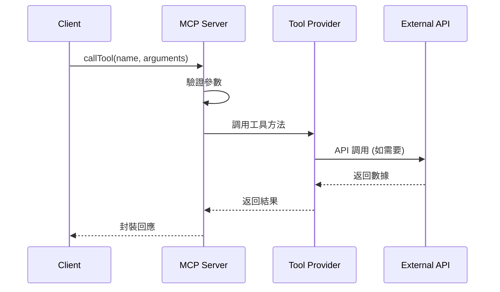
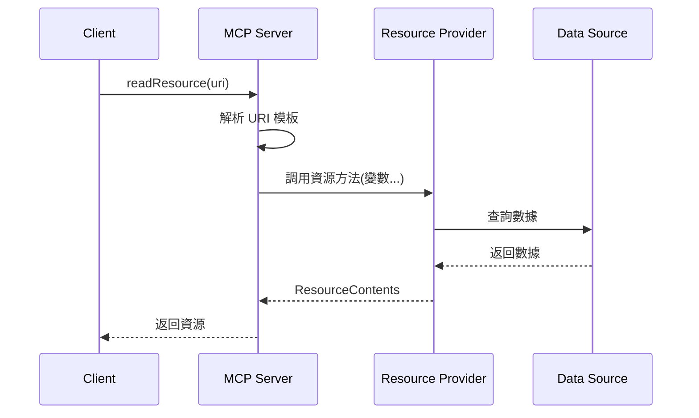
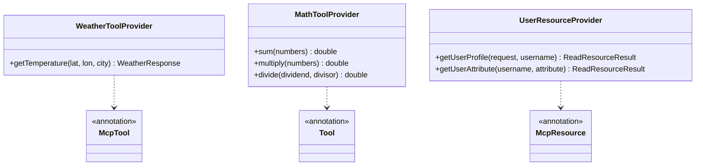

# 專案2：MCP Server - 工具與資源 - 技術規格文件

**專案名稱**: chapter9-mcp-server-tools-resources
**對應章節**: 9.4 MCP Server 開發基礎
**Spring AI 版本**: 1.0.3
**Spring Boot 版本**: 3.5.7
**文檔版本**: 1.0
**最後更新**: 2025-10-31

---

## 1. 專案概述

### 1.1 專案目標

教學如何開發 MCP Server，提供工具(Tools)和資源(Resources)。學習重點：

- 使用 `@Tool` 和 `@McpTool` 註解開發工具
- 使用 `@McpResource` 提供靜態和動態資源
- 配置 STDIO 和 SSE 雙傳輸模式
- 實現參數驗證和錯誤處理

### 1.2 功能需求

| 功能類別 | 功能 | 優先級 |
|---------|------|--------|
| **工具** | 天氣查詢（Open-Meteo API） | P0 |
| **工具** | 數學計算（加法、乘法、除法） | P0 |
| **工具** | 文本處理（大小寫轉換、字數統計） | P0 |
| **工具** | 時間工具（獲取當前時間） | P1 |
| **資源** | 用戶資料（URI: `user-profile://{username}`） | P0 |
| **資源** | 用戶屬性（URI: `user-attribute://{username}/{attribute}`） | P0 |
| **資源** | 配置文件（靜態） | P1 |
| **資源** | 日誌文件（動態） | P1 |

---

## 2. 架構與選型

### 2.1 整體架構

```
┌─────────────────────────────────────────┐
│         MCP Server 應用                  │
├─────────────────────────────────────────┤
│                                         │
│  ┌─────────────────────────────────┐   │
│  │   MCP Server Core               │   │
│  │   (協議處理、請求路由)            │   │
│  └──────┬──────────────┬────────────┘   │
│         │              │                │
│  ┌──────▼──────┐  ┌───▼──────────┐     │
│  │ Tool        │  │ Resource     │     │
│  │ Providers   │  │ Providers    │     │
│  └──────┬──────┘  └───┬──────────┘     │
│         │              │                │
│  ┌──────▼──────────────▼────────────┐   │
│  │  Service 層（業務邏輯）          │   │
│  └──────────────────────────────────┘   │
│                                         │
│  ┌──────────────────────────────────┐   │
│  │  Transport: STDIO / SSE          │   │
│  └──────────────────────────────────┘   │
└─────────────────────────────────────────┘
```

### 2.2 關鍵決策

**為什麼混用 @Tool 和 @McpTool?**
- 展示 Spring AI 工具與 MCP 的兼容性
- `@Tool`: 通用工具，簡單易用
- `@McpTool`: MCP 專屬功能（如 ProgressToken）

**為什麼支援雙傳輸?**
- STDIO: 本地進程、CLI 工具、開發測試
- SSE: 遠端服務、HTTP 整合、生產環境

---

## 3. 技術棧

```xml
<dependencies>
    <!-- Spring Boot Web -->
    <dependency>
        <groupId>org.springframework.boot</groupId>
        <artifactId>spring-boot-starter-web</artifactId>
    </dependency>

    <!-- Spring AI MCP Server WebMVC -->
    <dependency>
        <groupId>org.springframework.ai</groupId>
        <artifactId>spring-ai-starter-mcp-server-webmvc</artifactId>
    </dependency>

    <!-- WebFlux (for external API calls) -->
    <dependency>
        <groupId>org.springframework.boot</groupId>
        <artifactId>spring-boot-starter-webflux</artifactId>
    </dependency>

    <!-- Lombok -->
    <dependency>
        <groupId>org.projectlombok</groupId>
        <artifactId>lombok</artifactId>
    </dependency>
</dependencies>
```

---

## 4. 資料模型

### 4.1 工具相關

```java
// 天氣回應
@Data
public class WeatherResponse {
    private CurrentWeather current;

    @Data
    public static class CurrentWeather {
        @JsonProperty("temperature_2m")
        private double temperature;
        private String time;
    }
}

// 數學運算結果
@Data
@Builder
public class MathOperationResult {
    private String operation;      // 運算類型
    private List<Double> operands; // 運算數
    private double result;         // 結果
}
```

### 4.2 資源相關

```java
// 用戶資料
@Data
@Builder
public class UserProfile {
    private String username;
    private String fullName;
    private String email;
    private String city;
    private Integer age;
    private String occupation;
    private List<String> interests;
}

// 應用配置
@Data
@ConfigurationProperties(prefix = "app")
public class ApplicationConfig {
    private String name;
    private String version;
    private Map<String, Boolean> features;
}
```

---

## 5. 工具設計

### 5.1 工具清單

| 工具名稱 | 註解 | 功能 | 參數 |
|---------|------|------|------|
| `getTemperature` | `@McpTool` | 獲取溫度 | latitude, longitude, city |
| `sum` | `@Tool` | 加法 | numbers[] |
| `multiply` | `@Tool` | 乘法 | numbers[] |
| `divide` | `@Tool` | 除法 | dividend, divisor |
| `toUpperCase` | `@Tool` | 轉大寫 | text |
| `toLowerCase` | `@Tool` | 轉小寫 | text |
| `wordCount` | `@Tool` | 字數統計 | text |
| `getCurrentTime` | `@McpTool` | 當前時間 | timezone (可選) |

### 5.2 實現結構

```java
@Service
@Slf4j
public class WeatherToolProvider {
    private final WebClient webClient;

    /**
     * 獲取指定位置的溫度
     */
    @McpTool(description = "Get temperature for a specific location")
    public WeatherResponse getTemperature(
            @McpToolParam(description = "Latitude") double latitude,
            @McpToolParam(description = "Longitude") double longitude,
            @McpToolParam(description = "City name") String city) {
        // 調用 Open-Meteo API
        // 返回溫度數據
    }
}

@Service
public class MathToolProvider {
    @Tool(description = "Add multiple numbers")
    public double sum(@ToolParam(description = "Numbers") double... numbers) {
        return Arrays.stream(numbers).sum();
    }

    @Tool(description = "Multiply numbers")
    public double multiply(double... numbers) {
        return Arrays.stream(numbers).reduce(1.0, (a, b) -> a * b);
    }

    @Tool(description = "Divide two numbers")
    public double divide(double dividend, double divisor) {
        if (divisor == 0) throw new ArithmeticException("除數不能為零");
        return dividend / divisor;
    }
}
```

---

## 6. 資源設計

### 6.1 資源清單

| URI 模板 | 名稱 | 說明 | MIME |
|---------|------|------|------|
| `user-profile://{username}` | User Profile | 完整用戶資料 | text/plain |
| `user-attribute://{username}/{attribute}` | User Attribute | 特定屬性 | text/plain |
| `config://application` | App Config | 應用配置 | application/json |
| `log://application` | App Log | 應用日誌 | text/plain |

### 6.2 實現結構

```java
@Service
@Slf4j
public class UserResourceProvider {
    private final Map<String, UserProfile> userDatabase;

    /**
     * 獲取用戶完整資料
     */
    @McpResource(
        uri = "user-profile://{username}",
        name = "User Profile",
        description = "Complete user profile information"
    )
    public ReadResourceResult getUserProfile(
            ReadResourceRequest request,
            String username) {
        // 從資料庫查詢用戶
        // 格式化並返回
    }

    /**
     * 獲取用戶特定屬性
     */
    @McpResource(
        uri = "user-attribute://{username}/{attribute}",
        name = "User Attribute",
        description = "Specific user attribute"
    )
    public ReadResourceResult getUserAttribute(
            String username,
            String attribute) {
        // 查詢並返回指定屬性
    }
}

@Service
public class ConfigResourceProvider {
    @McpResource(
        uri = "config://application",
        name = "Application Configuration",
        mimeType = "application/json"
    )
    public String getApplicationConfig() {
        // 返回應用配置 JSON
    }
}
```

### 6.3 URI 設計最佳實踐

#### 6.3.1 命名規範

**推薦的 URI 設計**:

```
✅ 好的設計：
user-profile://{username}              # 清晰、簡潔、使用連字符
user-attribute://{username}/{attribute} # 層次分明
config://application                   # 語意明確
document://{category}/{id}             # RESTful 風格

✅ 變數命名：
{username}    # 小寫、清晰
{userId}      # 駝峰命名可接受
{id}          # 簡短但明確
```

**避免的 URI 設計**:

```
❌ 應避免：
userProfile://{username}              # 駝峰命名不一致
user/profile/{username}               # 使用斜線作為協議部分
user-profile-{username}               # 缺少協議分隔符 ://
USER-PROFILE://{USERNAME}             # 全大寫
user_profile://{user_name}            # 底線不推薦
getUserProfile/{username}             # 動詞開頭(應用於工具,非資源)
```

#### 6.3.2 層次結構設計

**單層資源**:
```java
// 適用：簡單資源，只需一個識別符
@McpResource(uri = "user://{id}")
public ReadResourceResult getUser(String id) { ... }

@McpResource(uri = "document://{documentId}")
public ReadResourceResult getDocument(String documentId) { ... }
```

**多層資源**:
```java
// 適用：有明確層次關係的資源
@McpResource(uri = "user://{userId}/profile")
public ReadResourceResult getUserProfile(String userId) { ... }

@McpResource(uri = "user://{userId}/orders/{orderId}")
public ReadResourceResult getUserOrder(String userId, String orderId) { ... }

@McpResource(uri = "department://{dept}/employee://{empId}")
public ReadResourceResult getDepartmentEmployee(String dept, String empId) { ... }
```

#### 6.3.3 協議選擇指南

| 協議前綴 | 適用場景 | 範例 |
|---------|---------|------|
| `user://` | 用戶相關資源 | `user://{id}` |
| `doc://` 或 `document://` | 文檔資源 | `doc://{category}/{id}` |
| `config://` | 配置資源 | `config://database` |
| `log://` | 日誌資源 | `log://{service}/{date}` |
| `data://` | 通用數據資源 | `data://{dataset}/{key}` |
| `file://` | 文件系統資源 | `file://{path}` |

**一致性原則**:
- 同一類資源使用相同協議前綴
- 協議名稱應該是名詞,不是動詞
- 保持簡短但有意義

#### 6.3.4 參數驗證

```java
@McpResource(uri = "user-profile://{username}")
public ReadResourceResult getUserProfile(
        ReadResourceRequest request,
        String username) {

    // ✅ 參數驗證
    if (username == null || username.trim().isEmpty()) {
        throw new IllegalArgumentException("用戶名不能為空");
    }

    // ✅ 格式驗證
    if (!username.matches("^[a-zA-Z0-9_-]{3,20}$")) {
        throw new IllegalArgumentException(
            "用戶名格式不正確：只能包含字母、數字、底線和連字符，長度3-20字元"
        );
    }

    // ✅ 存在性檢查
    if (!userExists(username)) {
        throw new ResourceNotFoundException("用戶不存在: " + username);
    }

    // 處理資源...
}
```

#### 6.3.5 錯誤處理最佳實踐

```java
@McpResource(uri = "document://{category}/{id}")
public ReadResourceResult getDocument(String category, String id) {
    try {
        // ✅ 明確的錯誤類型
        validateCategory(category);
        validateDocumentId(id);

        Document doc = documentService.findDocument(category, id);
        if (doc == null) {
            throw new ResourceNotFoundException(
                String.format("文檔不存在: category=%s, id=%s", category, id)
            );
        }

        return ReadResourceResult.builder()
            .contents(List.of(
                ResourceContents.builder()
                    .uri(String.format("document://%s/%s", category, id))
                    .text(doc.getContent())
                    .mimeType("text/plain")
                    .build()
            ))
            .build();

    } catch (IllegalArgumentException e) {
        // ✅ 清晰的錯誤訊息
        log.warn("參數驗證失敗: {}", e.getMessage());
        throw e;
    } catch (ResourceNotFoundException e) {
        // ✅ 資源不存在
        log.info("資源不存在: {}", e.getMessage());
        throw e;
    } catch (Exception e) {
        // ✅ 未預期錯誤
        log.error("讀取文檔時發生錯誤", e);
        throw new ResourceReadException("無法讀取文檔", e);
    }
}
```

#### 6.3.6 URI 模板變數命名

**推薦命名**:
```java
// ✅ 清晰明確
{userId}        // 明確表示用戶 ID
{username}      // 明確表示用戶名
{documentId}    // 文檔 ID
{category}      // 類別
{attribute}     // 屬性名稱

// ⚠️ 可接受但不推薦
{id}           // 過於通用,在複雜 URI 中可能不清楚
{type}         // 語意不明確
{name}         // 太泛用

// ❌ 避免
{x}            // 無意義
{param1}       // 不清晰
{value}        // 太模糊
```

#### 6.3.7 實際範例對比

| 場景 | ❌ 不良設計 | ✅ 良好設計 | 說明 |
|------|-----------|-----------|------|
| 用戶資料 | `getUser/{id}` | `user://{userId}` | 資源用 URI,工具用動詞 |
| 訂單詳情 | `order-detail-{orderId}` | `order://{orderId}` | 使用標準分隔符 :// |
| 文章內容 | `article_{id}` | `article://{articleId}` | 協議與變數分離 |
| 用戶設定 | `userSettings://{id}` | `user://{userId}/settings` | 層次關係清晰 |
| 配置項目 | `getConfig/{key}` | `config://{key}` | 資源非動作 |

---

## 7. 系統流程圖

### 7.1 工具調用流程



### 7.2 資源讀取流程



---

## 8. 類別圖



---

## 9. API 設計

### 9.1 listTools

**回應**:
```json
{
  "tools": [
    {
      "name": "getTemperature",
      "description": "Get temperature for a specific location",
      "inputSchema": {
        "type": "object",
        "properties": {
          "latitude": {"type": "number"},
          "longitude": {"type": "number"},
          "city": {"type": "string"}
        },
        "required": ["latitude", "longitude", "city"]
      }
    }
  ]
}
```

### 9.2 callTool

**請求**:
```json
{
  "name": "getTemperature",
  "arguments": {
    "latitude": 25.03,
    "longitude": 121.54,
    "city": "Taipei"
  }
}
```

### 9.3 listResources

**回應**:
```json
{
  "resources": [
    {
      "uri": "user-profile://{username}",
      "name": "User Profile",
      "description": "Complete user profile information",
      "mimeType": "text/plain"
    }
  ]
}
```

### 9.4 readResource

**請求**: `"uri": "user-profile://john"`

**回應**:
```json
{
  "contents": [
    {
      "uri": "user-profile://john",
      "mimeType": "text/plain",
      "text": "User Profile: john\n==================\n..."
    }
  ]
}
```

---

## 10. 測試計劃

### 10.1 單元測試

**測試範圍**:
- 每個 Tool Provider 的工具方法
- 每個 Resource Provider 的資源方法
- 參數驗證邏輯
- 錯誤處理機制

**關鍵測試**:
```java
// WeatherToolProviderTest
- 正常天氣查詢
- 無效座標處理

// MathToolProviderTest
- 各種數學運算
- 除以零異常

// UserResourceProviderTest
- 讀取存在的用戶
- 讀取不存在的用戶
- URI 變數提取
```

### 10.2 整合測試

**測試場景**:
- Server 正常啟動
- 列出所有工具和資源
- 調用工具並驗證結果
- 讀取資源並驗證內容
- STDIO 和 SSE 傳輸測試

### 10.3 覆蓋率目標

- Tool Providers: 90%+
- Resource Providers: 90%+
- 整體: 85%+

---

## 11. 配置說明

### 11.1 application.yml

```yaml
spring:
  application:
    name: mcp-server-tools-resources

  ai:
    mcp:
      server:
        name: tools-resources-server
        version: 1.0.0
        type: SYNC
        stdio: false  # 透過參數切換
        sse-message-endpoint: /mcp/message
        tool-change-notification: true
        resource-change-notification: true

# 應用配置
app:
  name: MCP Tools & Resources Server
  version: 1.0.0
  features:
    weather: true
    math: true

# 日誌
logging:
  level:
    root: INFO
    org.springframework.ai: DEBUG
  file:
    name: logs/application.log

server:
  port: 8080
```

---

## 12. 部署說明

### 12.1 STDIO 模式

```bash
# 編譯
mvn clean package -DskipTests

# 運行
java -Dspring.ai.mcp.server.stdio=true \
     -Dspring.main.web-application-type=none \
     -Dspring.main.banner-mode=off \
     -jar target/chapter9-mcp-server-tools-resources-1.0.0.jar
```

### 12.2 SSE 模式

```bash
# 運行（預設配置）
java -jar target/chapter9-mcp-server-tools-resources-1.0.0.jar

# 或使用 Maven
mvn spring-boot:run
```

### 12.3 測試連接

```bash
# 測試 SSE 端點
curl -X POST http://localhost:8080/mcp/message \
  -H "Content-Type: application/json" \
  -d '{
    "jsonrpc": "2.0",
    "method": "tools/list",
    "id": 1
  }'
```

---

## 13. 開發檢查清單

### 13.1 工具開發

- [ ] 創建 WeatherToolProvider（`@McpTool`）
- [ ] 創建 MathToolProvider（`@Tool`）
- [ ] 創建 TextToolProvider（`@Tool`）
- [ ] 創建 TimeToolProvider（`@McpTool`）
- [ ] 實現參數驗證
- [ ] 實現錯誤處理
- [ ] 添加日誌記錄

### 13.2 資源開發

- [ ] 創建 UserResourceProvider
  - [ ] `user-profile://{username}`
  - [ ] `user-attribute://{username}/{attribute}`
- [ ] 創建 ConfigResourceProvider
- [ ] 創建 LogResourceProvider
- [ ] 初始化測試數據
- [ ] 實現 URI 變數提取

### 13.3 配置與測試

- [ ] 配置 application.yml
- [ ] 配置雙傳輸模式
- [ ] 編寫單元測試
- [ ] 編寫整合測試
- [ ] 測試 STDIO 模式
- [ ] 測試 SSE 模式
- [ ] 驗證工具調用
- [ ] 驗證資源讀取

---

## 附錄

### A. 常見問題

**Q: 如何切換傳輸模式?**
- STDIO: `-Dspring.ai.mcp.server.stdio=true -Dspring.main.web-application-type=none`
- SSE: 預設或 `-Dspring.ai.mcp.server.stdio=false`

**Q: 如何添加新工具?**
- 創建 Service，使用 `@Tool` 或 `@McpTool` 註解方法

**Q: URI 模板如何使用?**
- `@McpResource(uri = "resource://{var}")` → 方法參數自動匹配

### B. 參考資源

- [Spring AI MCP Server 文檔](https://docs.spring.io/spring-ai/reference/api/mcp/mcp-server-boot-starter-docs.html)
- [Open-Meteo API](https://open-meteo.com/)
- [MCP 協議規範](https://spec.modelcontextprotocol.io/)

### C. 下一步

完成本專案後：
1. 測試所有工具和資源功能
2. 使用專案1的 Client 連接此 Server
3. 準備進入專案3學習進階功能

---

**文檔維護**: 本規格文件持續更新中
**最後更新**: 2025-10-31
